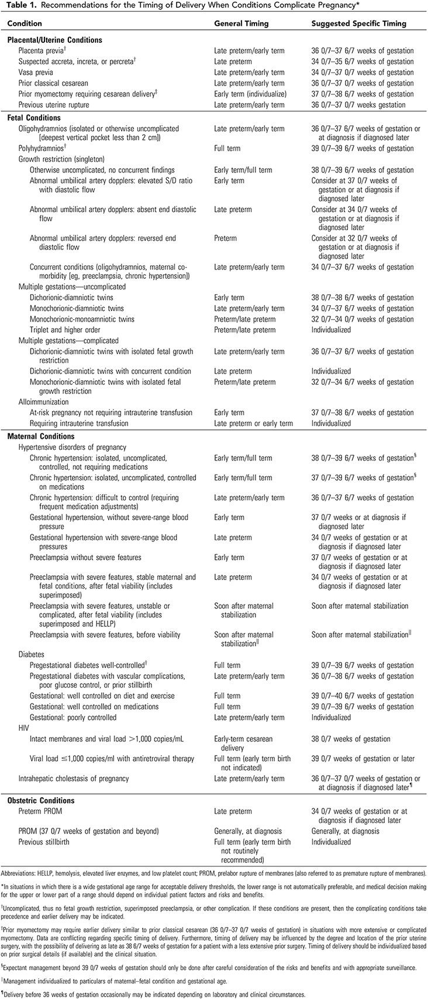

## タイトル
Medically Indicated Late-Preterm and Early-Term Deliveries  
医学的な兆候のある後期早産および早期正期産

## 概要
後期早産および早期正期産の新生児リスクは十分に確立されており、妊娠39 0/7週未満の選択的分娩に関連する新生児合併症の可能性が十分に説明されている。  
しかし、後期早産および早期正期産が正当化される、多くの母体、胎児、および胎盤の合併症がある。  
そのような場合の出産のタイミングは、後期早産および早期正期産の母体および新生児のリスクと、さらなる妊娠の継続に関連するリスクとのバランスをとる必要がある。  
より早い分娩のための医学的産科学的徴候があった場合、39週まで分娩を延期することは推奨されない。  
妊産婦または新生児のいずれかの利益のための後期早産および早期正期産の明確な兆候がある場合、出産は肺成熟検査の結果にかかわらず行われるべきである。  
逆に、未熟な肺のプロファイルの結果に関連して分娩を安全に遅らせる可能性がある場合、後期早産および早期正期産の分娩に関しての明確な指標は存在しない。  
また、分娩時期をガイドするデータが役に立たないいくつかの条件が残っている。  
これらの条件のいくつかには、子宮裂開または慢性的な胎盤剥離が含まれる。  
これらの条件での分娩時期は現在の臨床状況に基づいて個別に判断されるべきである。  
この委員会の見解は、妊娠39週までに分娩を必要とするであろう頻繁な産科条件を含み、分娩の推奨を裏付ける最新のエビデンスを適用するように改訂されている。

## 推奨事項
ACOG/SMFMによる勧告
より早い分娩のための医学的産科学的徴候があった場合、39週まで分娩を延期することは推奨されない。  
* 表1は、いくつかの特定の条件に対する分娩時期の推奨事項を示している。  
* 後期早産が見込まれる場合、出生前コルチコステロイドの投与歴がない一部の患者は、出産後7日以内にベタメタゾンを1回投与することが推奨される。  
しかし、医学的な兆候のある後期早産は出生前コルチコステロイドの投与を遅らせるべきではない。

ACOG/SMFMは長年に渡って、妊娠39週以前の不適応な出産を推奨していない。  
長年のこの原則の理由は、後期早産（妊娠34 0/7-36 6/7週）および早期正期産（妊娠37 0/7-38 6/7週）の新生児リスクが十分に確立されていること、および妊娠の39 0/7週未満での選択的分娩に関連する新生児合併症の可能性が十分に説明されているためである（1、2）。  
これらおよび他のデータに基づいて、妊娠39週以降の選択的分娩の時期が推奨される（3）。

しかし、後期早産または早期正期産が正当化される、多くの母体、胎児、および胎盤の合併症がある。  
そのようなケースの分娩時期は、後期早産または早期正期産の母体および新生児のリスクと妊娠継続に関するリスクのバランスをとる必要がある。  
より早い分娩のために医学的産科学的兆候がある場合、妊娠39週までの分娩継続は推奨できない。  
妊娠39週未満で出産するための適切な適応症の問題に対処するために、NICHD/SMFMは利用可能なエビデンスをまとめたワークショップを開催し、勧告を行った（4）。  
ほとんどの場合、分娩時期の言及に関するエビデンスは限られており、専門家の合意と関連する観察研究の勧告に基づいて推奨される。  
委員会の見解は、妊娠39週以前に分娩を必要とする産科条件を含み、分娩の推奨を裏付ける最新のエビデンスを適用するように改訂されている。

分娩のタイミングで考慮すべきいくつかの重要な原則がある。  
まず、分娩時期に関する決定は複雑であり、相対的な母親と新生児のリスク、診療環境、そして患者の意思を考慮に入れなければならない。  
次に、後期早産または早期正期産は、母体および/または新生児のベネフィットに対して保証される。  
場合によっては、医療提供者は、母児にとって競合するリスクとベネフィットを比較検討する必要がある。  
そして、勧告は限られたデータに基づいて行われているため、分娩時期決定は常に患者の必要性に応じて行われるべきである。  
さらに、妊娠39週以前の出産時期に関する推奨事項は、妊娠期間の正確な推定に依存している。

胎児の肺成熟度を決定するための羊水穿刺は、最適に至らなかった妊娠中であっても、分娩時期の決定のために使用されるべきではない（5）。  
この理由は複数あり相互に関連している。  
まず、母体または新生児のベネフィットのために後期早産または早期正期産の明確な兆候がある場合、出産は肺成熟検査の結果にかかわらず行われるべきである。  
逆に、未熟な肺のプロファイルの結果に関連して分娩が安全に延期できる可能性がある場合、後期早産または早期正期産の分娩についての明確な指標は存在しない。  
次に、羊水の成熟に関する指標は新生児の呼吸器予後の予測には不十分であり、他の臓器系の成熟度を必ずしも反映しているわけではない（6）。

後期早産が予想される分娩の場合、投与歴がない患者は、出産後7日以内に出生前ベタメタゾンを1回投与することが推奨される（7）。  
しかし、医学的な兆候のある後期早産の場合は、出生前コルチコステロイドの投与を遅らせるべきではない。

表1は、多くの特定の条件に対する分娩のタイミングに関する推奨事項を示している。  
これは包括的なものではなく、臨床診療で起こりうる主要な徴候のリストである。  
「一般的な時期」は、後期早産または早期正期産の条件において、適切に管理されていることを指す。  
「推奨される特定の時期」は、後期早産または早期正期産の分娩のより広い範囲のより明確な分娩時期を指す。  
これらは単なる推奨事項であり、新しいエビデンスが見つかった時に個別に再評価する必要がある。  
また、分娩時期を指し示すデータが役に立たないいくつかの条件が残っている。  
例えば、子宮裂開または慢性的な胎盤剥離である。  
この場合の分娩時期は現在の臨床状況に基づいて個別に決定されるべきである。  
許容可能な分娩閾値について広い妊娠期間がある状況では、下限は自動的に決定することはできず、そして上限または下限の範囲についての医学的意思決定は個々の患者の因子およびリスクとベネフィットに依存するべきである。  
珍しいことではないが、後期早産または早期正期産の可能性のある患者は複数の適応症を有することがある。

## リンク
https://www.acog.org/Clinical-Guidance-and-Publications/Committee-Opinions/Committee-on-Obstetric-Practice/Medically-Indicated-Late-Preterm-and-Early-Term-Deliveries
