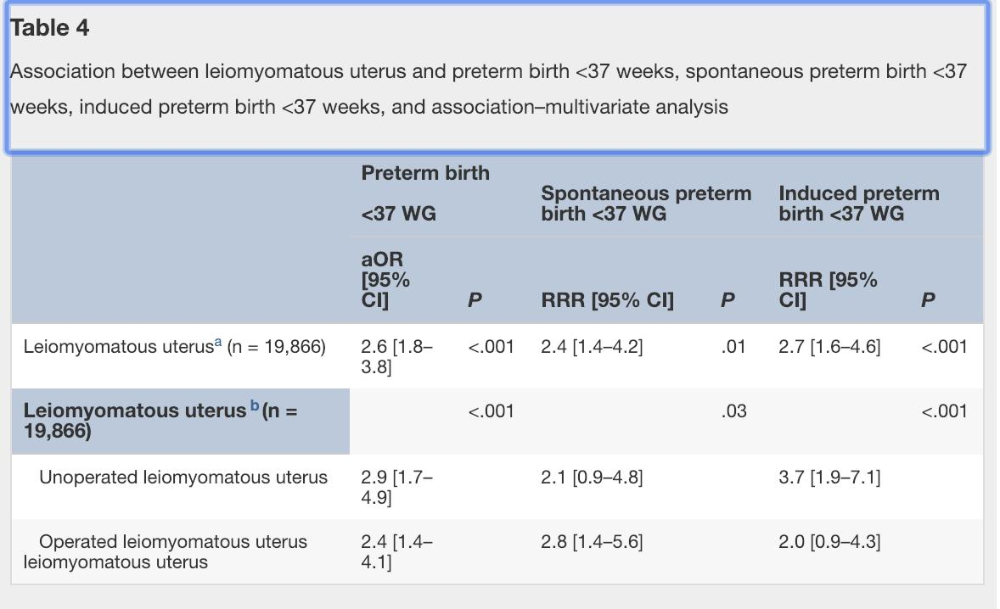

## タイトル
Leiomyomatous uterus and preterm birth: an exposed/unexposed monocentric cohort study  
子宮平滑筋腫と早産：曝露/非曝露のコホート研究

## 著者/所属機関
Aude Girault, MDa,∗,'Correspondence information about the author MD Aude GiraultEmail the author MD Aude Girault, Camille Le Ray, MD, PhDa, Charles Chapron, MD, PhDb, François Goffinet, MD, PhDa, Louis Marcellin, MD, PhDb

## 論文リンク
https://doi.org/10.1016/j.ajog.2018.08.033

## 投稿日付
Published online: August 25, 2018  
Accepted: August 20, 2018  
Received in revised form: July 25, 2018  
Received: February 8, 2018

## 概要
### 目的
妊娠中の子宮平滑筋腫の存在と早産との関連性を評価すること、および関連性が存在する場合には、子宮筋腫の既往がある場合にその持続性を評価すること。

### 研究デザイン
2011年1月から2015年9月までの間に、3次施設の大学病院で22週以上の出産を行った単胎妊娠の全女性を対象とした、曝露/非曝露の後ろ向きコホート研究。子宮平滑筋腫群の女性は、妊娠中の子宮平滑筋腫（1箇所以上、20mm以上の平滑筋腫、または大きさに関係なく多発性平滑筋腫）が子宮摘出術の既往のない産婦人科超音波で見られる女性、または子宮鏡検査、腹腔鏡検査、または持続性平滑筋腫を伴うまたは伴わない開腹術による筋腫摘出術（1箇所以上、20mm以上の平滑筋腫の切除、または多発性平滑筋腫）。

### 結果
コホート内の19,866人の女性のうち、301人（1.5％）が子宮平滑筋腫を有していた（154人の未手術の女性および147人の手術を受けた女性）。早産の割合は、子宮平滑筋腫群で12.0％、非子宮平滑筋腫群で8.4％であった。早産の危険因子を調整後、子宮平滑筋腫は早産と有意に相関があった（調整オッズ比、2.5；95％信頼区間、1.7〜3.7）。この関連性は、非子宮平滑筋腫と比較した場合、未手術の女性（調整オッズ比2.7；95％信頼区間、1.6-4.6）および手術を受けた女性（調整オッズ比2.3；95％信頼区間、1.3-3.9）で有意であった。

### 結論
子宮平滑筋腫は早産と相関しており、この相関は子宮摘出術後も持続する。

### 表4

