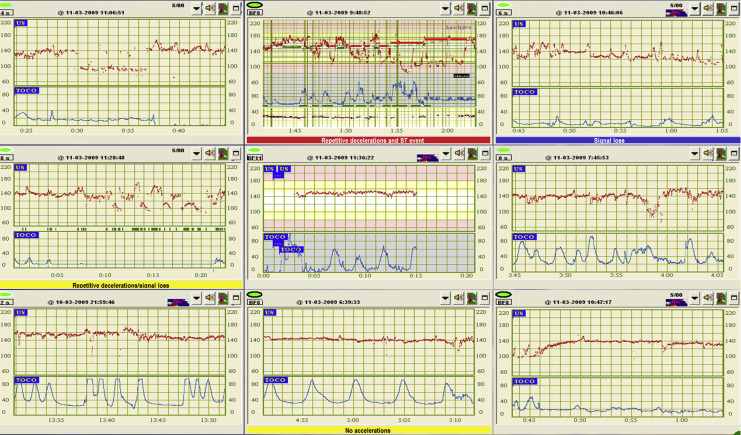
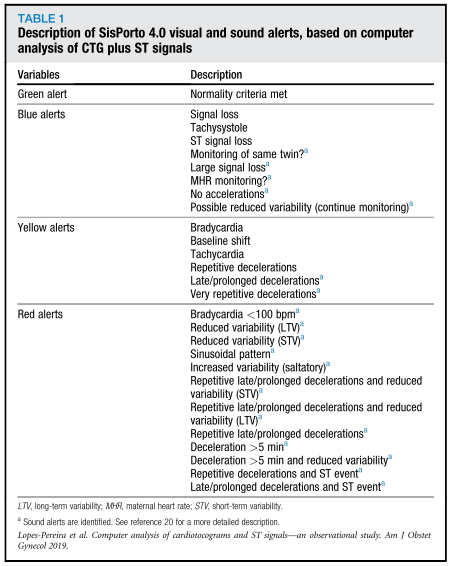
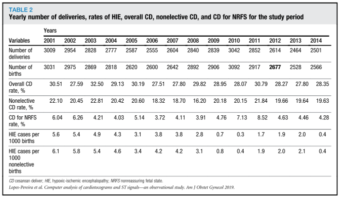
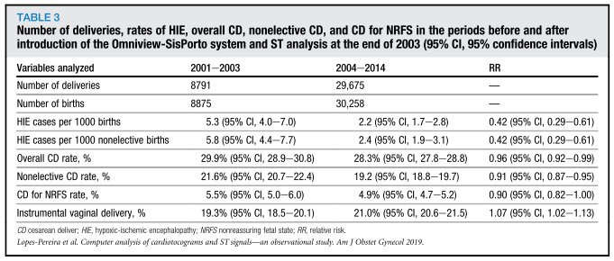
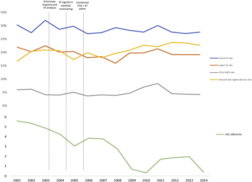

## タイトル
Computerized analysis of cardiotocograms and ST signals is associated with significant reductions in hypoxic-ischemic encephalopathy and cesarean delivery: an observational study in 38,466 deliveries  
心電図とSTシグナルのコンピューター分析は低酸素性虚血性脳症と帝王切開分娩の有意な減少と関連する：38,466分娩における観察研究

## 著者/所属機関
Joana Lopes-Pereira, MDa,∗,'Correspondence information about the author MD Joana Lopes-PereiraEmail the author MD Joana Lopes-Pereira, Antónia Costa, MD, PhDa,b,∗,'Correspondence information about the author MD, PhD Antónia CostaEmail the author MD, PhD Antónia Costa, Diogo Ayres-De-Campos, MD, PhDb,c,d, Cristina Costa-Santos, MS, PhDc, Joana Amaral, MDa, João Bernardes, MD, PhDa,b
a Department of Obstetrics and Gynecology, University of Porto School of Medicine, and Centro Hospitalar, S. João, Portugal  
b Institute of Biomedical Engineering, University of Porto School of Medicine, Porto, Portugal  
c Department of Health Information and Decision Sciences and Center for Research in Health Technology and Services, University of Porto School of Medicine, Porto, Portugal

## 論文リンク
https://doi.org/10.1016/j.ajog.2018.12.037

## 投稿日付
Published online: December 27, 2018  
Accepted: December 20, 2018  
Received in revised form: November 29, 2018  
Received: May 20, 2018

## 概要
### 目的
* 三次医療施設の分娩病棟へ分娩中CTGおよびSTシグナルを自動解析する中央監視システムを導入、評価すること。

### 研究デザイン
* 後ろ向きコホート研究。
* 年間の低酸素性虚血性脳症（HIE）、器械分娩、全体の帝王切開（CD）、および緊急のCDの情報が病院の臨床データベースから得られた。
* 分娩中CTGおよびSTシグナルを自動解析する中央監視システムの導入前（2001年1月から2003年12月まで）、および後（2004年1月から2014年12月まで）に発生した周産期の有害転帰、および介入をOmniview-SisPortoを用いて評価した。

### 結果
* 期間中に38,466の分娩が行われた。
* システム導入後、出生1000人あたりのHIEの症例数（5.3％、95％信頼区間[4.0〜7.0] vs 2.2％、95％信頼区間[1.7〜2.8]；相対リスク、0.42、95％信頼区間[0.29〜0.61]）、全体のCD率（29.9％、95％信頼区間[28.9–30.8] vs 28.3％、95％信頼区間[27.8–28.8]；相対リスク、0.96、95％信頼区間[0.92–0.99]）、緊急のCD率（21.6％、95％信頼区間[20.7-22.4] vs 19.2％、95％信頼区間[18.8-19.7]；相対リスク、0.91、95％信頼区間[0.87-0.95]）は有意に減少した。

### 結論
三次医療施設における分娩中のCTG計測およびSTシグナルの自動解析の導入により、HIEが有意に減少し、CD率がわずかに減少した。

### 図1 分娩期の中央監視ステーションのスクリーンショット

### 表1 CTGとST波形のコンピューター分析に基づく、SisPorto 4.0の視覚および音声アラートの説明

### 表2 研究期間中の年間分娩数、HIEの割合、全体のCD、非選択的CD（＝緊急？）、およびNRFSのCD

### 表3 Omniview-SisPortoシステムの導入前後および2003年末のST分析後の納入数、HIE、全体CD、非選択CD、およびNRFSのCD（95％CI）

### 図2 年毎の全体的な状況
  
