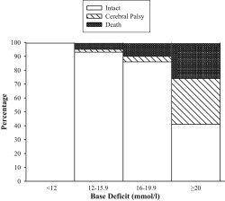

## タイトル
Threshold of metabolic acidosis associated with newborn cerebral palsy: medical legal implications  

## 著者/所属機関

## 論文リンク
https://doi.org/10.1016/j.ajog.2018.11.1107

## 投稿日付
Published online: December 07, 2018  
Accepted: November 30, 2018  
Received in revised form: October 30, 2018  
Received: August 12, 2018

## 概要

### 図1

