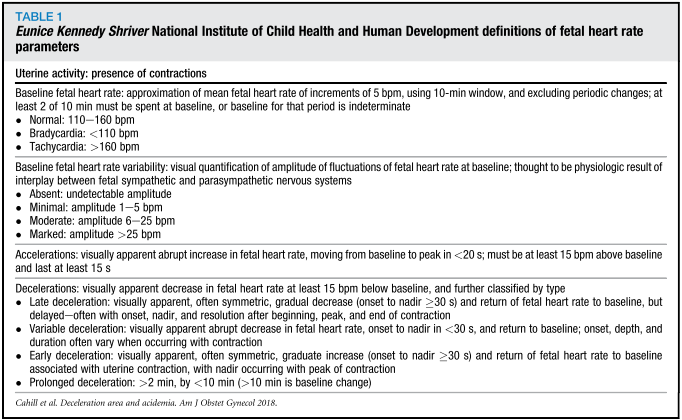
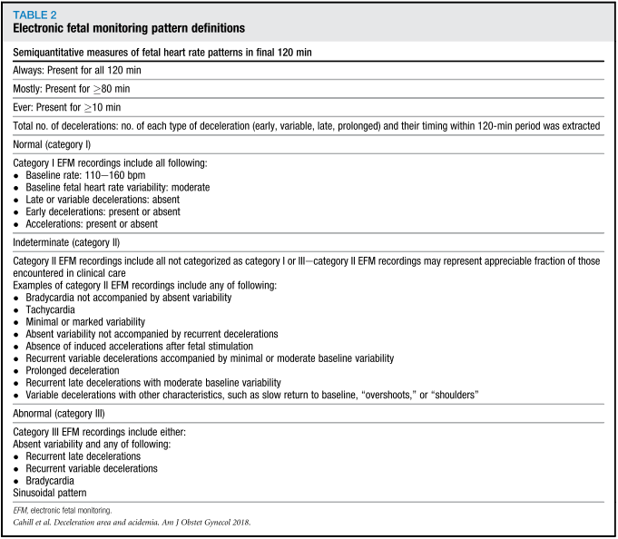
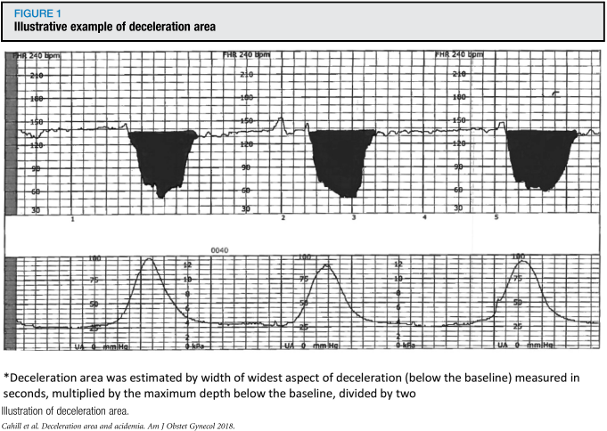
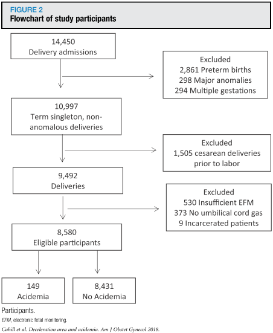
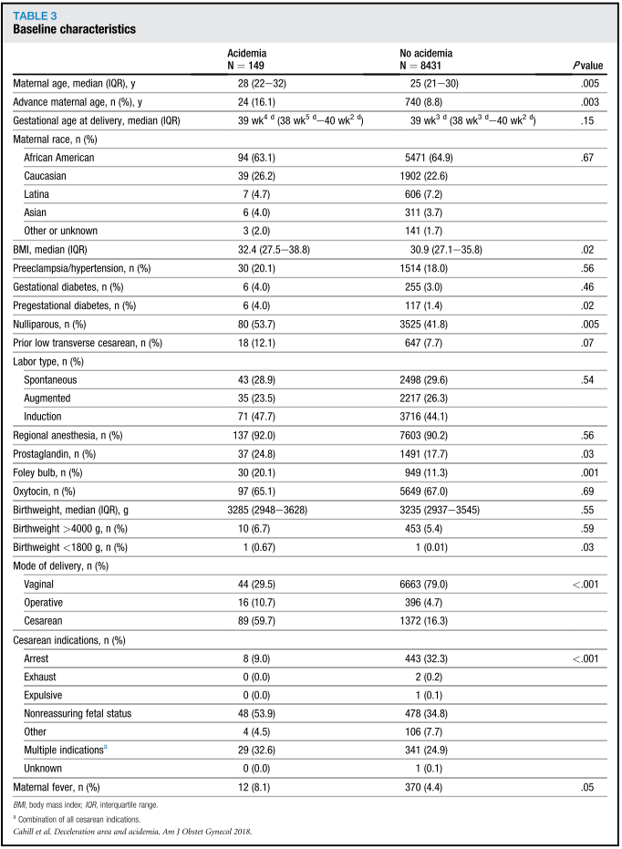
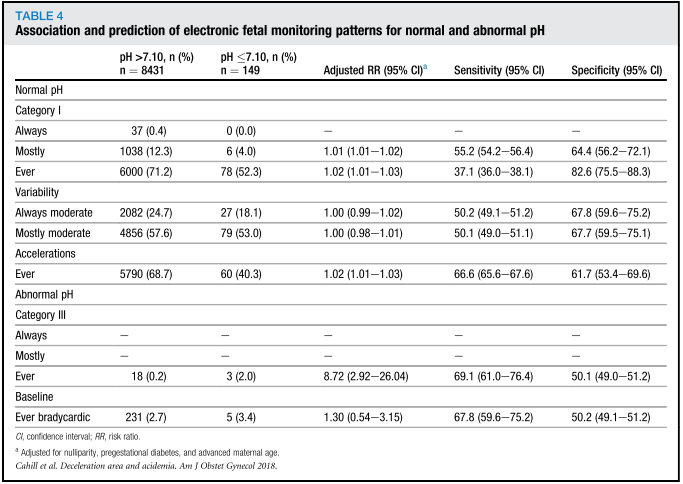
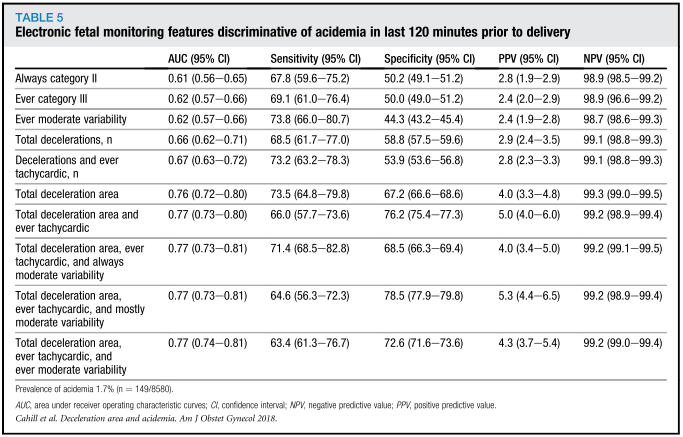
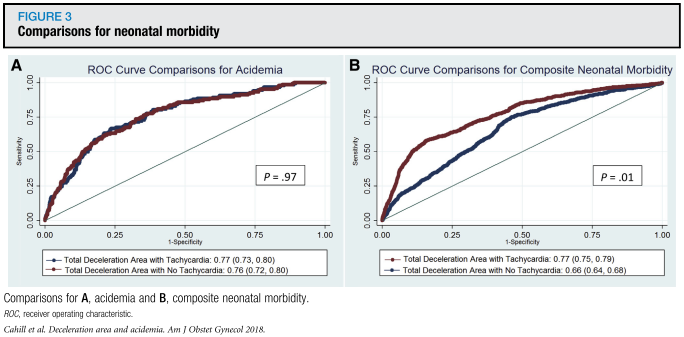
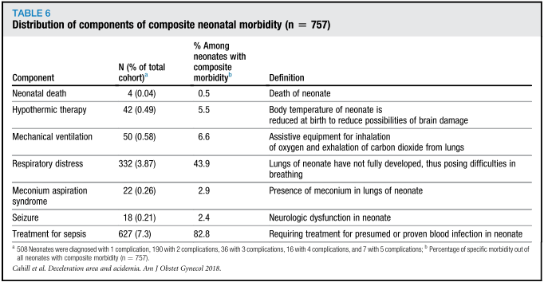
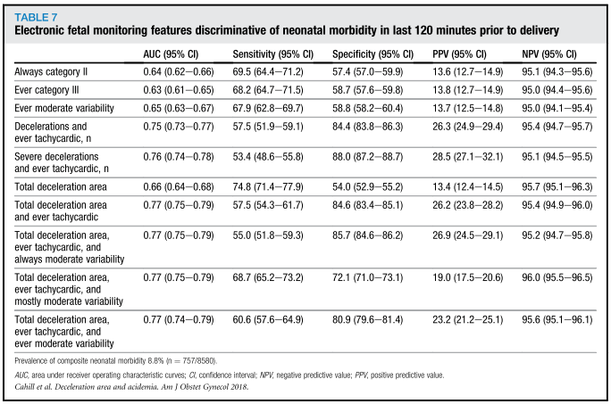

## タイトル
A prospective cohort study of fetal heart rate monitoring:deceleration area is predictive of fetal acidemia  
胎児心拍数モニタリングの前向きコホート研究：一過性徐脈の面積から胎児のアシデミアを予測

## 著者/所属機関
Alison G. Cahill, MD, MSCI∗,'Correspondence information about the author MD, MSCI Alison G. CahillEmail the author MD, MSCI Alison G. Cahill, Methodius G. Tuuli, MD, MPH, Molly J. Stout, MD, MSCI, Julia D. López, PhD, MPH, George A. Macones, MD, MSCE  
Department of Obstetrics and Gynecology, Washington University in St Louis, St Louis, MO

## 論文リンク
https://doi.org/10.1016/j.ajog.2018.01.026

## 投稿日付
Published online: February 03, 2018  
Accepted: January 22, 2018  
Received in revised form: January 12, 2018  
Received: August 25, 2017

## 概要
### 目的
視覚的に解釈された分娩中の胎児心拍数パターンが正期産の胎児のアシデミアと罹患率に関連するという仮説を検証すること。

### 研究デザイン
* 2010年から2015年までの妊娠37週以上の単胎妊娠、頭位を対象とした前向きコホート研究。
* 分娩前120分間のEFMパターンは10分のエポック？で解釈された。
* 解釈は、Eunice Kennedy ShriverのNICHD基準に従ったカテゴリ分類と個々のEFMパターン、さらに新規のパターンを含んだ。
* 主要転帰は、胎児アシデミア（臍帯動脈pH≦7.10）；新生児罹患率も評価した。
* 初産婦、妊娠糖尿病、および母体年齢について調整された酸血症の最終的な回帰モデル。
* ROC AUCを用いて、アシデミア、および新生児罹患率についての個々のモデルのテスト特性を評価した。

### 結果
* 8580人の女性のうち、149人（1.7％）がアシデミアの児を出産した。
* 全コホートのうち、757人（8.8％）において新生児罹患が診断された。
* 持続的なカテゴリーI、および10分間のカテゴリーIIIは、それぞれ通常のpHおよびアシデミアと有意に関連していた。
* 一過性徐脈の総面積はアシデミアを非常に識別しやすく（ROC AUC、0.76；95％信頼区間、0.72-0.80）、10分の頻脈を伴う一過性徐脈の面積は新生児罹患に対してすばらしい識別能力を示した（ROC AUC、0.77；95％信頼区間、0.75-0.79）。
* 一旦一過性徐脈の面積が閾値に達すると、潜在的に1例のアシデミアおよび新生児罹患を予防するのに必要な帝王切開数は5および6であった。

### 結論
* 研究されたEFMパターンから、一過性徐脈の面積はアシデミアの最も予測的なEFMパターンであり、罹患の重大なリスクを知るために頻脈とも組み合わせる。
* 37週以上の患者に限定されており、早産には適用できないかもしれない。
* 本研究は人間の視覚的解釈による分類であり、コンピュータ分析は使用していない。

### 表1 NICHDのFHRパターンの定義

### 表2 EFMパターンの定義

### 図1 一過性徐脈の面積の例

### 図2 研究の患者選定のフローチャート

### 表3 ベースライン特性

### 表4 正常/異常pHのEFMパターンの予測と相関

### 表5 分娩前120分のEFMのアシデミアの特徴分類

### 図3 新生児罹患率の比較

### 表6 新生児罹患の分布

### 表7 分娩前120分のEFMの新生児罹患の特徴分類

