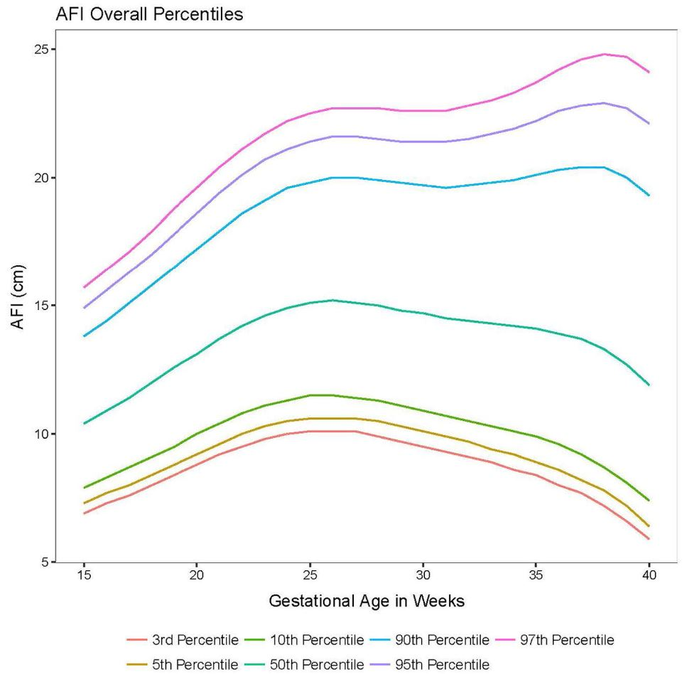

## タイトル
A contemporary amniotic fluid volume chart for the United States: The NICHD Fetal Growth Studies–Singletons  
現代の米国における羊水量チャート：NICHDの胎児発育成長研究-単胎児

## 著者/所属機関
John Owen, MD, MSPH a, Paul S. Albert, PhD b, Germaine M. Buck Louis, PhD, MS b, Karin M. Fuchs, MD c, William A. Grobman, MD, MBA d, Sungduk Kim, PhD b, Mary E. D’Alton, MD c, Ronald Wapner, MD c, Deborah A. Wing, MD, MBA e, Katherine L. Grantz, MD, MS b  
a University of Alabama at Birmingham School of Medicine, AL  
b Eunice Kennedy Shriver National Institute of Child Health and Human Development, National Institutes of Health, MD  
c Columbia University Medical Center, NY
d Northwestern University, IL
e University of California, Irvine, Miller Children’s Hospital/Long Beach Memorial Medical Center, CA

## 論文リンク
https://doi.org/10.1016/j.ajog.2019.02.030

## 投稿日付
Published online: February 18, 2019  
Accepted: February 14, 2019  
Received in revised form: February 11, 2019  
Received: December 11, 2018

## 概要
### 目的
羊水指数と最深の羊水ポケットから羊水量を推定するための米国標準を開発すること。

### 研究デザイン
4つの人種の正常な単胎妊娠をした2334人の低リスク妊婦の多施設観察研究の二次分析を行った。  
妊娠15〜40週で超音波検査機器を用いて羊水量を評価した（最大5回）。  
12の周産期センターが参加し、すべて同一の高解像度機器を使用し、資格のある超音波検査技師によって実施された。  
その後、合併症を有する患者（n＝597）は除外した。  
羊水指数および最深の羊水ポケットと人種のノモグラムは、3次スプラインを含む線形混合モデルを使用して開発された。  
人種間の違いは、世界規模で実施されている試験と群間の試験の両方で評価した。  
3、および97パーセンタイル値（羊水過多、過少の評価に一般的に使用されるカットオフ範囲）も推定した。

### 結果
合計1719人（非ヒスパニック系白人480人、非ヒスパニック系黒人418人、ヒスパニック系485人、アジア系336人）の妊婦が選択基準を満たした。  
羊水指数と最深の羊水ポケットは妊娠期間毎に変化し、妊娠26週と33週でそれぞれ最大値を示した。  
人種間で統計的に有意な差が観察された（妊娠17-22週および35-40週では、母体特性および胎児推定体重の調整後も統計的に有意な差があった）。  
人種間のばらつきは、妊娠35週以降で最も顕著であったが、3、および97パーセンタイルの羊水指数はすべて、羊水過少症（5 cm以下）と羊水過多症（25 cm以上）のカットオフの範囲内（3パーセンタイル値は5.9cm（妊娠40週）から10.1cm（妊娠25-27週）、97パーセンタイル値は24.8cm（妊娠38週）から15.7cm（妊娠15週））であった。

### 結論
超音波羊水量の推定値は人種間で異なっていたが、カットオフの範囲内であった。  
選択された母体特性と胎児推定体重は人種間で違いはなかった。*（結果と違うことを述べている）*

### 図

