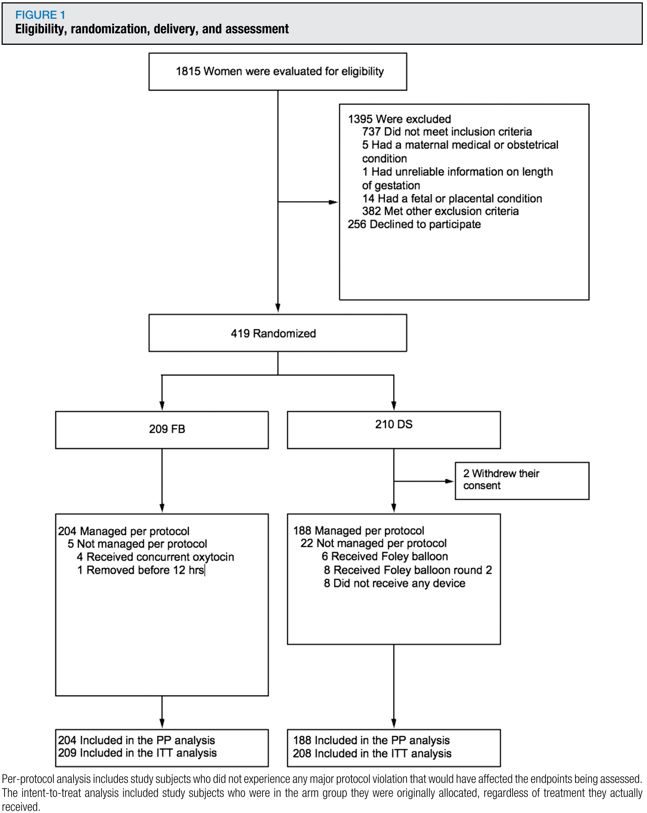
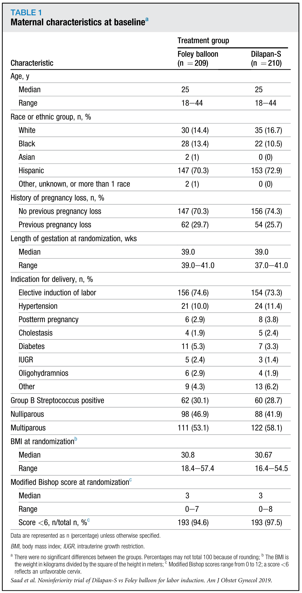
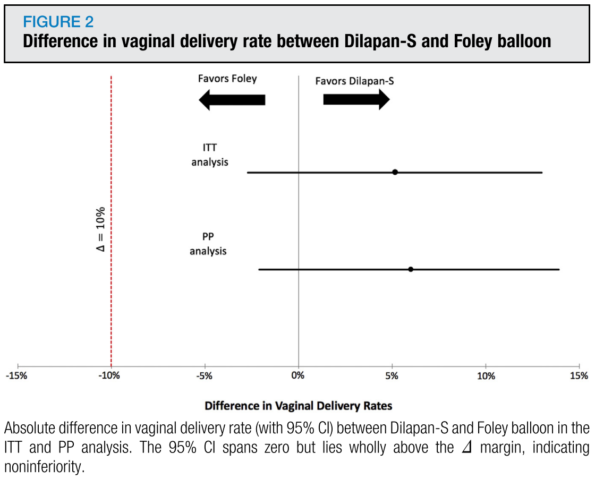
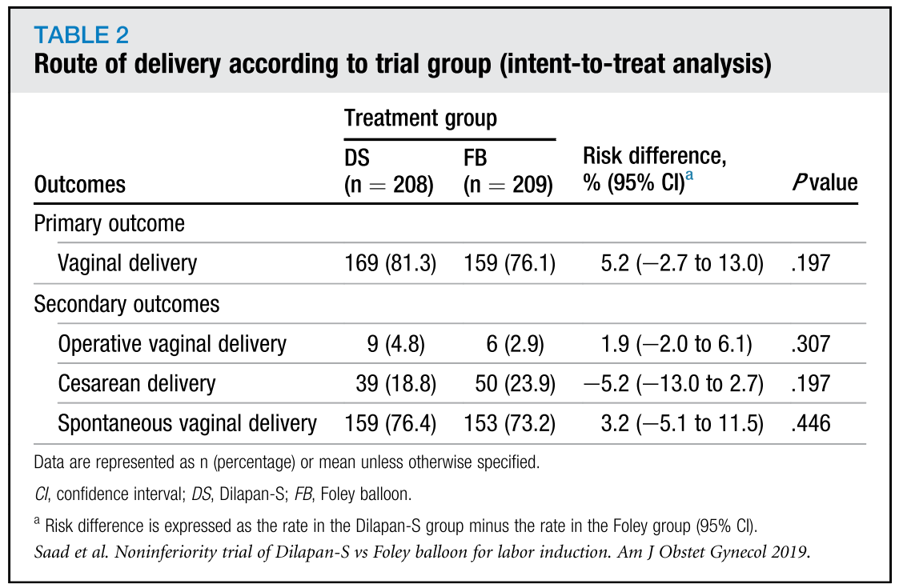
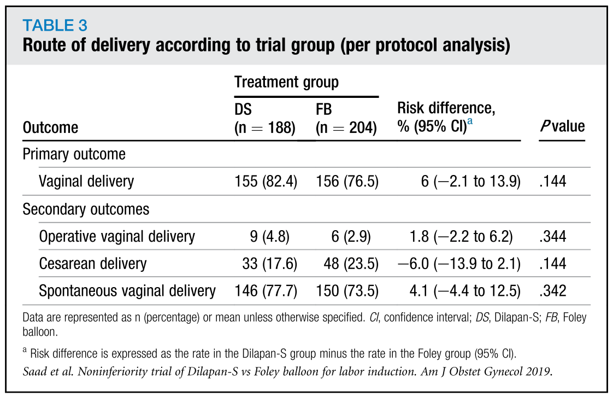
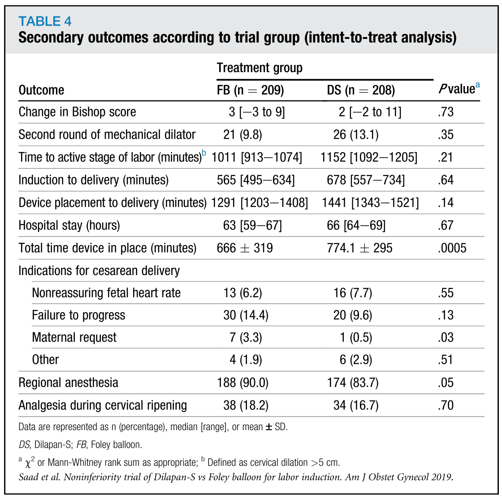
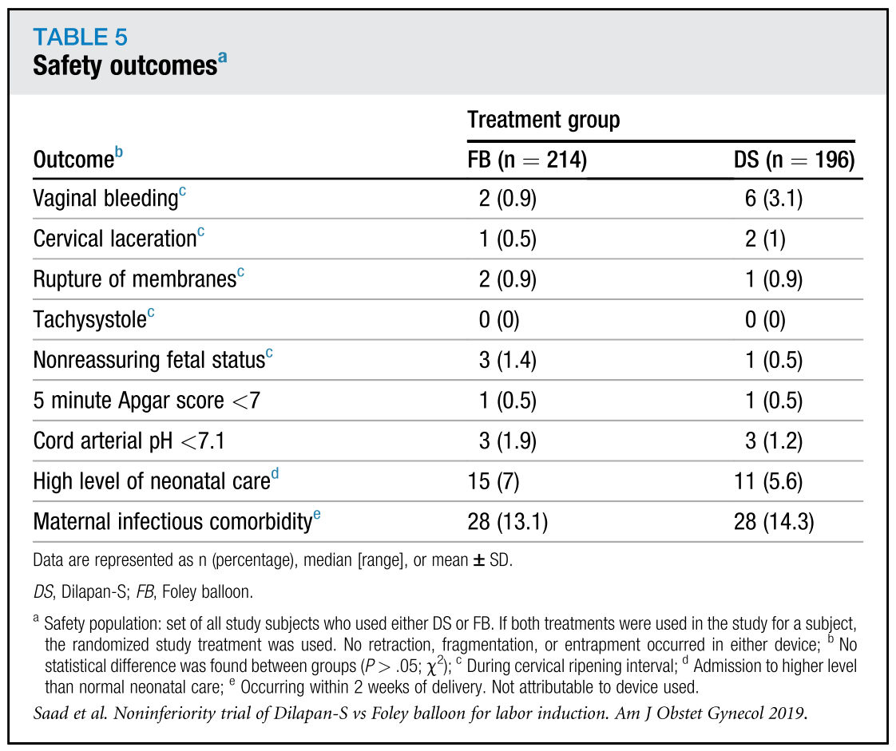
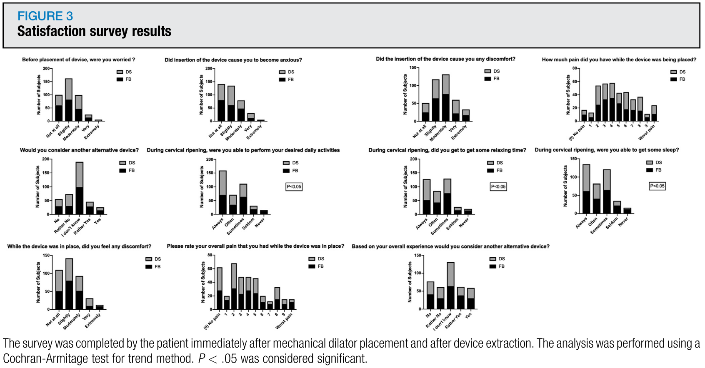

## タイトル
A randomized controlled trial of Dilapan-S vs Foley balloon for preinduction cervical ripening (DILAFOL trial)  
頸管熟化のためのダイラパンSvsフォーリーバルーンの無作為化対照試験（DILAFOL試験）

## 著者/所属機関
Antonio F. Saad, MD∗,'Correspondence information about the author MD Antonio F. SaadEmail the author MD Antonio F. Saad, Josephine Villarreal, MD, Joe Eid, MD, Nicholas Spencer, MD, Viviana Ellis, MD, Gary D. Hankins, MD, George R. Saade, MD  
Department of Obstetrics and Gynecology, University of Texas Medical Branch at Galveston, Galveston, TX

## 論文リンク
https://doi.org/10.1016/j.ajog.2019.01.008

## 投稿日付
Published online: February 18, 2019  
Accepted: January 4, 2019  
Received in revised form: December 31, 2018  
Received: November 9, 2018

## 概要
### 目的
頸管熟化に関して、ダイラパンSがフォーリーバルーンより劣っていないという仮説を検証すること。

### 研究デザイン
* 誘発が予定されている妊娠≧37週で、頸管熟化が遅い（頸管拡張≦3cmおよび頸管消失≦60％）患者に対して、フォーリーバルーン群とダイラパンS群に無作為に割り当てた。
* 一方の頸管拡張による熟化が不十分である場合、もう一方を実施した。
* 頸管熟化後の管理は臨床提供者に一任された。
* 主要転帰は経膣分娩であった。
* 誘発後に満足度調査を行った。
* サンプルサイズは、10-90％の非劣性マージン、およびフォーリーバルーンの71％、ダイラパンSの76％の経膣分娩の推定頻度に基づいていた。

### 結果
* 2016年11月から2018年2月まで、419人の患者を無作為化に割り当てた（フォーリーバルーン209人、ダイラパンS 210人）。
* ITT分析では、ダイラパンS vsフォーリーバルーンにおいて経膣分娩が一般的であった（81.3％ vs 76.1％）。
* フォーリーバルーンとの絶対差は5.2％（95％信頼区間、-2.7）であり、ダイラパンSが劣っていなかった（有意性を示すほどの差ではなかった）。
* プロトコルごとの母集団において非劣性が確認され（フォーリーバルーン n＝204、ダイラパンS n＝188）、結果の頑健性が裏付けされた。
* 副次転帰は、フォーリーバルーンと比較してダイラパンS内の留置時間が長いことを除いて、群間に有意差はなかった。
* 母体と新生児の有害事象は群間で有意差はなかった。
* 事前相互作用分析では、ランダム化、パリティ、またはBMI>30kg/m2での頸管拡張による経膣分娩に対する効果に差がないことが示された。
* ダイラパンS患者は、睡眠（P＝0.01）、弛緩時間（P＝0.001）、および所望の日常活動の遂行（P＝0.001）に関して、フォーリーバルーンを有する患者よりも満足度が高かった。

### 結論
* 出産前の頸管熟化に関して、ダイラパンSはフォーリーバルーンに比べて劣っていなかった。
* フォーリーバルーンに対するダイラパンSの利点には、食品医薬品局の承認、安全なプロファイル、イントロイトスからの突出がない、緊張下におく必要がない、および患者満足度の向上が含まれる。

### 図1 適性、ランダム化、分娩経路、および評価

### 表1 母体ベースライン特性

### 図2 ダイラパンSとフォーリーバルーンの経膣分娩率の差異

### 表2 治験群による分娩経路（ITT分析）

### 表3 試験群による分娩経路（PP解析）

### 表4 試験群による副次転帰（ITT分析）

### 表5 安全性の転帰

### 図3 満足度調査結果

