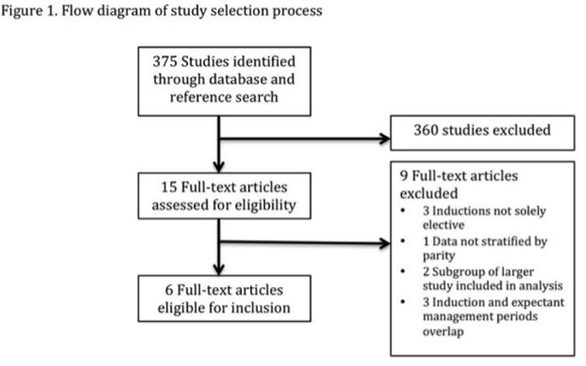

## タイトル
Elective induction of labor at 39 weeks compared with expectant management: a meta-analysis of cohort studies  
予期管理と比較した39週での選択的分娩誘発：コホート研究のメタアナリシス

## 著者/所属機関
William A. Grobman, MD, MBA, Northwestern University, IL  
Aaron B. Caughey, MD, PhD, Oregon Health & Science University, OR

## 論文リンク
https://doi.org/10.1016/j.ajog.2019.02.046

## 投稿日付
Published online: February 25, 2019  
Accepted: February 20, 2019  
Received in revised form: February 18, 2019  
Received: December 13, 2018

## 概要
### 目的
未経験の女性の39週での選択的分娩誘発を期待管理と比較した観察研究の系統的レビューを行い、選択的誘発と帝王切開分娩との関連性、ならびに他の母体および周産期の転帰を推定する。

### 研究デザイン
以下の場合にのみ、研究はこのメタアナリシスに適格であった。（1）観察的であった。（2）39週目に分娩誘発を受けている女性と、その妊娠期間を超えて期待される管理を受けている女性とを比較した。（3）39週目に他の分娩誘発の兆候がない場合にのみ、導入グループの女性を含めた。（4）未成年者の女性に関するデータを提供した。定義済みの主要転帰は帝王切開分娩であり、他の母体および周産期の罹患率を表す二次転帰も評価した。ランダム効果モデルを用いて、95％信頼区間でプールされた相対リスクを推定するために、さまざまな研究からの結果データが組み合わされました。

### 結果
最初の検索で同定された375件の研究のうち、39週で選択的な労働喚起を受けている66,019人の女性と期待される管理を受けている584,390人の女性を含む6つのコホート研究が選択基準を満たした。39週での分娩の選択的誘導は、帝王切開分娩の頻度の有意な低さ（26.4％対29.1％;相対リスク0.83; 95％信頼区間0.74–0.93）および周産期感染（2.8％対5.2）に関連していた％、相対リスク、0.53、95％信頼区間、0.39-0.72）。導入群の女性の新生児は呼吸器罹患率を有する可能性が低かった（0.7％対1.5％；相対リスク0.71； 95％信頼区間0.59-0.85）。胎便吸引症候群（0.7％対3.0％；相対リスク、0.49； 95％信頼区間、0.26-0.92）。新生児集中治療室への入院（3.5％対5.5％；相対リスクは0.80；信頼区間95％、0.72〜0.88）。周産期死亡率のリスクも低かった（0.04％対0.2％、相対リスク0.27、95％信頼区間、0.09-0.76）。

### 結論
6つのコホート研究のこのメタアナリシスは、妊娠期間を超えた期待管理と比較して39週での分娩の選択的誘導が、帝王切開分娩、母体周産期感染、および呼吸器疾患を含む周産期有害転帰のリスクの有意な低下と関連していた、集中治療室の入院、および死亡率。

### 図1

