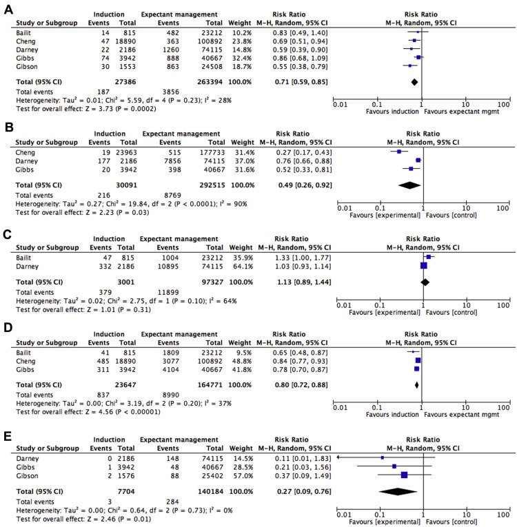

## タイトル
Elective induction of labor at 39 weeks compared with expectant management: a meta-analysis of cohort studies  
待機的管理と比較した39週での選択的分娩誘発：コホート研究のメタアナリシス

## 著者/所属機関
William A. Grobman, MD, MBA, Northwestern University, IL  
Aaron B. Caughey, MD, PhD, Oregon Health & Science University, OR

## 論文リンク
https://doi.org/10.1016/j.ajog.2019.02.046

## 投稿日付
Published online: February 25, 2019  
Accepted: February 20, 2019  
Received in revised form: February 18, 2019  
Received: December 13, 2018

## 概要
### 目的
39週の初産婦に対する待機的管理と比較した選択的分娩誘発の観察研究の系統的レビューを行い、選択的誘発と帝王切開の相関、ならびに他の母体および周産期の転帰を推定すること。

### 研究デザイン
* 本メタ分析では、初産婦で、他の分娩兆候がなく、39週で分娩誘発を受けた群と39週以降も待機的管理を受けている群を比較した。
* 主要評価項目は帝王切開であり、副次的評価項目は他の母体および周産期罹患率であった。
* ランダム効果モデルを用いて、95％信頼区間で相対リスクを推定するために、さまざまな研究からの結果データが組み合わされた。

### 結果
* 最初の検索で同定された375件の研究のうち、39週で選択的誘発を受けている66,019人の妊娠女性と待機的管理を受けている584,390人の妊娠女性を含む6つのコホート研究が選択基準を満たした。
* 39週での選択的誘発は、帝王切開の頻度および周産期感染の頻度が有意に低かった。
  * 帝王切開 26.4％ vs 29.1％; 相対リスク 0.83; 95％信頼区間 0.74-0.93
  * 周産期感染 2.8％ vs 5.2％; 相対リスク 0.53; 95％信頼区間 0.39-0.72
* 誘発群の新生児は、呼吸器関連の新生児罹患率、胎便吸引症候群、NICU入院、周産期死亡リスクは低かった。
  * 呼吸器疾患 0.7％ vs 1.5％; 相対リスク 0.71; 95％信頼区間 0.59-0.85
  * 胎便吸引症候群 0.7％ vs 3.0％; 相対リスク 0.49; 95％信頼区間 0.26-0.92
  * NICU入院 3.5％ vs 5.5％; 相対リスク 0.80; 95％信頼区間 0.72-0.88
  * 周産期死亡 0.04％ vs 0.2％; 相対リスク 0.27; 95％信頼区間 0.09–0.76

### 結論
39週での分娩の選択的誘導は、39週以降の待機的管理と比較して、帝王切開、周産期感染、および周産期有害転帰、NICU入院、周産期死亡のリスク低下と有意に関連していた。

### 図1 研究フロー

### 図2 結果

