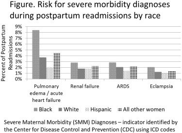

## タイトル
Maternal Outcomes by Race during Postpartum Readmissions  
産後再入院中の人種による母親の転帰

## 著者/所属機関
Aleha Aziz, MD MPH, Cynthia Gyamfi-Bannerman, MD MSc, Zainab Siddiq, MS, Jason D. Wright, MD, Dena Goffman, MD, Jean-Ju Sheen, MD, Mary E. D’Alton, MD, Alexander M. Friedman, MD MPH'Correspondence information about the author MD MPH Alexander M. FriedmanEmail the author MD MPH Alexander M. Friedman
Department of Obstetrics and Gynecology, College of Physicians and Surgeons, Columbia University, New York, NY

## 論文リンク
https://doi.org/10.1016/j.ajog.2019.02.016

## 投稿日付
Published online: February 17, 2019  
Accepted: February 5, 2019  
Received in revised form: February 2, 2019  
Received: November 10, 2018

## 概要
### 目的
分娩後の再入院中の重篤な合併症との人種の関連性を判断すること。

### 研究デザイン
この反復横断分析は、2012年から2014年までの医療費と利用プロジェクトからの全国（全国）入院患者サンプルを利用した。出産入院後の15〜54歳の分娩後再入院女性は、疾病管理予防センターの基準によって識別された。人種および民族性は、非ヒスパニック系白人、非ヒスパニック系黒人、ヒスパニック系、アジア系または太平洋諸島系、ネイティブアメリカン、その他、および不明として特徴付けられた。人種による再入院の全体的なリスクが決定された。人種による再入院中の重篤な母親の罹患率のリスクを分析した。肺水腫/急性心不全および脳卒中を含む個々の転帰も人種によって分析された。人口統計学、入院要因、および併存リスクを含む対数線形回帰モデルを使用して、産後再入院中の重篤な母親の罹患率のリスクを分析した。

### 結果
1130万人の出産のうち、2012年から2014年までの分娩後に入院した207,730人（1.8％）の女性が分析され、96,670人の白人、47,015人の黒人、および33,410人のヒスパニック系女性が含まれていた。非ヒスパニック系白人女性と比較して、非ヒスパニック系黒人女性は産後再入院のリスクが80％高かった（95％信頼区間（CI）79％〜82％）一方、ヒスパニック系女性は再入院のリスクが11％低かった（95％CI 10％〜12％）。調整されていない分析では、非ヒスパニック系白人女性と比較して、非ヒスパニック系黒人女性は、妊婦の重度の罹患率が27％高く（95％CI 24〜30％）、ヒスパニック系女性は10％低かった（95％CI 7〜13％）。調整モデルでは、非ヒスパニック系黒人女性は、非ヒスパニック系白人女性よりも再入院中の重度の母体罹患率のリスクが16％高かった（95％CI 10〜22％）一方、ヒスパニック系女性は7％低リスク（95％CI 1〜12％）であった。他の人種グループと非ヒスパニック系白人女性との間の深刻な母体罹患率リスクの差は有意ではなかった。全体的な罹患率に加えて、非ヒスパニック系黒人女性は、他の人種群よりも子癇、ARDS、および腎不全のリスクが有意に高かった（p<0.05 all）。黒人女性は、白人女性よりも肺水腫/急性心不全のリスクが126％高かった（95％CI 117〜136％）。

### 結論
黒人女性は、（i）分娩後に再入院する、（ii）再入院中に重篤な母親の罹患率を被る、および（iii）肺水腫/急性心不全などの生命を脅かす合併症を患う傾向が高かった。心血管系危険因子を有する黒人女性を含むリスクのある女性は、分娩後の短期追跡調査から恩恵を受ける可能性がある。

### 図

