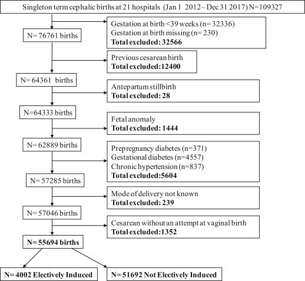

## タイトル
Maternal and newborn outcomes with elective induction of labor at term  
満期における選択的誘発実施による母子の転帰

## 著者/所属機関
Vivienne Souter, MDa,b,∗,'Correspondence information about the author MD Vivienne SouterEmail the author MD Vivienne Souter, Ian Painter, PhDa,b, Kristin Sitcov, BSb, Aaron B. Caughey, MD, PhDc  
a Department of Health Services, School of Public Health, University of Washington, Seattle, WA  
b Foundation for Health Care Quality, Seattle, WA  
c Department of Obstetrics & Gynecology, Oregon Health & Science University, Portland, OR

## 論文リンク
https://doi.org/10.1016/j.ajog.2019.01.223

## 投稿日付
Published online: February 01, 2019  
Accepted: January 21, 2019  
Received in revised form: January 8, 2019  
Received: November 9, 2018

## 概要
### 目的
妊娠39週以上で選択的誘発実施群と妊娠継続群の転帰を比較すること。

### 研究デザイン
* 2012年1月1日から2017年12月31日までの出生に関する病歴サマリーデータを使用して後ろ向きコホート研究。
* 妊娠39週0日から42週6日までの単胎妊娠に限定。
* 帝王切開の既往、出産タイプまたは出産時の妊娠週数の記録の欠如、分娩前死産、帝王切開、胎児奇形、妊娠糖尿病、および妊娠高血圧は除外された。
* 妊娠39週および40週における選択的誘発実施時の帝王切開での出生率と、同じ妊娠週数の他のすべての妊娠における出生率を比較した。
* 母体の転帰（器械分娩、肩甲難産、第3度または第4度の会陰裂傷、妊娠高血圧症、および産後出血）と新生児の転帰（巨人児、5分Apgar <7、分娩時の蘇生、挿管、呼吸器合併症、およびNICU入院）も、妊娠39週および40週の選択的誘発実施群と妊娠継続群とで比較した。
* ロジスティック回帰モデリングを用いて、母親の年齢およびBMIを調整しながら、転帰に対するオッズ比を算出した。
* 結果は出生時の初産/経産および妊娠期間によって層別化された。
* 入院期間（分娩まで、分娩後、およびトータル）を、選択的誘発実施群と妊娠継続群とで比較した。

### 結果
* 合計55694人の出生：39週以上で選択的誘発実施群が4002人、39週0日から42週6日の妊娠継続群が51692人。
* 初産婦では、妊娠39週での選択的誘発実施群は妊娠継続群との比較して、帝王切開の可能性の減少（14.7％vs23.2％、調整オッズ比0.61、95％信頼区間、0.41-0.89）および器械分娩による出生率の増加（18.5％vs10.8％、調整オッズ比、1.8; 95％信頼区間、1.28-2.54）と相関があった。
* 経産婦では、選択的誘発実施群と妊娠継続群の帝王切開による出生率は同程度であった。
* 妊娠39週での選択的誘発実施は、初産婦（2.2％vs7.3％、調整オッズ比0.28、95％信頼区間、0.11〜0.68）および経産婦（0.9％vs3.5％、調整オッズ比0.24、95％信頼区間、0.15〜0.38）における妊娠高血圧の可能性の低下と相関があった。
* 長期選択的誘発実施は、有害な新生児の転帰の増加とは相関がなかった。
* 妊娠39週での選択的誘発実施は、初産婦（1.3時間； 95％信頼区間、0.2〜2.3）と経産婦（3.4時間； 95％信頼区間、3.2〜3.6）の両方で入院から出産までの時間の増加と相関があった。

### 結論
妊娠39週での分娩の選択的誘発は、初産婦における帝王切開の減少、経産婦および初産婦における高血圧の減少、ならびに分娩時間の増加と関連していた。

### 図 研究フロー

