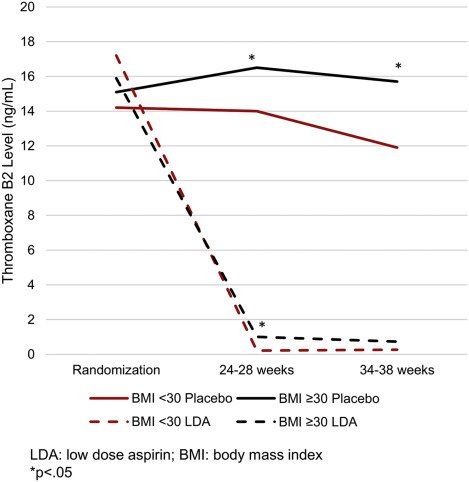

## タイトル
Obesity and laboratory aspirin resistance in high-risk pregnant women treated with low-dose aspirin  
低用量アスピリンで治療された高リスク妊婦における肥満と実験室アスピリン耐性

## 著者/所属機関
Matthew M. Finneran, MD'Correspondence information about the author MD Matthew M. FinneranEmail the author MD Matthew M. Finneran, Veronica M. Gonzalez-Brown, MD, Devin D. Smith, MD, Mark B. Landon, MD, Kara M. Rood, MD
Division of Maternal-Fetal Medicine, Department of Obstetrics and Gynecology, The Ohio State University College of Medicine, Columbus, OH

## 論文リンク
https://doi.org/10.1016/j.ajog.2019.01.222

## 投稿日付
Published online: February 17, 2019  
Accepted: January 21, 2019  
Received in revised form: January 14, 2019  
Received: November 12, 2018

## 概要
### 目的
LDAで治療された高リスク女性における血小板由来トロンボキサン阻害に対する肥満の関連を調査すること。

### 材料および方法
妊娠高血圧腎症のリスクが高い女性におけるLDA（60mg）投与の効果を調査する前向き多施設共同研究の二次分析である。母親の血清TXB2（TxA2の間接的測定値）レベルは、無作為化（妊娠13〜26週）、妊娠中期（無作為化後少なくとも2週間、妊娠24〜28週）、および妊娠後期（妊娠34～38週）の3時点で抽出した。無作為化時およびその後の少なくとも1時点でTXB2レベルが記録された場合、患者を分析に含めた。患者はBMIカテゴリーと治療群によって層別化された。TXB2レベルの中央値は、各時点で、ならびに完全なTXB2の割合で計算した。阻害（<0.01ng/mL）。多変量ロジスティック回帰分析を行って、母体年齢、人種、無作為化時の高リスク群、妊娠率、および妊娠16週未満の無作為化率について調整して、BMIカテゴリーによる完全なTxB2阻害のオッズ比（OR）を求めた。

### 結果
合計1002人の患者が分析に含まれ、それぞれ496人（49.5％）および506人（50.5％）がLDA群およびプラセボ群に含まれた。すべてのBMIカテゴリーにおいて、LD治療を受けた女性の間でTxB2レベルの大幅な減少があった。対照的に、プラセボに割り当てられた女性は、無作為化後のTXB2レベルの顕著な減少を示さず、肥満女性は、妊娠中期（16.5、四分位範囲[IQR] 8.0〜31.8vs14.0、IQR 6.9〜26.7、ng/mL; P＝0.032）と後期（15.7、IQR 7.6〜28.5vs11.9、IQR 4.6〜25.9、ng/mL; P＝0.043）の両方でより高い中央値TXB2レベルを示した。層別BMI LDAグループ間で比較すると、クラスIII肥満の女性は検出可能なTXB2レベルが妊娠中期（調整オッズ比[aOR]、0.33;信頼区間[CI]、0.15〜0.72）と後期（aOR、0.30； CI、0.11〜0.78）、および両方（aOR、0.09； CI、0.02〜0.41）の時点で最も低かった。

### 結論
妊娠高血圧腎症の予防のためにLDAを受けている高リスクの肥満女性は、TXB2の完全な阻害率が低い。これらのデータは、この集団ではアスピリンの投与量または頻度の増加が必要であることを示唆している。

### TxB2 levels were drawn at 3 time points

