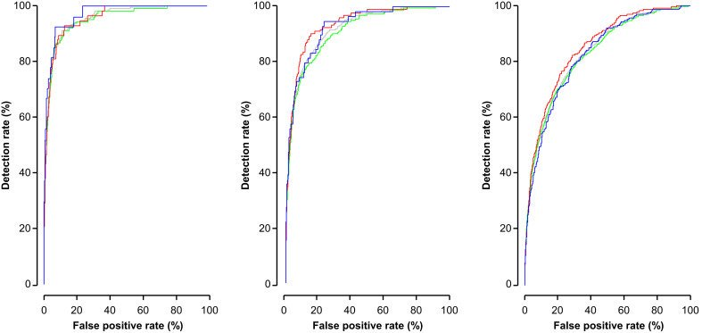

## タイトル
Prediction of imminent preeclampsia at 35–37 weeks gestation  
妊娠35〜37週での差し迫った妊娠高血圧腎症の予測

## 著者/所属機関
Anca Ciobanu, MD a, Alan Wright, PhD b, Anca Panaitescu, MD a, Argyro Syngelaki, PhD a, David Wright, PhD b, Kypros H. Nicolaides, MD a,  
a Harris Birthright Research Centre for Fetal Medicine, King’s College, London, UK  
b Institute of Health Research, University of Exeter, Exeter, UK

## 論文リンク
https://doi.org/10.1016/j.ajog.2019.01.235

## 投稿日付
Published online: February 07, 2019  
Accepted: January 30, 2019  
Received in revised form: January 22, 2019  
Received: December 22, 2018

## 概要
### 目的
胎盤成長因子単独または可溶性Flt-1 /胎盤成長因子比におけるパーセンタイルカットオフの使用
と競合するリスクモデルの間で、35w0d〜36w6dでの評価後2週目および4週目に妊娠高血圧腎症を伴う出産スクリーニングのパフォーマンスを比較すること。

### 研究デザイン
* 英国の2つの産科病院で妊娠35週0日〜36週6日の定期的な通院の患者を対象とした前向き観察研究。
* 母体の人口統計学的特徴および病歴の記録、ならびに血清胎盤増殖因子および可溶性Flt-1および平均動脈圧の測定が含まれた。
* ROC AUCを用いて妊娠高血圧腎症の性能予測を胎盤成長因子単独によるスクリーニングの評価、および母性因子、胎盤増殖因子、可溶性Flt−1、および平均動脈圧（トリプルテスト）の組み合わせを用いた以前に開発された競合リスクモデルのそれとの可溶性Flt-1 /胎盤成長因子比の評価から≦2週間および≦4週間後の分娩と比較した。

### 結果
* 15,247の妊娠のうち、326人（2.1％）がその後に妊娠高血圧腎症を経験した。
* 評価から2週間および4週間以下の妊娠高血圧腎症を伴う分娩のスクリーニングにおいて、トリプルテストの成績は、胎盤成長因子単独または可溶性Flt-1 /胎盤成長因子比よりも優れていた。
* トリプルテスト（0.975; 95％信頼区間、0.964〜0.985）によるスクリーニングにおける2週間以下の妊娠高血圧腎症のROC AUCは、胎盤増殖因子単独（0.900; 95％信頼区間、0.866-0.935; P <0.0001）および可溶性Flt-1 /胎盤増殖因子比（0.932; 95％信頼区間、0.904-0.960; P = 0.0001）よりも高かった。
* トリプルテスト（0.907; 95％信頼区間、0.886-0.928）によるスクリーニングで4週間以下の妊娠高血圧腎症のROC AUCは、胎盤増殖因子単独（0.827; 95％信頼区間、0.800-0.854; P <0.0001）または可溶性Flt-1 /胎盤増殖因子比（0.857; 95％信頼区間、0.830-0.883; P <0.0001）よりも高かった。
最大で20-30％のスクリーニング陽性率、トリプルテストで達成された2週間以下および4週間以下の妊娠高血圧腎症を伴う出産の検出率は、可溶性Flt-1 /胎盤増殖因子比より約10％、胎盤成長因子単独よりも20％高かった；負の予測値は3つのテストで同様であった。

### 結論
妊娠35週0日〜36週6日において、競合リスクモデルによる妊娠高血圧腎症の切迫早産のスクリーニングの成績は、胎盤成長因子単独または可溶性Flt-1/胎盤成長因子比よりも優れている。

### 図

