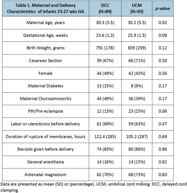

## タイトル
Premature Infants Receiving Cord Milking or Delayed Cord Clamping: A Randomized Controlled Non-inferiority Trial  
臍帯ミルキングまたは遅延臍帯クランプを受けている未熟児：無作為化対照非劣性試験

## 著者/所属機関
Anup C. Katheria 1, Frank Reister 2, Helmut Hummler 2, Jochen Essers 2, Marc Mendler 2, Giang Truong 3, Shareece Davis-Nelson 3, Akila Subramaniam 4, Wally Carlo 4, Toby Debra Yankowitz 5, Hyagriv Simhan 5, Stacy Beck 5, Joseph Kaempf 6, Mark Tomlinson 6, Georg Schmolzer 7, Radha Chari 7, Eugene Dempsey 8, Keelin O’Donoghue 8, Shazia Bhat 9, Matthew Hoffman 9, Arji Faksh10, Yvonne Vaucher 1, Jeff Szychowski 4, Gary Cutter 4, Michael Varner 11, Neil Finer 12  
1 Sharp Mary Birch Hospital for Women & Infants, San Diego, CA,  
2 University of ULM, ULM, Baden-Wurttemberg, Germany,  
3 Loma Linda University Children’s Hospital, Loma Linda, CA,  
4 University of Alabama, Birmingham, AL,  
5 Magee-Womens Hospital, Pittsburgh, PA,  
6 Providence St. Vincent Medical Center, Portland, OR,  
7 University of Alberta, Edmonton, Alberta, Canada,  
8 Cork University Maternity Hospital, Cork, Ireland,  
9 Christiana Care, Newark, DE,  
10 Sharp Healthcare, San Diego, CA,  
11 University of Utah, Salt Lake City, UT,  
12 University of California San Diego, San Diego, CA

## 論文リンク
https://doi.org/10.1016/j.ajog.2018.12.004

## 投稿日付
February 14, 2019

## 概要
### 目的
臍帯ミルキング（UCM）の未熟児に対する安全性を調査すること。

### 研究デザイン
* 妊娠23-31週の早産児を対象とした多国籍無作為化対照非劣性試験。
* 乳児は、出産方法および妊娠週数、少ない週数（23-27週）および多い週数（28-31週）に分類され、UCMまたは遅延臍帯クランプ（DCC）のいずれかに無作為に割り当てられた。
* 除外 - 主要な先天性異常、重度の胎盤剥離、胎盤が原因の帝王切開？、臍帯脱出、胎児水腫、胎盤血腫、一絨毛膜性双胎、分娩時の母児の重度の感染リスク、および24ヶ月の神経発達検査に戻る可能性が低い場合。
* 複合主要転帰には、重度の脳室内出血（IVH、重度はグレード3以上を定義）または全群の死亡（23-31週）が含まれた。

### 結果
* 2017年6月-2018年8月に474人の児が登録された。
* 死亡または重度のIVHの発症は、DCC群 19/238（8％）、UCM群 28/236（12％）であった（p＝0.16）。
* 群間で死亡数に違いはなかったが、重度のIVHの発生率は、UCM群の少ない週数でより高かった（22％ vs 4％、p＝0.0007）。
* 暫定的な評価の後、効果安全性評価委員会（DSMB）は、少ない週数でUCMに無作為に割り当てられた児における重症IVHの増加の安全性の転帰に基づいて募集を中止することを推奨した。
* この層では、母体と出産方法に違いはなかった（表1）。
* 少ない週数での新生児転帰を表2に示す。

### 結論
* 超未熟児においては、UCM後に重度のIVHのリスクが高まった。
* 妊娠23-27週の児へのUCMの実施を中止することを検討するべきである。

### 表1 23-27週の児の母体、および分娩の特徴

### 表2 分娩室？および新生児転帰（23-27週）

