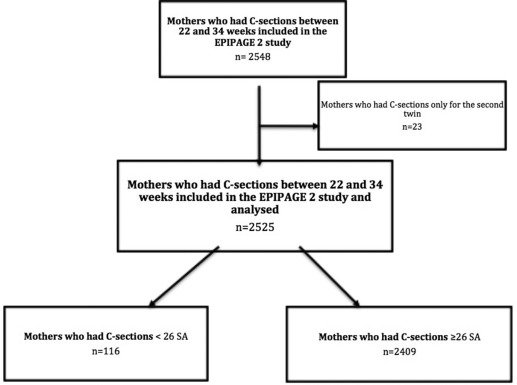

## タイトル
Association between gestational age and severe maternal morbidity and mortality of preterm cesarean delivery: a population-based cohort study  
pretermの帝王切開と重篤な母体罹患率および死亡率との関連：集団ベースのコホート研究

## 著者/所属機関

## 論文リンク
https://doi.org/10.1016/j.ajog.2019.01.005

## 投稿日付
Published online: January 09, 2019  
Accepted: January 2, 2019  
Received in revised form: December 12, 2018  
Received: September 27, 2018

## 概要
### 目的
妊娠26週未満の妊娠期間（26週）が26〜34週の帝王切開分娩と比較してpretermの帝王切開分娩の重度の母性罹患率および死亡率（SMMM）と関連しているかどうかを評価すること。

### 材料および方法
EtudeEpidémiologiquesur les petitsâgesgestationnels（EPIPAGE）2は2011年の早期出産に関する全国前向き集団ベースのコホート研究である。  
帝王切開分娩が22週から34週の母親、ただし双胎の第2子のみの帝王切開を受けた母親および妊娠中絶を受けた母親は除外しました。  
SMMMは、以下の合併症のうちの少なくとも1つの発生として定義される複合エンドポイントとして分析された：輸血の使用によって定義される重度の産後出血、集中治療室入院、または死亡。  
26週未満の妊娠期間とSMMMの関連を評価するために、我々は多変量ロジスティック回帰と傾向スコアマッチングアプローチを使用した。

### 結果
早期帝王切開分娩を受けた2525人の女性のうち、26週前に116人、26週と34週の間に2409人が、407人（14.4％）がSMMMを受けた。  
SMMMは、妊娠26歳未満の31人の母親（26.7％）対26〜34週間の376人（14.2％）で発生した（P  ＜0.001）。  
クラスター多変量ロジスティック回帰は、26週未満の妊娠期間とSMMMとの間に有意な関連性を示し（調整オッズ比[aOR]、2.50; 95％信頼区間[CI]、1.42-4.40）、傾向スコアマッチング分析はこれらの結果と一致していた（aOR、2.27、95％CI、1.31-3.93）。

### 結論
産科医は26週前に帝王切開分娩に関連したより高いSMMMについて知り、この知識を帝王切開分娩に関する決定に統合し、そして関連する合併症を管理する準備をするべきである。

### 図1

