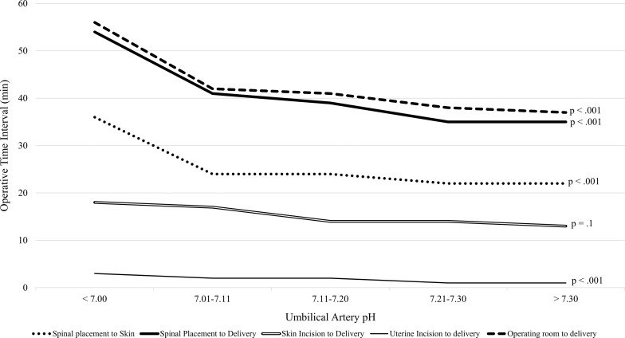

## タイトル
Time from neuraxial anesthesia placement to delivery is inversely proportional to umbilical arterial cord pH at scheduled cesarean delivery  
神経軸麻酔の留置から分娩までの時間は予定帝王切開分娩時の臍帯血帯pHに反比例する

## 著者/所属機関

## 論文リンク
https://doi.org/10.1016/j.ajog.2019.01.006

## 投稿日付
Published online: January 09, 2019  
Accepted: January 2, 2019  
Received in revised form: December 18, 2018  
Received: September 4, 2018

## 概要
### 目的
我々は、予定期間の帝王切開での出産前の時間間隔に従って新生児臍帯動脈のpHを評価しようとしました。

### 研究デザイン
我々は、2014年9月から2017年2月の間に帝王切開分娩の後ろ向きコホート研究を行った。  
脊髄麻酔下で37〜41週間の予定帝王切開分娩を受けている安心の術前非ストレステストを受けたシングルトン妊娠が含まれた。  
手術室への入室、脊椎麻酔の配置、皮膚切開、子宮切開、および分娩の間の時間間隔を計算した。  
主な結果は臍帯動脈のpHでした。  
人口統計学的データ、母体の血圧、出産前の時間間隔、出産の結果は、臍帯動脈のpH間隔<7.0、7.01–7.10、7.11–7.20、7.21-7.30、および> 7.30に従って分析された。  
臍帯ガス分析物および新生児の転帰は、出産までの時間によって脊髄によって分析された。  
臍帯動脈pHの低下の予測因子を同定するために段階的線形回帰を行った。  
受信者 - 操作者特性曲線は、脊髄から分娩までの時間および臍帯動脈のｐＨ ＜７．０および７．１について計算された。

### 結果
527人の参加者のうち、臍帯動脈のpHの中央値は7.27 [四分位範囲、7.23〜7.29]、ボディマス指数は35 kg / m 2 [四分位範囲、30〜41]であった。  
母体体格指数と低血圧エピソードの両方は臍帯動脈のpHの低下とともに増加した（P <0.001、P <.02）。  
臍帯動脈のpH間隔が短くなるにつれて、すべての配達前の時間間隔（配達までの手術室、皮膚への脊椎、配達までの脊椎、および配達までの子宮切開）は増加した（P<0.05（すべての場合）。  
段階的線形回帰では、交絡変数を制御した後の臍帯動脈pHの低下は、母体のボディマスインデックス、非頭部症状、出産間隔から子宮切開までの間隔、およびベースラインからの血圧の最大低下によって予測された（F [5,442] 〕= 17.7、P  = 0.0001]、調節R 2納期に脊髄により評価0.157の、両方の臍動脈および静脈pHおよび二酸化炭素の分圧が（減少P <全てについて0.001）が、しかし塩基欠乏と新生児の転帰は類似していた（P全て≧0.7）。  
低酸素性虚血性脳症の2例があった（0.38％）。  
受診者動作特性曲線は、２７分を超える脊髄分娩開始時間が臍帯動脈ｐＨ ＜７．１（曲線下面積、０．７４、１００％感度、２１％特異性）および３０を超える間隔と関連していることを実証した。  
分は臍帯動脈ｐＨ ＜７．０（曲線下面積、０．８０、１００％感度、３３％特異性）と関連した。

### 結論
出産までの期間と子宮切開 - 出産までの期間が長いほど、予定期間の帝王切開での臍帯動脈pHの低下と関連していた。  
脊椎配置後の分娩前の時間を最小限に抑える努力は、予期しない新生児の酸血症の頻度を減らすことができます。

### 図1

