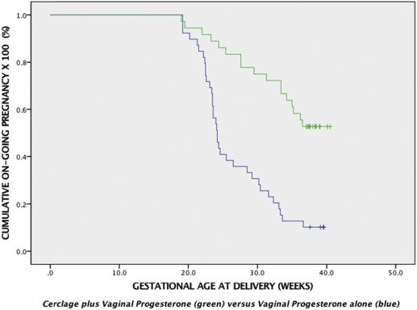

## タイトル
Cervical cerclage for singleton pregnant patients on vaginal progesterone with progressive cervical shortening  
進行性頸部短縮を伴うプロゲステロン製剤を投与している単胎妊娠患者に対する頸椎縫縮術

## 著者/所属機関
Christopher A. Enakpene, MDa,b,∗,'Correspondence information about the author MD Christopher A. EnakpeneEmail the author MD Christopher A. Enakpene, Laura DiGiovanni, MDa,b, Tiffany N. Jones, MD, MSb,d, Megan Marshalla, BScb, Dimitrios Mastrogiannis, MD, MBA, PhDc, Micaela Della Torre, MD, MSa,b

## 論文リンク
https://doi.org/10.1016/j.ajog.2018.06.020

## 投稿日付
Published online: July 12, 2018  
Accepted: June 26, 2018  
Received in revised form: June 11, 2018  
Received: February 19, 2018

## 概要
### 目的
プロゲステロン製剤の投与が（1）早産全体の自然分娩率の低下、（2）妊娠期間の延長、および（3）プロゲステロン製剤単独と比較した新生児転帰の改善を判断すること。

### 研究デザイン
子宮頸管長<20 mmのプロゲステロン製剤を投与した単胎妊娠のすべての女性を対象とした後ろ向きコホート研究。2013年1月から2016年12月に出産された頸管長が<10 mmの患者のみが含まれた。頸管縫縮術の実施は医師の判断に基づいて決定された。人口統計データ、連続した子宮頸管長状態に関する情報、病歴、出産歴および社会的背景、頸管縫縮の実施の有無、そして新生児の転帰を比較した。

### 結果
プロゲステロン製剤を投与している子宮頸管長が短い合計310人の女性が確認され、そのうち75人は進行性短縮頸管長<10 mmの基準を満たした。子宮頸管長が<10 mmの女性のうち、36人（48％）が子宮頸管縫縮術＋プロゲステロン製剤投与を受け、39人（52％）がプロゲステロン製剤単独を続けた。ベースライン特性、平均子宮頸管長（5.06 mm vs 5.52 mm）、および短い子宮頸管の診断時の平均妊娠週数（21週5日vs21週3日）は、縫縮術を受けた女性と受けなかった女性とでそれぞれ同様であった。出産時の平均在胎週数は、子宮頸管縫縮術患者の方が有意に高かった（34週3日vs27週2日；P<0.001）。37、35、32、28、および24週未満の早産の割合は、子宮頸管縫縮術群で有意に低かった：44.1％vs84.2％、38.2％vs81.6％、23.5％vs78.9％、14.7％vs63.2％ 、および11.8％vs39.5％。37週未満の早産の自然発生率は交絡因子をコントロールした後も有意なままであった（相対リスク、0.11；95％信頼区間、0.03–0.41；P<0.001）。平均妊娠遅延期間は、プロゲステロン製剤単独群と比較してプロゲステロン製剤と子宮頸管縫縮術を組み合わせた群で14週であった。NICUの入院および呼吸窮迫症候群の発症は、プロゲステロン製剤単独群と比較して、縫縮術群で有意に低かった：13（36.1％）vs23（65.7％）（相対リスク0.55、95％信頼区間、0.34-0.90）；P＝0.018）と8（22.2％）vs17（43.6％）（相対リスク0.59、95％信頼区間、0.29-0.90、P＝0.027）。縫縮術を受けた女性の新生児もまた、壊死性腸炎を発症する、または新生児死亡を経験する可能性は有意に低かった。

### 結論
子宮頸管長が極端に短い女性における頸管縫縮術＋プロゲステロン製剤が、全体的な早産の割合、妊娠期間の延長を2倍、そして新生児の全体的な罹患率と死亡率を著しく減少させることを示した。

### 図

