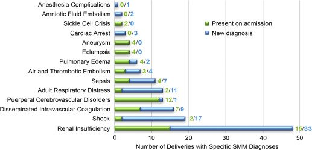

## タイトル
Contribution of hypertension to severe maternal morbidity  
重度の母体罹患率に対する高血圧の寄与

## 著者/所属機関
Jane Hitti, MD∗,'Correspondence information about the author MD Jane HittiEmail the author MD Jane Hitti, Laura Sienas, MD, Suzan Walker, RN, Thomas J. Benedetti, MD, MHA, Thomas Easterling, MD
Department of Obstetrics/Gynecology, University of Washington Medical Center, Seattle, WA

## 論文リンク
https://doi.org/10.1016/j.ajog.2018.07.002

## 投稿日付
Published online: July 15, 2018  
Accepted: July 2, 2018  
Received in revised form: June 29, 2018  
Received: March 2, 2018

## 概要
### 目的
地域の周産期の紹介センターにおける、高血圧障害と重度の母体罹患率との関連を評価すること。

### 研究デザイン
後ろ向き横断研究。
重症の特徴を有する妊娠高血圧腎症の女性は、正常血圧の女性と比較してより高い割合の重度の母性罹患率を有すると仮定した。
入院中に発生したもの以外に、入院前から存在していた重度の母体罹患率診断の割合も評価した。
ワシントン大学メディカルセンターを受診した7025人の女性全員について、重度の母体罹患率と診断（例、腎不全、ショック、敗血症）および治療（例、輸血および子宮摘出術）の割合を評価した。
重度の母体罹患率は、事前に指定された国際疾病分類診断および手順コードから決定された。
全ての診断はチャートレビューによって確認された。
Vizient大学保健システムコンソーシアムによって提供された病院管理データを介して各診断について入院時の割合を計算した。
母親の人口統計学的および臨床的特徴を、重度の母親の罹患率の有無にかかわらず女性について比較した。
カイ2乗統計的有意性を決定するためにフィッシャーの直接確率検定を使用した。
母親の人口統計学的および臨床的特徴と重度の母親の罹患率との間の関連について、オッズ比および95％信頼区間が計算された。

### 結果
7025分娩中、284症例（4％）が重度の母体罹患率を示した。
154人が輸血のみを受け、27人が他の処置を受け、103人の女性が149の重症の罹患率診断を受けた（26人の女性が複数の診断を受けた）。
重度の妊娠高血圧腎症が438例の出産で発生した（6.2％）。
特に、高血圧は用量依存的に重度の母体罹患率と関連しており、重度の妊娠高血圧腎症と最も強い相関が観察された（オッズ比、5.4；95％信頼区間、3.9〜7.3）。
重度の母体罹患率はまた、重度ではない妊娠高血圧腎症、慢性高血圧、早産、妊娠前糖尿病、および多胎妊娠と有意に関連していた。
重度の母体罹患率を有する女性では、早産の3分の1以上が母親の高血圧と関連していた。
アメリカインディアン/アラスカ先住民の女性は、他の人種/民族グループと比較して、有意に高い重度の母体罹患率を示した（11.7％vs白人:3.9％、P<0.01）。
全体として、39.6％の重度の母体罹患率診断が入院時に存在していた。

### 結論
妊娠中の高血圧障害は用量依存的な関係で重度の母体罹患率と強く相関しており、母体罹患率の上昇に対処するための戦略には高血圧の早期認識と管理が含まれるべきであることを示唆している。
高血圧に焦点を当てた予防戦略は、医学的に指示された早産にも影響を与える可能性がある。
ワシントン州の恵まれない人口であるアメリカインディアン/アラスカ先住民の女性の間での深刻な母体罹患率の増加の発見は、社会経済的要因が不利な母体の健康転帰に果たす可能性があるという役割を強調している。
重度の母体罹患率の診断の39％が入院前から存在していたので、病院間の比較のための品質測定基準として使用される場合、この測定値はリスク調整されるべきである。

### 図

