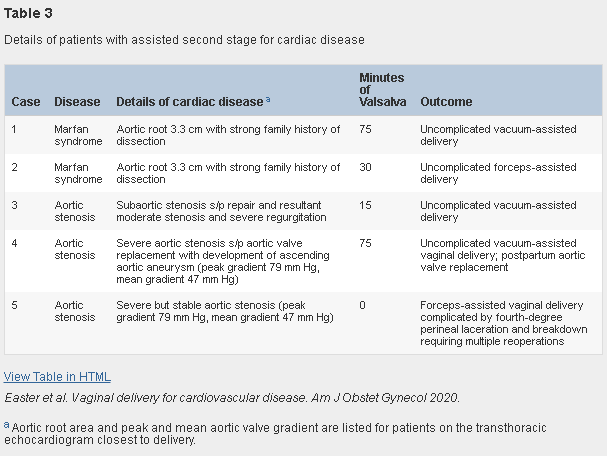

## タイトル
Planned vaginal delivery and cardiovascular morbidity in pregnant women with heart disease  
心臓病の妊婦における計画的経膣分娩と心血管の罹患率

## 著者/所属機関

## 論文リンク
https://doi.org/10.1016/j.ajog.2019.07.019

## 投稿日付
Published online:July 13, 2019  
Accepted:July 10, 2019  
Received in revised form:June 30, 2019  
Received:April 9, 2019

## 概要
バックグラウンド
産科適応のための妊娠予備帝王切開での心血管疾患の管理に関するコンセンサスガイドラインはありますが、このアプローチをサポートするデータは不足しています。

### 目的
経膣分娩試行または予定帝王切開によって、心血管疾患の女性における心血管と産科の罹患率を比較すること。

### 研究デザイン
* 2011年9月～2016年12月に、プロトコル化された心血管疾患の管理手法を用いて、三次医療施設(大学)で出産する女性の前向きコホート研究。  
* 帝王切開の産科的徴候がない限り、心血管疾患の女性の経腟分娩を推奨。
* 経膣分娩を試行する女性で、分娩第2期にいきんで血行動態や症状が変化した場合に器械分娩を提供できる場合は、バルサルバの実施を許可。
* 予定された分娩様式(経腟、または帝王切開)で分類。
* 単変量解析を使用して、予定された分娩様式に従って有害転帰を比較。
* 主要転帰は、持続性不整脈、心不全、心停止、脳血管障害、心臓手術または介入の必要性、または死亡。
* 産科および新生児の結果も考慮された。

### 結果
* 同意を得た276人の妊娠24週以上の女性。
  * 先天性心疾患（68.5％）
  * 不整脈（11.2％）
  * 結合組織病（9.1％）
  * 心筋症（8.0％）
  * 弁膜症（1.4％）
  * 血管性心疾患（1.8％）
* 分娩様式
  * 経腟分娩試行：76％（n = 210）
  * 予定帝王切開：24％（n = 66）
  * 経腟分娩試行の女性は、左室流出路閉塞、多産、および早産の割合が低かった。
  * 経腟分娩試行のすべての女性にバルサルバが許可された。
* 経膣分娩試行の女性の86.2％（n = 181）が成功
  * うち9.5％で器械分娩
  * 5人(下表)は、別の産科的徴候なしに、心血管疾患の徴候のために器械分娩を受けた。
    * 4人は、出産前15～75分でバルサルバを実施。
* 有害な心イベントは、経膣分娩試行群と予定帝王切開群で類似していた（4.3％ vs 3.0％、P = 1.00）。
* 以下イベントは経腟分娩試行群で低かった。
  * 産後出血（1.9％ vs 10.6％、P < .01）
  * 輸血（1.9％ vs 9.1％、P = .01）
* コホート全体またはハイリスク心血管疾患または産科合併症のハイリスク女性のサブセットにおいて、有害な心臓、産科、または新生児の転帰に差はなかった。

### 結論
本研究の結果から、帝王切開が心血管系の有害転帰を減少させず、ハイリスク疾患を含む心血管系疾患を有する女性の大多数の経腟分娩試行を支持することを示唆している。

### 表 

