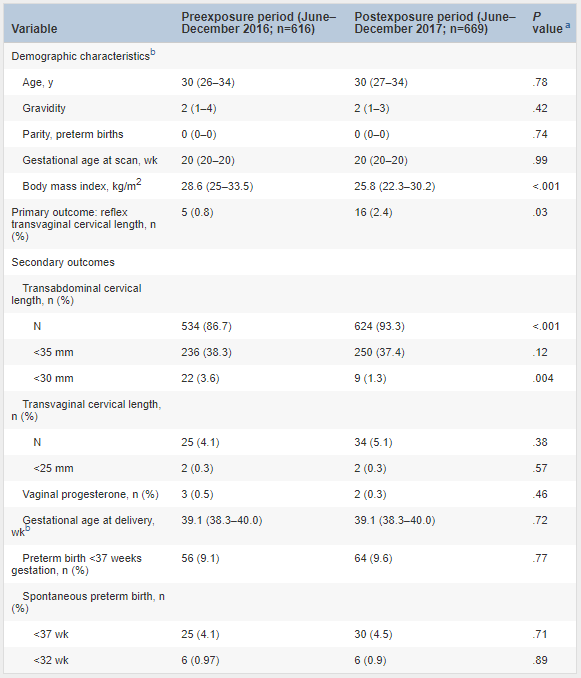

## タイトル
Transvaginal ultrasound is superior to transabdominal ultrasound in the identification of a short cervix  
経膣超音波検査は、短い子宮頸管長(short cervix)の同定において経腹部超音波検査よりも優れています

## 著者/所属機関

## 論文リンク
https://doi.org/10.1016/j.ajog.2019.05.051

## 投稿日付
Published online:June 07, 2019

## 概要
### 目的
普遍的な経腹部頸部長（TACL）スクリーニングの実施の有効性を低下させる可能性のある技術的な制限を評価すること。

### 研究デザイン
妊娠16週0～23週6の単胎妊娠の横断研究を行いました。  
適格な患者を、自然早産の伝統的な危険因子を伴わない単胎妊娠の患者と定義しました。  
暴露前期間（2016年6月～12月）では、反射経膣スキャンのプロトコルなしでTACLが実行されました。  
曝露後期間（2017年6月～12月）では、ルーチンTACLはソールらによって記載された方法に従って実施した、TACLの測定値が30 mm未満の場合、または経腹ビューが制限されている場合は、反射経腹部頸部長（TVCL）超音波スキャンを実施しました。  
主要な結果は、反射型TVCL超音波スキャンの割合であり、これは短縮または準最適TACLの疑いに応じて実行されるTVCL超音波スキャンとして定義されました。  
二次転帰には、TACL <30 mmの数とさまざまな産科転帰が含まれていました。  
6人の超音波検査技師が再現性研究に参加しました。  
この研究では、クラス間相関係数を計算して、TACL測定の評価者間および評価者内の一致を評価しました。  

### 結果
完全なデータは、曝露前群の616人の患者と曝露後グループの669人の患者で利用可能でした。  
ボディマス指数にわずかな差がありましたが、人口統計に他の違いはなかった（表）。
* 曝露前：中央値、28.6 kg/m2 \[四分位範囲、25.0〜33.5 kg/m2 \]
* 曝露後：中央値、25.8 kg/m2 \[四分位範囲、22.3〜30.2 kg/m2 \] ; P <.001

曝露後群では、34人の患者（5.1％）が経膣超音波スキャンを受けました。  
経膣スキャンのほぼ半分（16/34; 47.1％）は反射的に行われました。  
TACL <30 mmのために9回のスキャンが実行され、7回のスキャンはTACLランドマークの不十分な視覚化によるものでした。  
他の経膣スキャンは、定期的な産科的適応（胎盤評価など）のために実施されました。  
暴露後群の2人の患者（0.3％）のみがTVCL <25 mmであることが判明した。  
二次結果に違いはありませんでした。  
TACL測定のクラス内相関係数は0.15（95％信頼区間、0.04–0.45）でした。  
被験者内分散は0.11（95％信頼区間、0.10〜0.13）でした。

### 表 患者の人口統計学的特性と選択の結果

aカイ二乗検定またはフィッシャーの正確検定（カテゴリデータ）およびウィルコクソンのランクサム検定（ノンパラメトリック連続データの場合）  
bデータは中央値（25〜75パーセンタイル）で示されます。

### 結論
子宮頸部の長さのスクリーニングは、早産を減らすために膣プロゲステロンまたは他の介入による治療を実施するために重要です。  
ユニバーサルTVCLスクリーニングと比較して、TACLスクリーニングプログラムは、経膣スキャンの頻度を大幅に削減しました。  
ただし、TACLスクリーニングでは、予想よりも短い子宮頸部の症例が少なく、TACL測定の再現性が低かった。  
この研究は、多くの短いサービスが見落とされており、TACL測定のクラス内相関係数の低さが説明の可能性が高いことを強調しています。  

TACLスクリーニングを調査するほとんどの研究は、経膣超音波スキャンを同時に実施し、経腹部スキャンに関連する課題を強調しています。  
これらの研究は、現実のシナリオではなく、理想的な条件でのテストパフォーマンスに焦点を合わせました。  
したがって、本研究では、臨床診療で30 mmのカットオフポイントを使用したユニバーサルTACLスクリーニングの影響に関する情報を提供し、その結果はTACLスクリーニングの有効性を低下させる技術的限界に関する重要な疑問を提起します。  
TACLスクリーニングをサポートする説得力のあるデータが得られるまで、ユニバーサルTACLスクリーニングの主な利点は、高リスク患者の特定ではなく経膣スキャンの回避である可能性を検討するようプロバイダーに要請します。
