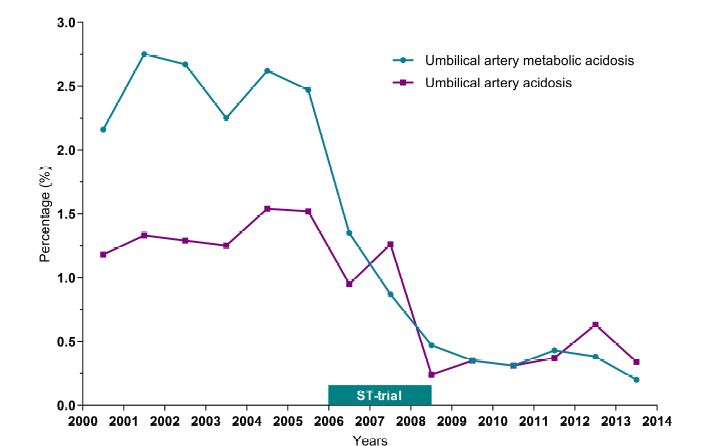

## タイトル
Significant reduction in umbilical artery metabolic acidosis after implementation of intrapartum ST waveform analysis of the fetal electrocardiogram  
胎児心電図の分娩時ST波形解析の実施後の臍帯動脈代謝性アシドーシスの有意な減少

## 著者/所属機関
Anadeijda J.E.M.C. Landman, Ms, MD 1, Saskia T. Immink-Duijker, Ms, MSc 1, Eduard J.H. Mulder, MSc, PhD 1, Maria P.H. Koster, MD, PhD 1, Serena Xodo, Ms, MD 2, Gerard H.A. Visser, MD, PhD 2, Floris Groenendaal, MD, PhD 3, Anneke Kwee, MD, PhD 2  
1 Department of Obstetrics and Gynecology, Wilhelmina Children’s Hospital, University Medical Center Utrecht, Utrecht University, Utrecht The Netherlands  
2 Department of Obstetrics, Wilhelmina Children’s Hospital, University Medical Center Utrecht, Utrecht University, Utrecht, The Netherlands  
3 Department of Neonatology, Wilhelmina Children’s Hospital, University Medical Center Utrecht, Utrecht University, Utrecht, The Netherlands

## 論文リンク
https://doi.org/10.1016/j.ajog.2019.02.049

## 投稿日付
Published online: March 01, 2019  
Accepted: February 22, 2019  
Received in revised form: January 17, 2019  
Received: May 14, 2018

## 概要
### 目的
2000年から2013年までの胎児心電図のST波形解析の実施後の周産期介入の頻度および有害な新生児転帰の変化を評価すること。

### 研究デザイン
* 三次施設で行われた後ろ向き縦断研究。
* 総計19,664人の中等度および高リスクの、単胎妊娠、頭位、妊娠36週以上、および経膣分娩を対象とした。
* 胎児心電図のST波形解析は2000年に実施され、2010年までにすべての分娩がこの技術を用いて監視された。
* 以下の周産期転帰に関するデータを収集した：  
  児頭採血、分娩様式、臍帯血ガス、アプガースコア、新生児脳症および周産期死亡。
* CTG単独、または胎児心電図のST波形分析と組み合わせてモニターされたすべての分娩における経時的変化を検出するために、長期傾向を分析した。
* ロジスティック回帰を使用して交絡因子を修正した。

### 結果
* 臍帯動脈代謝性アシドーシス率は2.5％（2000＋2001＋2002年の平均率）から0.4％（2011年＋2012年＋2013年の平均）に低下した（p<0.001、84％減少）。
* 2006年から2008年の間（胎児心電図ST波形解析の無作為化試験中）に大きく減少した。
* 現時点では、20％の分娩が監視対象となっている。
* 児頭採血率に有意な減少が見られた（p<0.001）。
* 全体的な帝王切開および器械分娩は有意に減少した（p<0.001）が、胎児仮死は減少しなかった。
* Apgarのスコアに変化はなかった。
* 新生児脳症の発生率は有意に低かった（OR 0.39、95％CI 0.17-0.89）。

### 結論
* 2000年から2013年にかけて、臍帯動脈代謝性アシドーシスの発生率が減少した。
* さらには、新生児脳症発生率、児頭採血率、ならびに帝王切開および器械分娩の総数が有意に減少した。

### 図

