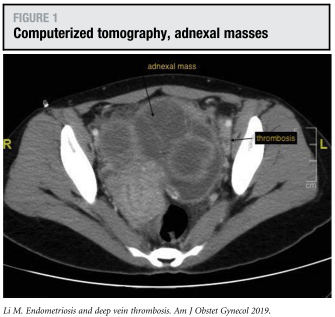
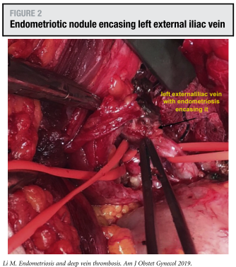
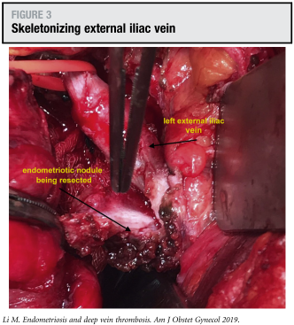
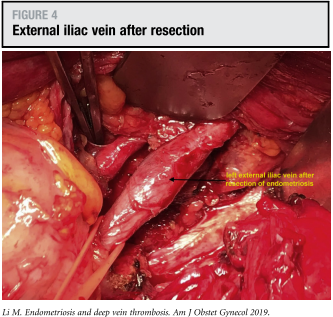

## タイトル
A rare case of endometriosis invading external iliac vein causing deep vein thrombosis  
深部静脈血栓症をきたした外腸骨静脈に浸潤した子宮内膜症のまれな症例

## 著者/所属機関
Ma Li, MD, MRCOG, FACOG'Correspondence information about the author MD, MRCOG, FACOG Ma LiEmail the author MD, MRCOG, FACOG Ma Li, Kailun Chen, MBBS, Yoke Fai Fong, MRCOG, FRANZCOG
Department of Obstetrics and Gynecology, National University Hospital, Singapore

## 論文リンク
https://doi.org/10.1016/j.ajog.2018.05.022

## 投稿日付
Published online: May 30, 2018  
Accepted: May 22, 2018  
Received in revised form: May 16, 2018  
Received: May 8, 2018

## 概要
25歳の未産婦は、3日間の発熱、下腹部の痛み、および息切れを示した。身体検査では、14週間の大きさの骨盤内腫瘤があった。CTスキャンでは、左外腸骨静脈の圧迫と両側血栓を示唆する静脈内の低密度が両側多室性付属器腫瘤が認められた（図1）。

  
図1 CT、付属器腫瘤

治療用量のエノキサパリンを1日2mg/kgで開始し、下大静脈フィルターを術前に挿入した。  
術中に、両側子宮内膜症性嚢胞が卵巣窩および子宮への緻密な癒着を伴って認められた。左外腸骨静脈を包む4cmの子宮内膜症の結節も認められた（図2）。

  
図2 左外腸骨静脈を包む子宮内膜症結節

結節の切除は、左外腸骨静脈を骨化した後に行い、結節を完全に除去した（図3および4）。組織学所見により子宮内膜症が確認された。

  
図3 外腸骨静脈を骨化する

  
図4 切除後の外腸骨静脈

IVCフィルターは術後2週間で除去され、エノキサパリンは3か月後に止められ、ホルモン抑制剤が長期管理のために始められた。
