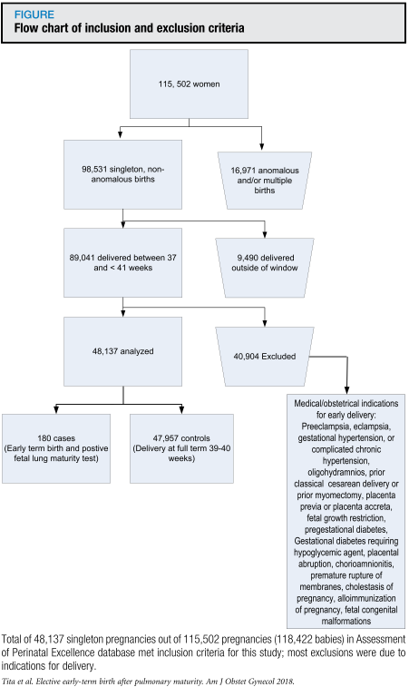
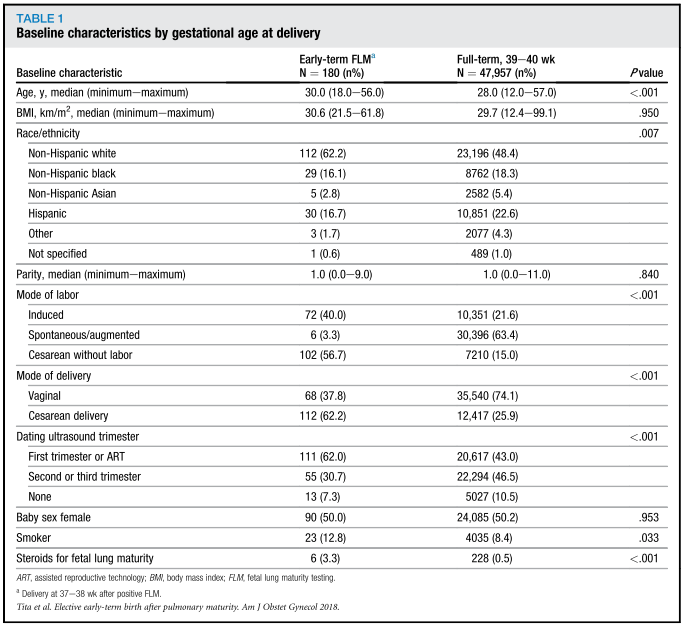
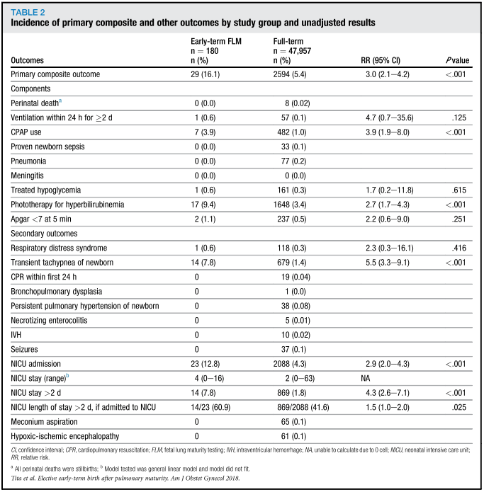
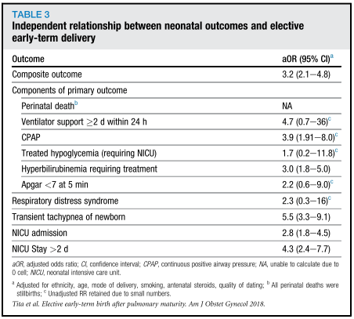

## タイトル
Neonatal outcomes of elective early-term births after demonstrated fetal lung maturity  
胎児肺成熟後の選択的早産の新生児転帰

## 著者/所属機関
Alan T.N. Tita, MD, PhDa,∗,'Correspondence information about the author MD, PhD Alan T.N. TitaEmail the author MD, PhD Alan T.N. Tita, Kathleen A. Jablonski, PhDo, Jennifer L. Bailit, MD, MPHc, William A. Grobman, MD, MBAb, Ronald J. Wapner, MDd, Uma M. Reddy, MD, MPHp, Michael W. Varner, MDe, John M. Thorp Jr., MDf, Kenneth J. Leveno, MDg, Steve N. Caritis, MDh, Jay D. Iams, MDi, George Saade, MDj, Yoram Sorokin, MDk, Dwight J. Rouse, MDl, Sean C. Blackwell, MDm, Jorge E. Tolosa, MD, MSCEn for the show Eunice Kennedy Shriver National Institute of Child Health and Human Development Maternal-Fetal Medicine Units Network

## 論文リンク
https://doi.org/10.1016/j.ajog.2018.05.011

## 投稿日付
Published online: May 22, 2018  
Accepted: May 14, 2018  
Received in revised form: November 9, 2016  
Received: March 10, 2016

## 概要
### 目的
胎児の肺成熟確認後の早産と早産の兆候がない正期産の新生児有害転帰の有病率とリスクを比較すること。

### 研究デザイン
* 2008年から2011年までの115,502人の分娩の異常な徴候を伴わない37〜40週の単胎妊娠の女性を対象とした観察研究の二次分析。
* 胎児肺成熟検査陽性後の選択的早産と正期産を比較した。
* 主要転帰は、死亡、2日以上の人工呼吸、持続的気道陽圧法、敗血症、肺炎または髄膜炎の治療、低血糖治療、高ビリルビン血症（光線療法）、および5分のApgar <7であった。
* ロジスティック回帰と傾向スコアのマッチング（1：1と1：2の両方）を使用した。

### 結果
* 全部で48,137の出生が選択基準を満たした。
* 早産の医学的または産科的適応がない場合の胎児肺成熟検査の有病率は0.52％であった（n＝249）。
* 肺成熟確認後の早産は180人（0.37％）、正期産は47,957人であった。
* 前者は、非ヒスパニック系白人、喫煙者、出生前のステロイド服用、陣痛誘発、帝王切開を受けていた。
* 複数のリスク（16.1％ vs 5.4％；調整オッズ比3.2；ロジスティック回帰による95％信頼区間、2.1-4.8）は、選択的早産でより頻度が高かった。
* 傾向スコアのマッチングにより、選択的早産における一次複合の増加が確認された：調整オッズ比、1：1の場合は4.3（信頼区間95％、1.8-10.5）、1：2の場合は3.5（信頼区間95％、1.8-6.5）の一致。
* 主要転帰の中では、光線療法を必要とするCPAP使用および高ビリルビン血症が有意に増加した。
* 新生児の一過性頻呼吸、NICU入院、および長期NICU滞在（> 2日）もまた、早産とともに増加した。

### 結論
肺成熟が確認されても、医学的または産科的適応がない早産は、正期産と比較して新生児の呼吸器および肝臓の転帰の悪化と関連しており、早産におけるこれらの臓器系の相対的未成熟を示唆している。

### 図 包含と除外基準のフローチャート

### 表1 出産時の在胎週数別ベースライン特性

### 表2 研究グループ別の主要転帰の発生率（未調整）

### 表3 新生児転帰と選択的早産の独立関係

