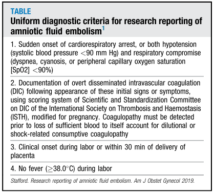
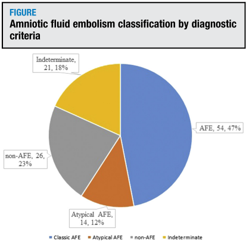

## タイトル
Evaluation of proposed criteria for research reporting of amniotic fluid embolism  
羊水塞栓症の研究報告のために提案された基準の評価

## 著者/所属機関
* Irene A. Stafford, MD, Baylor College of Medicine, TX
* Amirhossein Moaddab, MD, Baylor College of Medicine, TX
* Gary A. Dildy, MD, Baylor College of Medicine, TX
* Miranda Klassen, BS, Amniotic Fluid Embolism Foundation, CA
* Michael A. Belfort, MD, PhD, Baylor College of Medicine, TX
* Roberto Romero, MD, DMedSci, Eunice Kennedy Shriver National Institute of Child Health and Human Development, National Institutes of Health, University of Michigan, Michigan State University, East Lansing, Wayne State University, MI
* Steven L. Clark, MD, Baylor College of Medicine, TX

## 論文リンク
https://doi.org/10.1016/j.ajog.2018.11.1099

## 投稿日付
Published online: November 24, 2018

## 概要
### 目的
羊水塞栓症（AFE）の研究報告のために提案された基準を評価すること。

### 研究デザイン
* AFEレジストリ（データベース）は、Baylor College of MedicineとNICHD、NIHの周産期研究部門によって設置された。
* 2013年8月1日から2017年6月31日に登録されたチャートを用いて2つの分析を行った。
* 1.患者を以下の3群に分類するために、救急医療、母子医療の専門家グループが、コンセンサス診断に基づいて、医療記録の詳細な分析を行った。
  * （1）AFE
  * （2）AFE以外の明確な診断
  * （3）未確定/不確定診断
* 2.各チャート（産科訓練を受けていない医師によって分析された）は、AFE診断のために医療記録に最近発表された基準の各項目が含まれているかどうか判定された（表）。  

* 専門家によるレコードの分析とこれらの厳密で客観的な基準の一致が決定された。

### 結果
* 専門家によって合計115のチャートがレビューされ、68例（59％）でAFEと診断され、26例（23％）で明確な代替診断、そして21例（18％）で不確定診断となった（図）。  

* 提案された客観的基準の有無に従って分析すると、54例がAFEと同定された。専門家によるレビューも同様にAFEの診断を下した。
* 客観的基準を満たさなかったAFEとして専門家委員会によって識別された14例（21％）は、この状態の非典型的な提示を表すと考えられている。
* この基準セットの診断成績は次の通りであった：感度 79.4％（67.9-88.3）、特異度100％（94.1-100.0）、陽性適中率 100％、陰性的中率 81.3％（73.7-87.4）。

### 結論
AFEの研究報告のためのガイドラインの基準の使用は研究分析のためのクリーンなデータセットを提供するかもしれないが、いくつかの非典型的なケースは除外されると考えられる。
