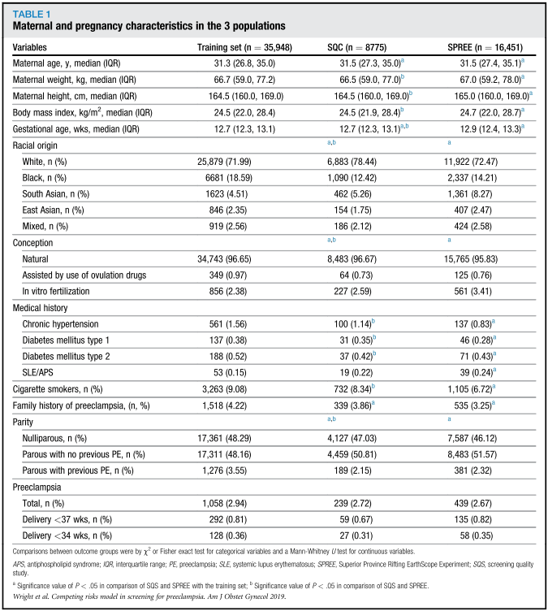
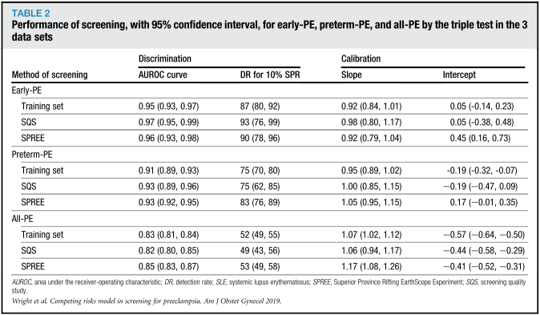
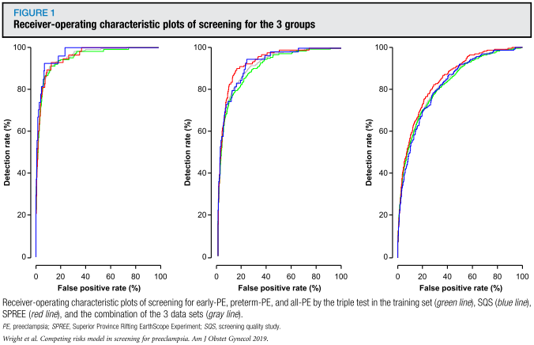
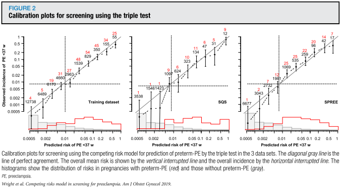
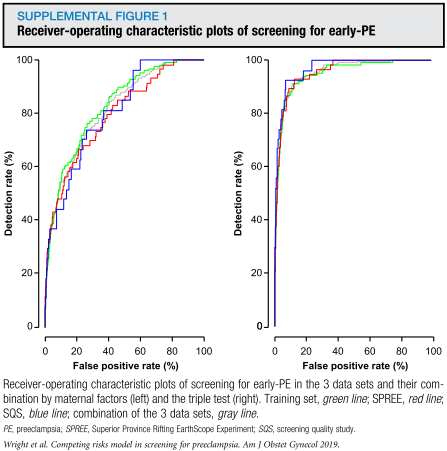
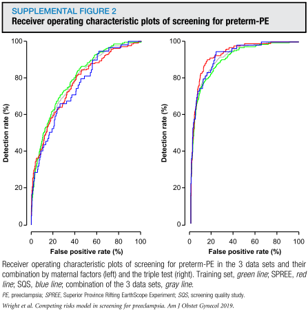
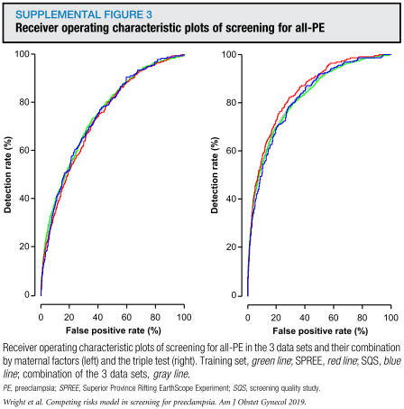
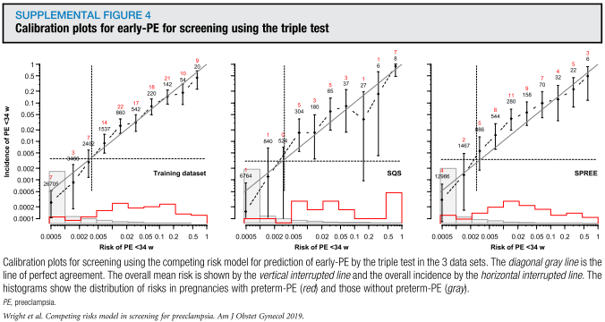
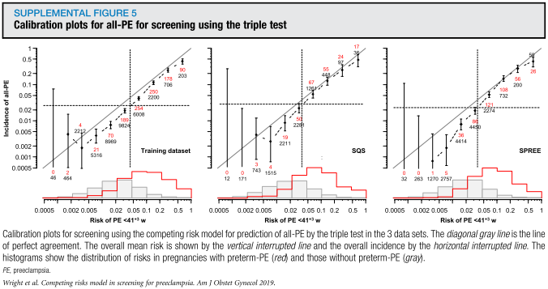
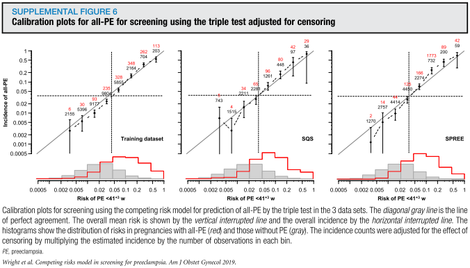

## タイトル
Predictive performance of the competing risk model in screening for preeclampsia  
妊娠高血圧腎症のスクリーニングにおける競合リスクモデルの予測性能

## 著者/所属機関
David Wright, PhDa, Min Yi Tan, MDb, Neil O’Gorman, MDb, Liona C. Poon, MDb, Argyro Syngelaki, PhDb, Alan Wright, PhDa, Kypros H. Nicolaides, MDb,∗,'Correspondence information about the author MD Kypros H. Nicolaides
From the Institute of Health Research, University of Exeter, Exeter (Drs D. Wright and A. Wright), and the Harris  
Birthright Research Centre for Fetal Medicine, King’s College, London (Drs Tan, O’Gorman, Poon, Syngelaki, and Nicolaides), United Kingdom.

## 論文リンク
https://doi.org/10.1016/j.ajog.2018.11.1087

## 投稿日付
Published online: November 14, 2018  
Accepted: November 8, 2018  
Received in revised form: October 28, 2018  
Received: September 11, 2018

## 概要
### 目的
母体因子、平均動脈圧、子宮動脈拍動指数、および血清胎盤成長因子を組み合わせた妊娠初期のトリプルテストを使用して、妊娠高血圧腎症の競合リスクモデルの予測性能を評価すること。

### 研究デザイン
* 妊娠11.0〜13.6週の単胎妊娠における妊娠高血圧腎症について、過去に報告された3施設の前向き非介入スクリーニング研究から得られたデータを使用した。
* 適切に訓練された要員によって、母体因子およびバイオマーカー、ならびに確認結果を記録した。
* 2010年2月から2014年7月の間に行われた35,948人の女性を対象とした最初の研究は、妊娠高血圧腎症を予測するための競合リスクモデルの開発に使用された。（トレーニングセットと見なす。）
* 2つの検証研究は、それぞれ8775人（2015年2月から9月）と16,451人（2016年4月から12月）で構成され、実施された。
* 妊娠 <34週、<37週、<41.3週の妊娠高血圧腎症を伴う出産の患者特有のリスクは、競合リスクモデルを用いて計算され、母体因子のみによる妊娠高血圧腎症のスクリーニングのパフォーマンスと3つのデータセットのそれぞれにおけるトリプルテストを評価した。
* まず、受信者動作特性曲線下面積（ROC AUC）および固定スクリーン陽性率１０％での検出率を用いて妊娠高血圧腎症群と非妊娠高血圧腎症群を区別するモデルの予測性能について調べた。
* 次に、較正勾配の測定および大規模な較正を行った。

### 結果
* early-PE、preterm-PE、およびall-PEの10％のスクリーニング陽性率での検出率は、それぞれ約90％、75％、および50％であり、結果は訓練と2つの検証データセットの間で一致していた。
* ROC AUCはそれぞれ>0.95、>0.90、および>0.80であり、罹患群と非罹患群の間で有意な差を示した。
* 同様に、検量線の傾きは1.0に非常に近く、予測リスクと観察された妊娠高血圧腎症の発生率はよく一致していた。
* early-PE、およびpreterm-PEにおいて、訓練セットおよび検証データセットの1つにおいて観察された発生率は予測と一致していた。
* all-PEの発生率は、3つのデータセットすべてにおいて予測よりも低かった。したがって、妊娠高血圧腎症を発症する前に他の理由で分娩するリスクが高いと見なされる場合、偽陽性であると見なすことができる。

### 結論
競合リスクモデルは、妊娠高血圧腎症の妊娠初期の予測のための効果的かつ再現可能な方法を提供する。

### 表1 3施設における母体および妊娠の特徴

### 表2 early-PE、preterm-PE、およびall-PEにおけるトリプルテストの95％信頼区間でのスクリーニングのパフォーマンス

### 図1 early-PE、preterm-PE、およびall-PEにおけるスクリーニングのROCプロット

### 図2 トリプルテストを用いたスクリーニングの較正プロット

### 補足図1 early-PEに対するスクリーニングのROCプロット

### 補足図2 preterm-PEに対するスクリーニングのROCプロット

### 補足図3 all-PEに対するスクリーニングのROCプロット

### 補足図4 early-PEに対するトリプルテストを用いたスクリーニングの較正プロット

### 補足図5 preterm-PEに対するトリプルテストを用いたスクリーニングの較正プロット

### 補足図6 all-PEに対するトリプルテストを用いたスクリーニングの較正プロット

