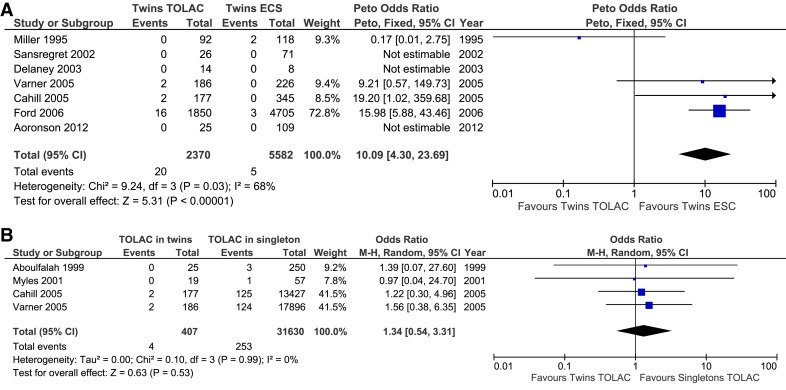

## タイトル
Trial of labor after cesarean delivery in twin gestations: systematic review and meta-analysis  
双子の妊娠における過去の帝王切開分娩後の経膣分娩の試み：系統的レビューとメタ分析

## 著者/所属機関

## 論文リンク
https://doi.org/10.1016/j.ajog.2018.11.125

## 投稿日付
Published online: November 19, 2018  
Accepted: November 1, 2018  
Received: October 5, 2018

## 概要
### 目的
双子の妊娠中の帝王切開後の分娩の試み(TOLAC)に関連する母体の罹患率を評価すること。

### 研究デザイン
電子データベースでコホート研究および双子の妊娠中のTOLACと妊娠結果との関連性を評価するランダム化比較試験が検索された。  
子宮破裂や子宮摘出術などの妊産婦死亡率と重度の罹患率を、分娩を試みた女性と計画的な帝王切開分娩を計画した女性との間で比較した。  
プールされたオッズ比は変量効果モデルを用いて計算された。  
シングルトンとツインの妊娠中のTOLACを比較するために追加の分析が行われた。

### 結果
以前の帝王切開分娩を伴う合計8209の双子の妊娠を含む11のコホート研究が本研究に含まれた。  
これらの妊娠期間のうち、2484人は経膣による出産を予定しており、5725人は予定帝王切開の繰り返しを予定していた。  
双子の妊娠における子宮破裂の割合は、選択的帝王切開群よりもTOLAC群で高かった（オッズ比10.09、95％信頼区間、4.30-23.69、I 2  = 68％）。  
しかしながら、TOLACを試みる双子の妊娠と単一の妊娠の間で子宮破裂の割合に統計的に有意な差は見られなかった（オッズ比、1.34、95％信頼区間、0.54-3.31、I 2）。 = 0％）。  
双子によるTOLACを試みた女性は、選択的反復帝王切開分娩と比較して、子宮瘢痕裂開、出血、輸血、または新生児の罹患率および死亡率のリスクが増加していなかった。  
双子の患者は、シングルトンの患者と同程度の経膣分娩成功率を示しました（オッズ比、0.85、95％信頼区間、0.61-1.18、I 2  = 36％）。

### 結論
このメタ分析は、双子によるTOLACは選択的帝王切開分娩と比較してより高い子宮破裂率と関連しているが、妊娠転帰および成功率はシングルトン妊娠におけるTOLACと同様であることを示す。  
双子の妊娠と以前の帝王切開分娩を持つ女性のための計画された経膣分娩は計画された繰り返しの帝王切開への安全な代替手段かもしれません。

### 図1

