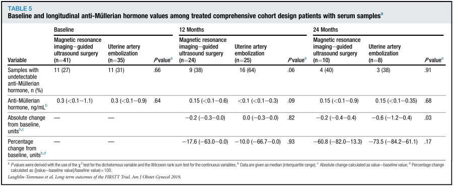

## タイトル
FIRSTT study: randomized controlled trial of uterine artery embolization vs focused ultrasound surgery  
FIRSTT研究：子宮動脈塞栓術と集束超音波手術のランダム化比較試験

## 著者/所属機関
Shannon Laughlin-Tommaso, MD, MPH, Emily P. Barnard, DO, Ahmed M. AbdElmagied, MD, Lisa E. Vaughan, MS, Amy L. Weaver, MS, Gina K. Hesley, MD, David A. Woodrum, MD, PhD, Vanessa L. Jacoby, MD, MAS, Maureen P. Kohi, MD, Thomas M. Price, MD, Angel Nieves, MD, PhD, Michael J. Miller, MD, Bijan J. Borah, PhD, James P. Moriarty, MS, Krzysztof R. Gorny, PhD, Phyllis C. Leppert, MD, PhD, Amanda L. Severson, MS, Maureen A. Lemens, RN, CCRC, Elizabeth A. Stewart, MD'Correspondence information about the author MD Elizabeth A. Stewart

## 論文リンク
https://doi.org/10.1016/j.ajog.2018.10.032

## 投稿日付
Published online: October 26, 2018  
Accepted: October 19, 2018  
Received in revised form: October 8, 2018  
Received: July 20, 2018

## 概要
### 目的
FIRSTT研究による子宮動脈塞栓術と磁気共鳴画像法を併用した集束超音波手術後の治療効果と卵巣機能を報告すること。

### 研究デザイン
Fibroid Interventions Reducing Symptoms Today and Tomorrow研究では、症状のある子宮筋腫を有する閉経前の女性が登録された。無作為化を拒否した女性は、並行観察コホートに登録された。結果分析には、包括的なコホートデザインが使用された。目標登録は220人の女性であり、そして、試験の無作為化されたそして並列群において41％（n = 91）を達成した。主要転帰は36ヶ月以内の子宮筋腫に対する再介入であった。副次的転帰は、血清抗ミュラー管ホルモンレベルの変化、および子宮筋腫の症状、生活の質、痛み、および性機能の標準化された尺度であった。

### 結果
2010年から2014年にかけて、83人の女性（平均年齢44.4歳）が包括的なコホートデザインで治療された（磁気共鳴画像法によるガイド下集束超音波手術では43人、子宮動脈塞栓術では40人、ランダムに22人）。ベースラインの臨床的特徴および子宮の特徴は、治療群間で同様であったが、子宮動脈塞栓術群におけるより高い筋腫負荷を除いて。再介入のリスクは、子宮動脈塞栓術よりも磁気共鳴画像法による集束超音波手術の方が高かった（ハザード比2.81、95％信頼区間1.01〜7.79）。子宮動脈塞栓術は、磁気共鳴画像法による集束超音波手術と比較して、24ヵ月時点で抗ミュラー管ホルモンレベルの有意に大きい絶対減少を示した。生活の質および疼痛スコアは両方の群で改善されたが、子宮動脈塞栓形成群ではかなり改善された。治療前の抗ミュラー管ホルモンレベルの上昇と治療時の年齢の低下は、再介入の全体的なリスクを高めた。

### 結論
我々の研究は、子宮動脈塞栓術後の再介入率の低下と症状の改善の改善を示しているが、有効性のいくつかは卵巣の予備能の低下によってもたらされる可能性がある。治療前の抗ミュラー管ホルモンレベルと年齢の両方が再介入のリスクと関連している。治験登録番号：NCT00995878、clinicaltrials.gov

### 主要な研究

### 包含および除外基準

### 研究参加者の特性

### 治療された包括的なコホートデザイン患者におけるベースラインおよび長期的に検証された患者報告尺度（n = 83）

### 試験で治療を受けた参加者の転帰

### 2回目の子宮筋腫手術の累積発生率と競合するリスクイベントを考慮した更年期障害

### ベースライン血清サンプルで処理された包括的コホートデザイン患者の縦抗ミューラー管ホルモン値

### 包括的なコホート設計に83人の患者を用いて12個の別々の競合リスクモデルにおけるハザード比

### 抗ミュラー管ホルモンレベルによる競合するリスクイベントを説明する2回目の平滑筋腫手術または更年期障害の累積発生率

