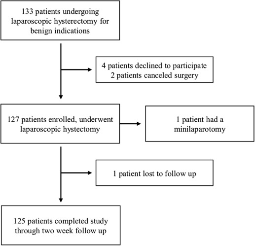
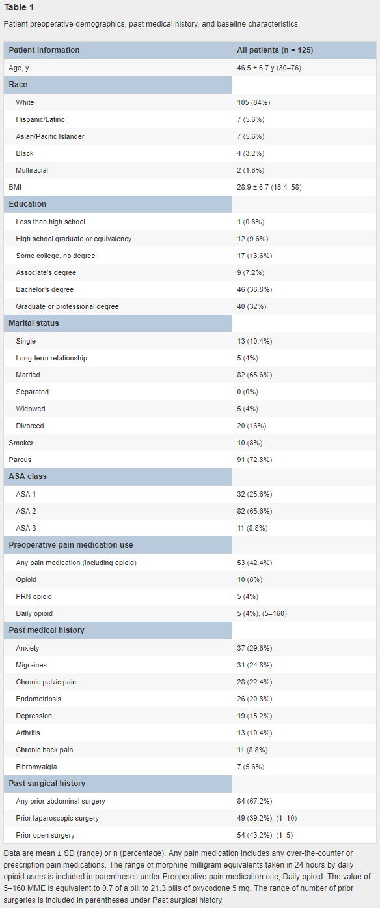
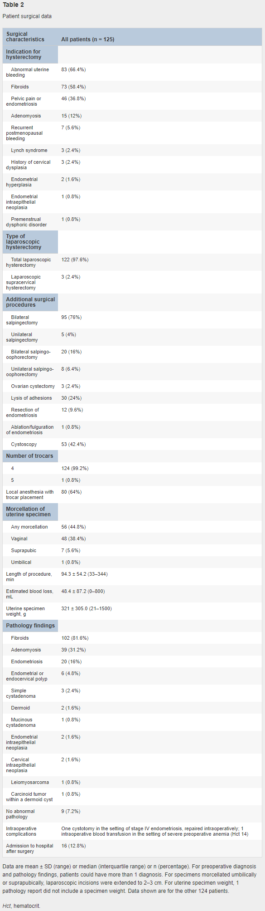
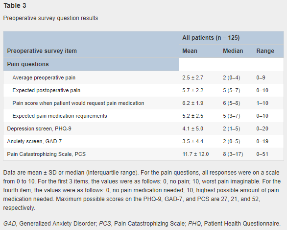
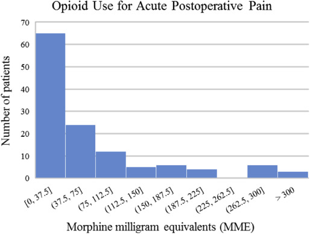
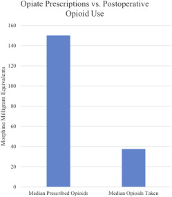
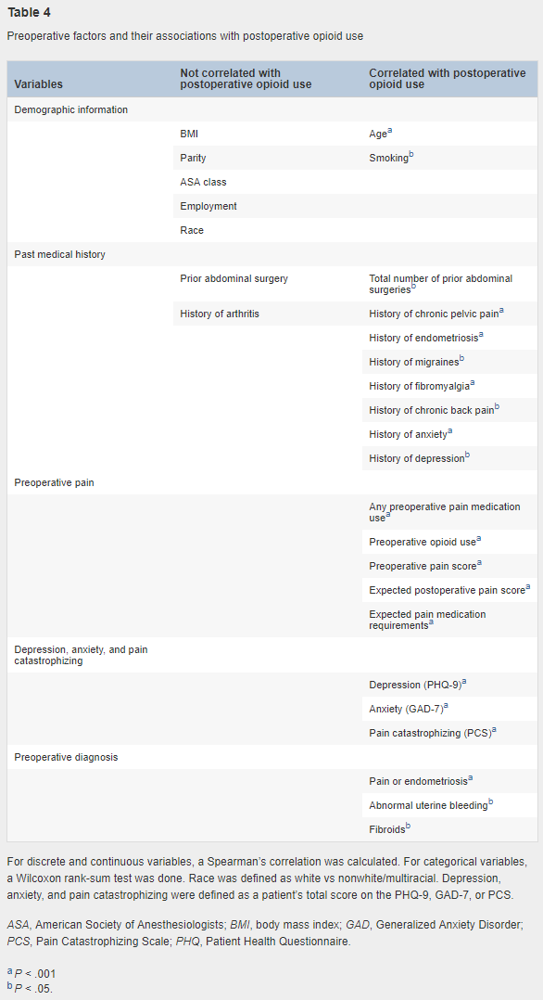
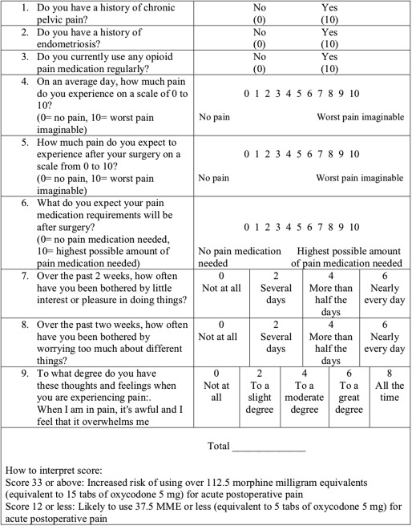
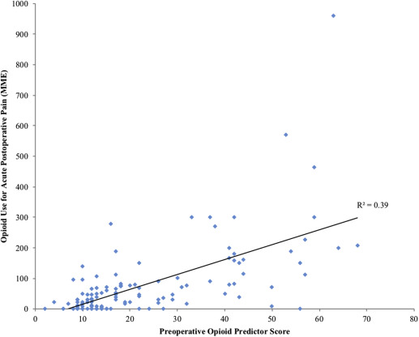
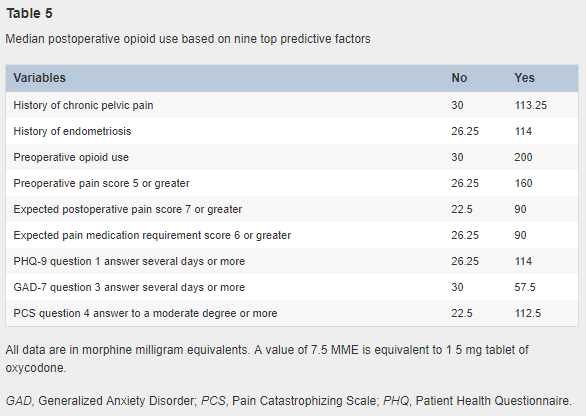

## タイトル
Opioid use after laparoscopic hysterectomy: prescriptions, patient use, and a predictive calculator  
腹腔鏡下子宮摘出術後のオピオイド使用：処方量、患者の使用量からの適切な量の予測

## 著者/所属機関
Marron Wong, MD a, Alison Vogell, MD b, Kelly Wright, MD b, Keith Isaacson, MD a, Megan Loring, MD a, Stephanie Morris, MD a
a Center for Minimally Invasive Gynecologic Surgery, Newton-Wellesley Hospital, Newton, MA  
b Department of Gynecology, Lahey Hospital and Medical Center, Burlington, MA

## 論文リンク
https://doi.org/10.1016/j.ajog.2018.10.022

## 投稿日付
Published online: October 25, 2018  
Accepted: October 18, 2018  
Received in revised form: October 16, 2018  
Received: July 31, 2018

## 概要
### 目的
低侵襲婦人科外科医によるオピオイド処方の実践、低侵襲性子宮摘出術後の術後オピオイド使用の測定、および患者が低術後オピオイドオピオイドユーザーになるかどうかを予測できる術前因子を特定すること。

### 研究デザイン
* 2施設で良性の適応症のために腹腔鏡下子宮摘出術を受けている125人の女性を対象とした調査ベースの前向き研究。
* 患者は、人口統計、病歴、および予想される疼痛スコアについて術前に調査され、不安、鬱病、および破局的思考について評価された。
* 術後1-2週間で、疼痛および鎮痛剤の使用について調査を行った。

### 結果
* 患者の98％が術後急性疼痛のためにオピオイドを処方された。
* 術前処方の中央値は、モルヒネ150mg相当、オキシコドン5mg20錠相当、
* 術後処方の中央値は、モルヒネ37.5mg相当、オキシコドン5mg5錠相当であった。
* 患者の90％が術後2週間でオピオイドを使い切っていなかった。
* 術後オピオイド使用と強く相関した術前因子
  * 慢性骨盤痛
  * 子宮内膜症の病歴
  * 術前オピオイド使用
  * 不安、鬱病
  * 疼痛壊滅
  * 術前疼痛スコア
  * 予想される術後疼痛スコア
  * 予想される術後疼痛投薬ニーズ
* これらの要因に基づいて予測算出表が開発され、オピオイド服用量が多い/少ない患者を特定する。
  * 多：モルヒネ112.5mg相当（定義）
  * 少：モルヒネ37.5mg相当（定義）

### 結論
* 急性術後疼痛管理のために腹腔鏡下子宮摘出術を受ける患者に必要とされるよりも平均して4倍の量のオピオイドを処方していた。
* 術前の危険因子に基づいて患者のオピオイド処方を個別化することは、オピオイドの過剰な処方を減らすのに役立つ。

### 図1 患者登録および試験完了までのフロー

### 表1 患者の術前の統計、病歴、およびベースライン特性

### 表2 患者の手術のデータ

### 表3 術前の調査結果

### 図2 術後の急性疼痛に対するオピオイド使用のヒストグラム

### 図3 オピオイド処方量と使用量の中央値の比較

### 表4 術前因子と術後オピオイド使用との関連

### 図4 腹腔鏡下子宮摘出術後のオピオイド使用量の予測算出表

### 図5 オピオイド予測スコアと術後オピオイド使用量の散布図

### 表5 上位予測因子に基づく術後オピオイド使用量の中央値

