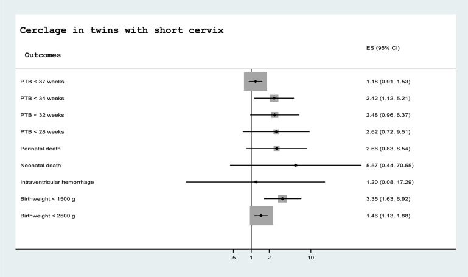

## タイトル
The placement of a cerclage in patients with twin pregnancies and a short cervix is associated with increased risk of preterm birth and adverse perinatal outcome  
双胎妊娠と子宮頸管長の短い患者での子宮頸管縫縮術の実施は、早産および有害な周産期転帰のリスク増加と関連している

## 著者/所属機関

## 論文リンク
https://doi.org/10.1016/j.ajog.2019.09.038

## 投稿日付
Published online:October 03, 2019

## 概要
AJOG 2019年6月号で、Liらは、双胎妊娠の子宮頸管縫縮術が早産のリスクを低減し、周産期転帰を改善するかどうかを評価するための系統的レビューとメタ分析を報告しました。  
著者らは、子宮頸管長が短い（15mm未満）または子宮頸管が拡張している（10mmを超える）双胎妊娠において、子宮頸管縫縮術を実施することで早産のリスクが減少し妊娠期間が延長すると結論付けました。  

著者らは、系統的レビューとメタ分析の一般的な推奨事項に従って、ランダム化比較試験とコホート（観察）研究を別々に分析しました。  
ただし、子宮頸管縫縮術の利点をサポートする結論は、3つの後ろ向きコホート研究からのデータのみに基づいていました。  
記事中の表2および3は、超音波で示される縫縮術について言及されることが多い双胎妊娠のランダム化比較試験からのメタ分析の結果を示しています。  
結論には言及していませんが、これらのランダム化試験の結果は、子宮頸管縫縮術の実施が早産および有害な周産期転帰の著しく高い頻度と実際に関連していることを示しています。  

子宮頸管長が短い双胎の子宮頸管縫縮術  

ランダム化比較試験のメタ分析は、バイアスのリスクを軽減し、系統的エラーのリスクを減らすように設計されているため、最高レベルの科学的証拠と見なされます。  
不妊治療に起因する妊娠に関して後述する例が示すように、遡及的コホート研究では、治療効果、選択バイアス、および臨床的適応によるトリートメント効果の過大評価が生じやすい傾向があります。  

Liらによって分析された3つのコホート研究の慎重なレビューは、子宮頸管縫縮術を有する患者と子宮頸管縫縮術を持たない患者の臨床的特徴が異なることを示した。  
確かに、子宮頸管縫縮術を受けた女性の多くは、生殖補助医療を受けていました。  
不妊治療に起因する妊娠の中で、患者とそのパートナーは、子宮頸管縫縮術を含む介入を検討する動機がより強くなります。  
医師は、多くの場合、基礎となるリスクプロファイルに基づいてこれらの患者に治療を勧めます。  
これは、適応による交絡の原因です。  

2つの研究グループは、人種に関しても異なっていました。  
不均衡に、子宮頸管縫縮術を受けた女性の多くは白人でした（相対リスク 1.28、95％信頼区間 1.05〜1.56）。  
早産の割合が非白人女性の方が高いことはよく知られています。  
研究グループ間のその他の重要な違いには、以前の早産率と補助的な膣プロゲステロンの使用が含まれていました。  

ランダム化試験から得られた結果は、彼らが推奨を行ったり、論文の結論を策定したりする際に考慮されませんでした。  
読者は、無作為化臨床試験の分析が結論で述べられたものとは反対の結果を示したことに注意する必要があります。  
これらの所見は、予期して治療された子宮頸管縫縮術と比較して、子宮頸管長が短い多胎妊娠での子宮頸管縫縮術による潜在的な害を示すメタ分析と一致しています。  
患者は、入手可能な最良の根拠に基づいた管理上の決定に値します。  
ここで報告された分析に基づいて、最良の根拠は、子宮頸管長が短い双胎妊娠は、早産および周産期の有害転帰を減らすために子宮頸管縫縮術を経るべきではないことを示唆しています。  

## リンク
[Cerclage for women with twin pregnancies: a systematic review and metaanalysis](../Dec2018/Cerclage_for_women.md)
