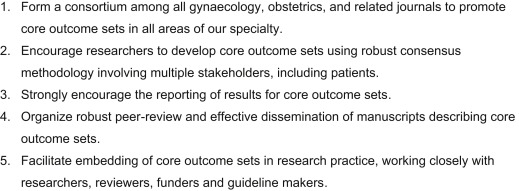

## タイトル
Tackling poorly selected, collected, and reported outcomes in obstetrics and gynecology research  
産科および婦人科の研究における不適切に選択、収集、および報告された転帰への取り組み

## 著者/所属機関
James M.N. Duffy, MBChB, MRes'Correspondence information about the author MBChB, MRes James M.N. DuffyEmail the author MBChB, MRes James M.N. Duffy, Sue Ziebland, DPhil, MSc, Peter von Dadelszen, FRCOG, DPhil, Richard J. McManus, FRCGP, FRCP

## 論文リンク
https://doi.org/10.1016/j.ajog.2018.09.023

## 投稿日付
Published online: September 28, 2018  
Accepted: September 21, 2018  
Received in revised form: September 1, 2018  
Received: May 18, 2018

## 概要
### 問題点
ランダム化比較試験は、臨床診療に関連し、専門家、研究者、および患者を含む多様な利害関係者の見解を真に反映する結果を選択、収集、および報告しなければならない。

### 解決策
コアアウトカムセットの開発、普及、および実施は、将来の無作為化比較試験が臨床診療に情報を提供し、患者ケアを向上させ、そして患者アウトカムを改善することを確実にするために、アウトカム選択、収集および報告を標準化するべきである。

### 不適切な選択：臨床診療および主要な利害関係者との関連性が欠如している結果
適切な結果を選択することは、無作為化試験を計画する際の重要なステップである。しかしながら、個々の結果の相対的な重要性は、サンプルサイズの要件、コスト、および時間の制約に対応するため、研究者にとって二次的な検討事項になる可能性がある。主要アウトカムは、研究の前向き仮説にとって治療上最も重要な結果である。

不妊治療の可能性を評価する無作為化試験を検討する際には、主な結果としての出産の選択に関する合意がある。残念なことに、2013年と2014年に発表された142件の不妊試験の系統的レビューでは、52件のみの試験（37％）が出生を報告していることがわかった。  
不適切に選択された結果は、主な結果を超えて広がる。研究者は、関心のある健康管理状態の複雑な病態生理学を反映する二次的な結果を選択すべきである。例えば、子癇前症を考慮するとき、二次的結果は血圧閾値、臨床症状、母体の罹患率、および新生児の罹患率を含むべきである。多くの子癇前症試験はこの要件には及ばない。79件の子癇前症試験の系統的レビューにより、転帰の報告に広範な変動があることが示された。少数のランダム化試験では、子癇（39試験、49％）、肺水腫（15試験、19％）、および腎不全（10試験、13％）を含む、母体の罹患率に関する結果が報告されている。  
過去30年間で、産科研究の範囲は拡大し、長期にわたる小児期の追跡調査は患者、医療専門家、そして研究者によってますます優先されるようになっている。長期的な結果を評価することの重要性がますます高まっているので、長期的な結果の選択、追跡期間、および方法に関して困難な決定を下す必要があるだろう。

### 回収率が低い：さまざまな定義および測定機器
複数の試験にわたって結果が一貫して収集および報告されている場合でも、エビデンス合成は測定方法または定義方法の違いによって制限される可能性がある。標準化されたアプローチがなければ、研究者はさまざまな定義と測定機器から選択することができる。例えば、研究者は、妊娠期間、出生時体重、およびクラウン - ヒールの長さのさまざまな組み合わせを使用して死産を定義した。子宮内膜症の試験を検討するとき、月経困難症は視覚的アナログ尺度、リッカート尺度、およびアンケートを含む10の異なる測定機器によって測定されてきた。そのような変動は、個々の患者データのメタ分析、ペアワイズのメタ分析、およびネットワークのメタ分析を含む二次研究を用いて個々のランダム化試験の結果を合成することを困難にする可能性がある。

### 不十分な報告：結果報告の偏り
結果報告の偏りは、結果に基づいてオリジナルの記録された結果変数のサブセットの公表のための選択として定義される。いくつかの系統的レビューにより、結果報告の偏りが確認され、メタアナリシスで個々の試験のデータをプールする際の影響が定量化された。519件のランダム化比較試験の系統的レビューで結果報告にかなりの欠陥があることが確認された；臨床試験登録記録と比較した場合、最終試験報告では、360（75％）の試験で有効性の結果が完全に報告されておらず、196（64％）の試験で有害な結果が完全に報告されていなかった。  
統計的に有意な結果は、有意でない結果と比較した場合、完全に報告されている可能性が高かった（オッズ比、2.0、95％信頼区間、1.6-2.7）。個々の試験の結果がメタアナリシスの中で組み合わされる場合、結果報告に関してさらなる問題が生じる。2007年に発表された157のコクラン系統的レビューの系統的レビューは、結果報告バイアスのリスクが高い少なくとも1件のランダム化試験を含む系統的レビューの3分の1以上を特定した。結果報告の偏りを考慮に入れた感度分析では、主要アウトカムの治療効果が20％以上減少したことが示された。

不良な結果の選択、測定、および報告に関する問題は、個々の医療状況内の将来の無作為化対照試験にわたって結果の選択、収集、および報告を標準化するための中核的な結果セットを開発、普及、および実施することによって対処できる。

### 行動を起こすよう呼びかけ：コアアウトカムセットの開発、普及、実施
コアアウトカムセットは、ロバストコンセンサスサイエンス手法を使用して開発されたアウトカムの最小データセットを表します。コアアウトカムは、一貫して選択され、標準化された方法で集められ、そして一貫して最終刊行物に報告されるべきである。コアアウトカムセットの存在は、特定の試験におけるアウトカムが制限されるべきであることを意味するのではない。むしろ、与えられた研究に適切なものとして含まれている他の結果と共に、中核的な結果が最低限収集され報告されるという期待がある。これにより、個々の試験の中核となる結果を比較し、対比し、必要に応じて組み合わせることが容易になる。現在、不妊症、子宮内膜症、子癇前症など、50以上のコアアウトカムセットが私たちの専門分野で開発されている。  
コアアウトカムセットを作成する際には、医療専門家、研究者、および患者を含む、さまざまな分野、地理的地域、および方法論的専門知識を含む、さまざまなステークホルダーを採用する必要がある。最終的なコアアウトカムセットの一般化可能性を確保し、他の研究者との信頼性を高めるためには、多数の多様な参加者が望ましい。

コアアウトカムセット開発の最初のステップは、公表されているランダム化比較試験の系統的レビューを行うことによって、潜在的なコアアウトカムの長いリストを作成することである（図1）。公表された試験の系統的レビューを通して識別された結果は、医療従事者の結果を大部分反映しており、研究者は特に患者や公衆の関与への最近の重点よりも前に研究を集め、測定することが重要であると考えている。歴史的な治験報告書で報告された結果は、患者を含む他の利害関係者にとって同じ関連性を保持できない可能性があるため、共有の意思決定を支持する証拠基盤は臨床診療に情報を提供するのに最適ではない可能性が高い。

### 図1.コアアウトカムセットの開発

コアアウトカムセットの開発者は、潜在的なコアアウトカムの長いリストに患者に関連のあるものが含まれているという安心を提供するために定性的方法を使用すべきである。残念ながら、関連するアウトカムを特定するために詳細な患者インタビューを使用したのは、少数のコアアウトカムセット開発者だけであった。将来のコアアウトカムセット開発者は、方法論的研究に従事して、アーカイブインタビュー、フォーカスグループ、フリーテキストアンケートの二次分析を含むさまざまな定性的方法を評価し、患者に関連する治療結果を特定する必要がある。

次のステップは、コンセンサスサイエンス手法を使用して、潜在的なコア結果の長いリストをコア結果セットに減らすことである。コアアウトカムセットの開発者は、個人が合意の範囲を評価し（合意測定）、次に意見の相違を解決する（合意開発）という反復プロセスに参加できるように、修正されたDelphiメソッドを使用した。潜在的な中核的成果は、参加者が個々の成果の重要性を評価するための一連のオンライン調査に入力されている。熟考と再計算を繰り返すことで、合意された中核的成果への収束が促進される。

最後のステップは、コアアウトカムをどのように定義し測定するべきかを決定することである。潜在的な定義および測定機器は、正式な定義開発イニシアチブ、国際的および国内のガイドライン、Cochraneの系統的レビュー、および無作為化対照試験にわたって蓄積されている。そのような定義は、個々の中核的成果について標準化された定義を優先させるために、合意形成ワークショップに参加することができる。可能性のある測定機器は、高品質の測定機器を個々の中核的成果と関連付けるためのコンセンサスに基づく健康測定機器の選択に関するイニシアチブ品質評価フレームワークを使用して品質評価されてきた。  
コアアウトカムセットが作成されたら、それが継続的な妥当性を確認するために定期的に見直されるべきである。将来のコアアウトカムセット開発者は、コアアウトカムセットが目的に適ったものであることを確実にするために戦略を慎重に設計するべきである。レビューの頻度、および特定のトリガーによってレビューを促すべきかどうかについては、不確実性がある。個々のコアアウトカムセットの取り込みの評価、コアアウトカムセットの対象となるユーザーへのインタビュー、および将来の試験におけるアウトカムレポートのモニタリングを含む方法は、レビュートリガーを検討する際のフレームワークを提供する可能性がある。

### 女性の健康ジャーナルによって支えられているコアアウトカムセット
コアアウトカムセットをランダム化比較試験に組み入れることは、臨床診療への情報提供、患者ケアの強化、および患者アウトカムの改善のための研究の有用性の向上に大きく貢献する可能性があります。不十分に選択され、収集され、そして報告された結果が女性の健康の進歩に対する深刻な障害であることを認識して、ジャーナルを含む80以上のジャーナルが女性と新生児の健康の中核成果（CROWN）イニシアチブを支持するために集まった。このコンソーシアムは、研究者がコアアウトカムセットを開発、普及、実施するのを支援している（図2）。

### 図2.女性と新生児の健康（CROWN）イニシアチブの中核的成果

参加している雑誌にまたがってCROWNイニシアチブの目的を実行することは、結果の選択、収集、および報告において調和を生み出すことを約束する研究者を奨励するはずである。やがて、医療専門家、研究者、および患者を含む研究消費者は、研究報告書の中核となる完全な結果セットを見直すことに慣れるようになるはずである。その結果、統計的有意性に基づく選択的報告の誘惑は大幅に減少するはずである。

コアアウトカムセットの実施は、オピニオンリーダー、健康研究資金提供者、および健康研究規制当局を含む他の主要な利害関係者によって支援されている。例えば、国立衛生研究所、欧州委員会、国立衛生研究所を含む健康研究の資金提供者によって実施された標準プロトコル項目：介入試験のための勧告声明は、可能な限りコアアウトカムセットの使用を推奨している。他の利害関係者との協力的関係を築くことは有益であろう。例えば、のような臨床試験登録簿、clinicaltrials.govは、個々のコアの結果セットの予め指定されたコレクションを義務付けることができる。

### 結論
中核となる結果セットを開発、普及、および実施することは、不適切に選択、収集、および報告された結果に対処するために多大な貢献をする可能性がある。実施は、将来の無作為化比較試験が、臨床診療に情報を提供し、患者の治療を強化し、そして患者の転帰を改善するための範囲と関連性を確実に保持するようにするべきである。
