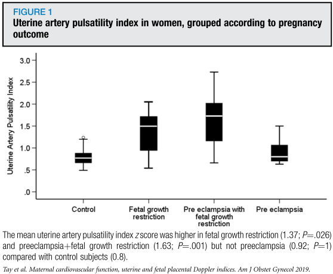
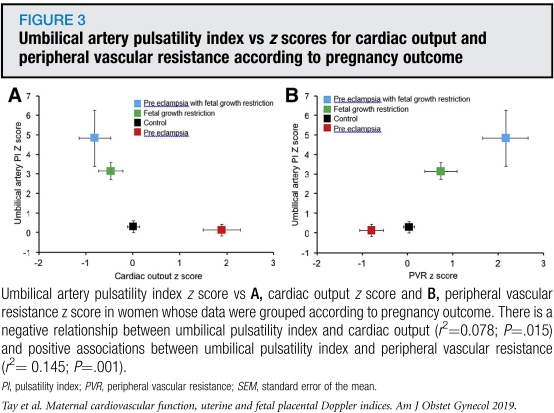

## タイトル
Uterine and fetal placental Doppler indices are associated with maternal cardiovascular function  
子宮および胎児胎盤のドプラ指数は母体の心臓血管機能と関連する

## 著者/所属機関
Jasmine Tay, BMBS, MRCOG, Giulia Masini, MD, Carmel M. McEniery, PhD, Dino A. Giussani, PhD, Caroline J. Shaw, PhD, Ian B. Wilkinson, MA, DM, Phillip R. Bennett, PhD, Christoph C. Lees, MD, FRCOG'Correspondence information about the author MD, FRCOG Christoph C. Lees

## 論文リンク
https://doi.org/10.1016/j.ajog.2018.09.017

## 投稿日付
Published online: September 19, 2018  
Accepted: September 11, 2018  
Received in revised form: August 28, 2018  
Received: May 29, 2018

## 概要
### 目的
母親の心血管機能と、胎児発育不全、妊娠高血圧腎症、および健康な妊娠における胎児の循環変化との関連を調査すること。

### 研究デザイン
妊娠24〜40週の健康な妊娠（n＝62）、妊娠高血圧腎症（n＝13）、妊娠高血圧腎症＋胎児発育不全（n＝15）、または胎児発育不全（n＝17）の女性。すべての患者は、不活性ガス再呼吸技術（？）の使用および末梢血管抵抗の導出を伴う心拍出量の測定を受けた。子宮（収縮？）および胎児のドプラ指数が記録され、後者は妊娠期間を計算するためにzスコアを取った。関連は多項式回帰分析によって決定した。

### 結果
平均子宮動脈拍動指数（？）は、コントロール群（0.8）と比較して、胎児発育不全（1.37;P＝0.026）および妊娠高血圧腎症＋胎児発育不全（1.63;P＝0.001）では高かったが、妊娠高血圧腎症では高くなかった（0.92;P＝1）。子宮拍動指数と心拍出量（r^2＝0.101; P＝0.025）および臍帯拍動指数zスコアと心拍出量（r^2＝0.078;P＝0.0015)の間に負の相関があり、子宮拍動指数と末梢血管抵抗（r^2＝0.150;P＝0.003）および臍帯拍動指数zスコアと末梢血管抵抗（r^2＝0.145;P＝0.001）の間に正の相関があった。脳ドプラ指数と心拍出量と末梢血管抵抗の間に有意な相関はなかった。

### 結論
子宮動脈ドプラの変化は、妊娠高血圧腎症の有無にかかわらず、胎児発育不全において異常に上昇する。さらに、胎児胎盤動脈血管内のインピーダンスは、少なくとも部分的には、母親の心血管機能と関連している。母親の心血管機能の評価は、危険性のある妊娠の監視および治療の選択肢を広げる。子宮および胎児の胎盤ドプラ指数は、母親の心血管機能と有意に関連している。

### 母体の特徴

### 妊娠転帰に従って分類した女性の子宮動脈拍動指数

### 母親の血行動態指数とドップラー拍動指数の関連

### 妊娠転帰による心拍出量および末梢血管抵抗に対する子宮動脈拍動指数vs zスコア

### 妊娠結果による心拍出量および末梢血管抵抗に対する臍帯動脈拍動指数vs zスコア

