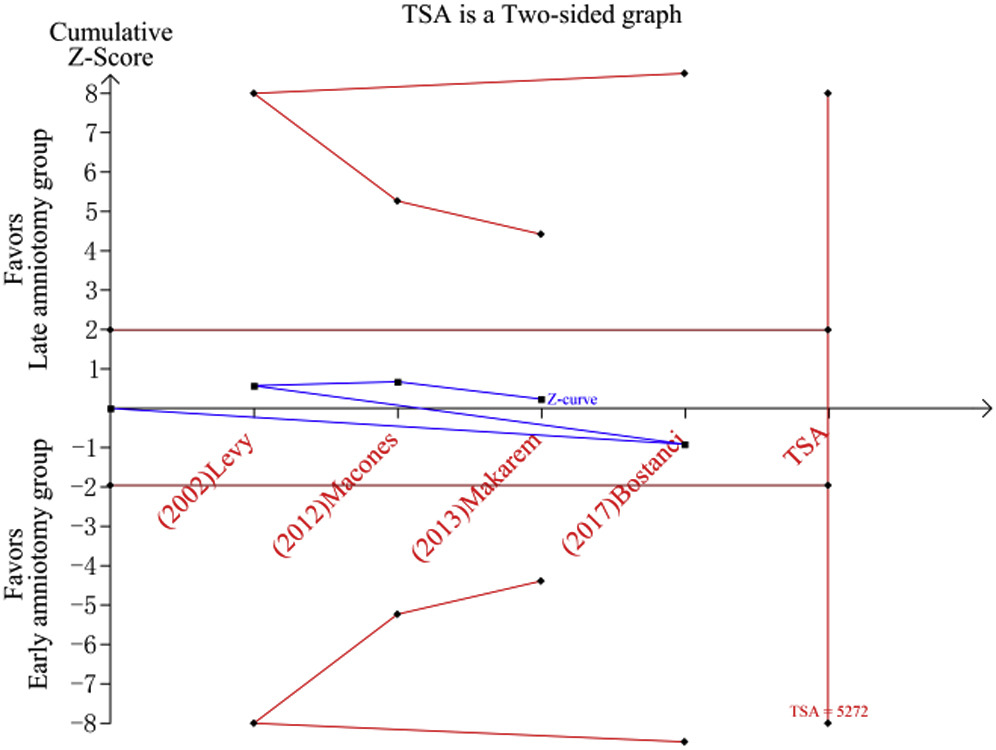

## タイトル
Early amniotomy for induction of labor: a trial sequential analysis  
分娩誘発としての早期人工破膜：試験逐次解析

## 著者/所属機関

## 論文リンク
https://doi.org/10.1016/j.ajog.2019.09.028

## 投稿日付
Published online:September 20, 2019

## 概要
De Vivoらは、系統的レビューとメタ分析において、早期人工破膜と\[後期人工破膜または子宮頸管熟成後の自然破水\]の有効性を評価した。  
患者を帝王切開のリスクが等しくなるように無作為に早期人工破膜群と対照群に割り当てた(31.1％ vs 30.9％、相対リスク 1.05、95％信頼区間 0.71〜1.56)。  
早期人工破膜を受けた女性は、誘発から出産までの時間が約5時間短かった(平均差-4.95時間(95％信頼区間 -8.12～-1.78))。  
早期と後期で他の産科/周産期転帰の違いは見られなかった。  
著者らは、子宮頸管熟化した女性への早期人工破膜は効果があり安全と結論付けた。  

しかし、問題があり、この研究は子宮頸管熟化した女性1273人を対象とした4件の試験のみが含まれており、サンプルサイズが小さかった。  
帝王切開リスクの主要転帰については、早期人工破膜群と後期人口破膜群の間で統計的に有意差がなかった。  
Levyらの研究では、帝王切開率は、後期人口破膜群と比較して早期人工破膜群が有意に高かった(20/80 \[25％\] vs 7/88 \[7.9％\]、相対リスク 1.74、95％信頼区間 1.30～2.34)。  
サンプルサイズが大きくなると、群間のこの差が統計的に有意になる可能性がある。  
メタ分析のサンプルサイズが十分であったかどうかにかかわらず、試験逐次解析(TSA)は重要な手法である。  
我々は帝王切開の主要転帰についてTSAを実施した。  
帝王切開率は、後期群で30.9％、早期群で40.0％と仮定され、α値は5％、検定力は80％であった。  
結果は、少なくとも5272人が必要であると示したが、このメタ分析には1273人しか含まれていなかった。  

累積Z曲線は監視境界を越えることができず、必要な情報サイズをはるかに下回っており、結果を判断するにはさらなる研究が必要であることを示している。

### Figure.1 帝王切開分娩の試験逐次解析(TSA)曲線

WHOの「正常出産ガイドライン：早期人工破膜は生理的タイミングでの破水を妨げる」という見解と非常に一致しており、通常の分娩には自然破水のタイミングを妨げる正当な理由があるはずである。  
このメタ分析はサンプルサイズが十分でないため、特に臨床現場でガイドラインとして用いる場合は注意が必要である。
