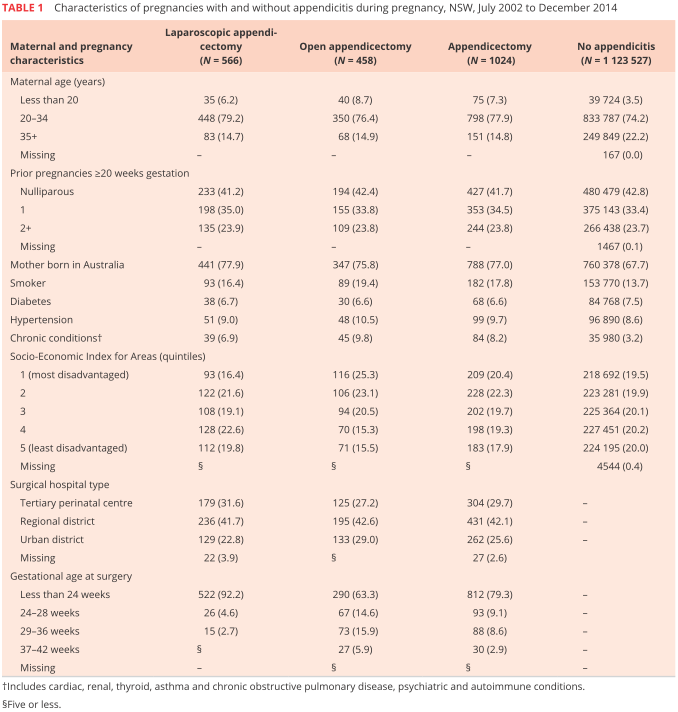
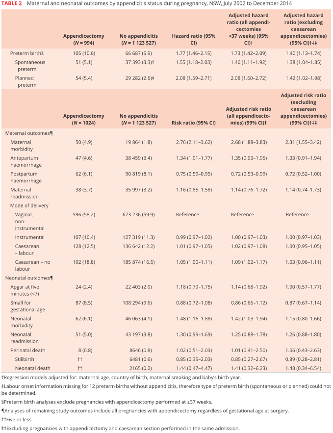
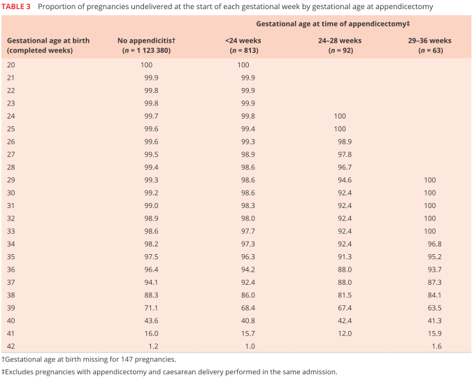
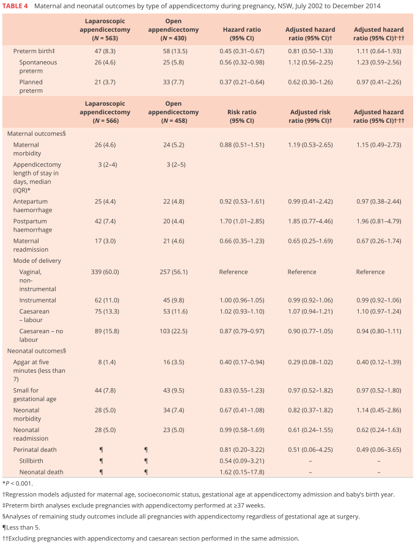

## タイトル
Appendicectomy during pregnancy and the risk of preterm birth: A population data linkage study  
妊娠中の虫垂切除術と早産のリスク：母集団データ連鎖研究

## 著者/所属機関
Ibinabo Ibiebele1,2, Margaret Schnitzler2,3, Tanya Nippita1,4 and Jane B. Ford1,2  
1 Clinical and Population Perinatal Health Research, Kolling Institute, Northern Sydney Local Health District, Sydney, Australia 2 Sydney Medical School Northern, University of Sydney, Sydney, Australia 3 Department of Colorectal Surgery, Royal North Shore Hospital, Sydney, Australia 4 Department of Obstetrics and Gynaecology, Royal North Shore Hospital, Northern Sydney Local Health District, Sydney, Australia

## 論文リンク
https://doi.org/10.1111/ajo.12807

## 投稿日付
Received: 5 November 2017  
Accepted: 28 February 2018  
Published: 30 March 2018  
Published Online: 19 February 2019

## 概要
### 目的
妊娠中の虫垂切除術後の早産およびその他の妊産婦および新生児の有害な出産のリスクを評価すること。

### 材料および方法
2002年から2014年までの単胎出生の女性の人口ベースのデータリンケージ研究。虫垂炎および虫垂切除術を伴う妊娠を虫垂炎を伴わない妊娠と比較した。早産に対する95％信頼区間（CI）での調整前および調整ハザード比（aHR）をそれぞれ推定した。ロバスト分散を用いた修正ポアソン回帰を使用して、他の結果について99％CIで調整前および調整後リスク比（aRR）を推定した。

### 結果
1,124,551の妊娠のうち、1024症例（0.9 / 1000人）が虫垂炎および虫垂切除術を受けていた。このうち、566人（55.3％）が腹腔鏡検査を受け、458人（44.7％）が開腹虫垂切除術を受けた。妊娠後期の虫垂切除術は早産の増加率と相関があった。母体と妊娠の要因を調整後、虫垂切除術は早産のリスク増加（全体aHR 1.73、95％CI 1.42-2.09；計画aHR 2.08、95％CI 1.60〜2.72）、母体罹患率（aRR 2.68、99％CI 1.88〜3.83）および新生児罹患率（aRR 1.42、99％CI 1.03〜1.94）と相関が見られたが、周産期死亡率に差はなかった。

### 結論
妊娠中の虫垂切除術は、自然および予定された早産における、母体および新生児の罹患率のリスク増加と関連していた。早産を予防または管理するためのリソースの利用可能性は、虫垂切除術が20週以上の妊娠期間で行われるときに考慮されるべきである。

### 表1.2002年7月から2014年12月までの虫垂炎あり/なしの妊娠の特徴

### 表2. 2002年7月から2014年12月までの妊娠中の虫垂炎の状態による妊産婦および新生児の転帰

### 表3. 妊娠週数毎の虫垂炎（ではない）の割合、および虫垂切除（ではない）の割合

### 表4．2002年7月から2014年12月までの妊娠中の虫垂切除術のタイプ別、母親と新生児の転帰

