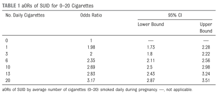
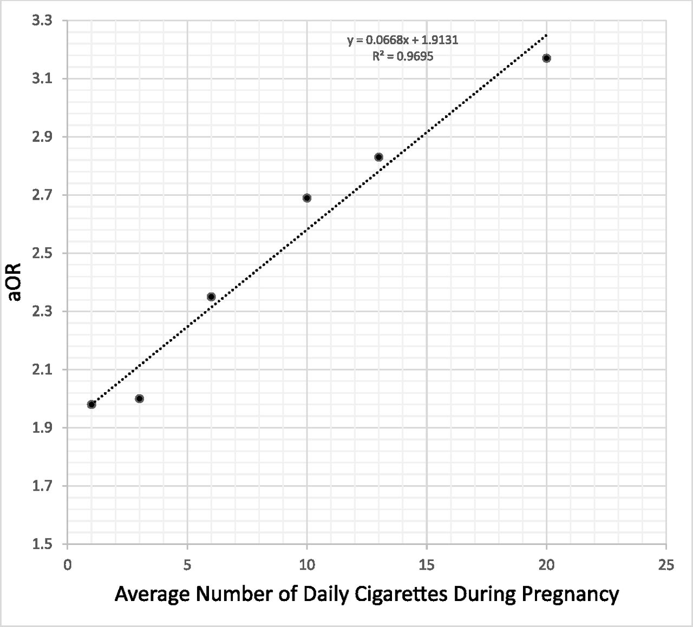
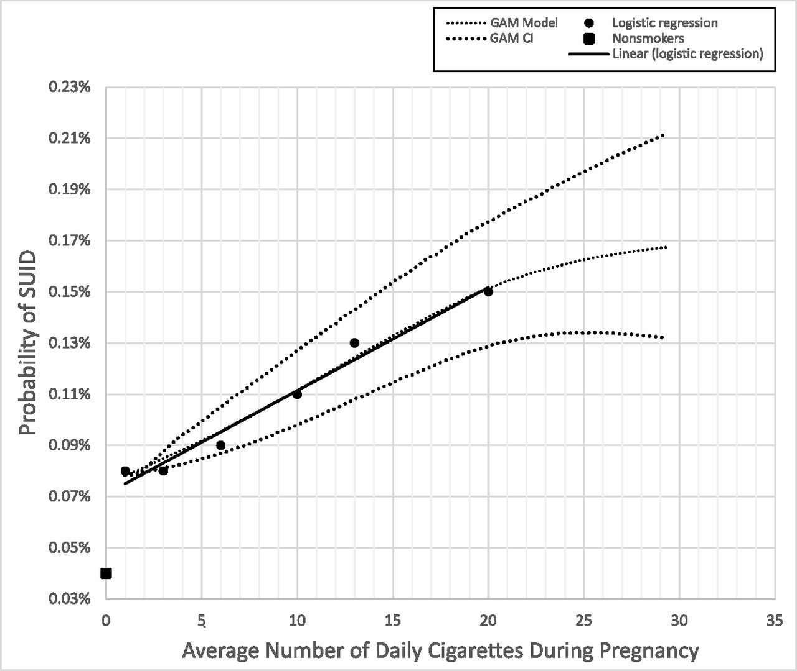
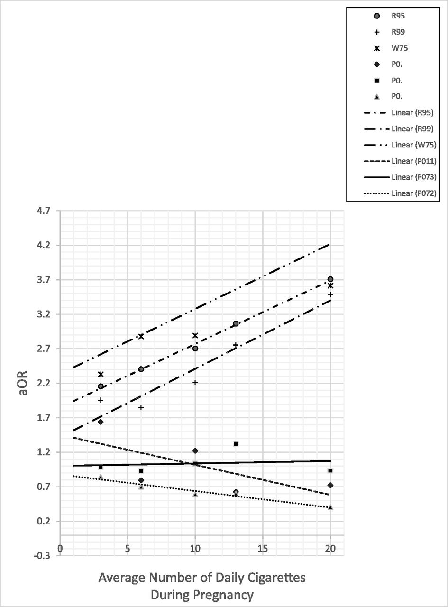

## タイトル
Maternal Smoking Before and During Pregnancy and the Risk of Sudden Unexpected Infant Death  
妊娠前および妊娠中の母親の喫煙と乳幼児突然死のリスク

## 著者/所属機関
Tatiana M. Anderson, PhD, Seattle Children’s Research Institute, Center for Integrative Brain Research, 1900 Ninth Ave, Seattle,  
Juan M. Lavista Ferres, Shirley You Ren, Rachel Y. Moon, Richard D. Goldstein, Jan-Marino Ramirez, Edwin A. Mitchell

## 論文リンク
https://doi.org/10.1542/peds.2018-3325

## 投稿日付
Accepted January 16, 2019.

## 概要
### 目的
母体の妊娠前の喫煙、妊娠中の喫煙の減少、および喫煙がSUID率（1歳未満の死亡）に及ぼす影響を調査すること。

### 方法
米疾病管理予防センターの新生児/乳児死亡関連出生コホートデータセット（2007-2011：20,685,463の出生、19,127のSUID）を分析。

### 結果
妊娠中の喫煙は禁煙と比較して、SUIDリスクは2倍以上になった（調整オッズ比\[aOR\] 2.44; 95％信頼区間\[CI\] 2.31-2.57）。  
紙巻たばこについては、1日あたり20本までは1本増える毎に0.07倍の確率で、SUIDの確率は直線的に増加した。20本以上では、横ばいであった。  
禁煙または喫煙を減らした場合、喫煙を続けた場合と比べてオッズ比が低下した（減少：aOR＝0.88、95％CI 0.79-0.98、禁煙：aOR＝0.77、95％CI 0.67-0.87）。  

### 結論
因果関係を仮定すると、米国のSUIDの22％は妊娠中の喫煙に起因している可能性がある。

### 表1 0〜20本の喫煙時のSUIDのaOR

### 図1 1日あたりの喫煙数（1～20）とSUIDのaOR

### 図2 1日あたりの喫煙数とSUIDの確率（ロジスティック回帰、GAM）
2つの異なる計算モデル、ロジスティック回帰とGAMは、すべての妊娠時期にわたって母親によって喫煙された報告されたタバコの1日の平均日数を与えられたSUIDの割合をプロットします。

### 図3 SUIDおよび非SUIDの乳児死亡の特定の原因のaOR。
R95（SIDS）、R99（明確ではない、または未知の死亡原因）、およびW75（偶発的な窒息またはベッド詰まり）を含む、乳児死亡の特定の原因とその他のSUID以外の乳児死亡のaORとの比較  
P07.2（新生児の極度の未熟児）、P07.3（未熟児）、およびP01.1（前期破水の影響を受けた新生児）を含む。

