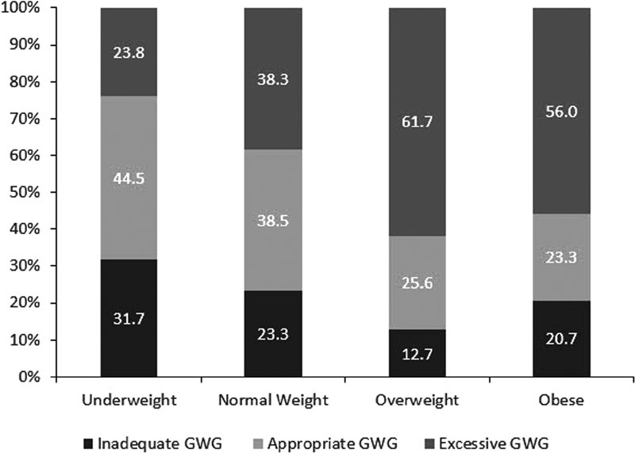

## タイトル
Association between Gestational Weight Gain Adequacy and Adverse Maternal and Neonatal Outcomes  
妊娠体重増加の十分性と有害な母親および新生児の転帰との関連

## 著者/所属機関

## 論文リンク
10.1055/s-0038-1672196

## 投稿日付
received: November 22, 2017  
accepted after revision: August 20, 2018  
published online: October 3, 2018

## 概要
### 目的
2009年ガイドラインに従って妊娠中の体重増加（GWG）の妥当性の罹患率を推定し、妊娠前の体重指数（BMI）によって層別化されたGWGの妥当性と有害転帰との関連を調べること。

### 研究デザイン
2011年から2013年までの米国のリンクされた出生/乳児死亡データセットを使用した後ろ向きコホート研究では、37から41週の非異常なシングルトン出生に限定されていた。  
有害転帰には、母体複合罹患率（CMM）、新生児複合罹患率（CNM）、ならびに新生児および乳児の死亡率が含まれた。  
GWGの妥当性と有害転帰との関連を調べるために、ロバストな誤差分散を持つ多変数ポアソン回帰モデルを使用しました。

### 結果
8,656,791人のシングルトン出生、20、32、および48％はそれぞれ、不十分、適切、過剰なGWGを有していた。  
多変量回帰調整後、適切なGWGと比較して、過剰なGWGはそれぞれCMMおよびCNMのリスクが1.10（1.08-1.33）および1.12（1.10-1.14）倍高かった; 同様の所見がBMIサブグループでも観察された。  
適切なGWGと比較して、不適切なGWGは、新生児および乳児の死亡リスクがそれぞれ1.14（1.03-1.26）および1.12（1.07-1.18）倍高かった。  
正常体重の女性でも同様の結果が認められた。

### 結論
過度のGWGはCMMとCNMのリスク増加と関連していたが、不十分なGWGは新生児と乳児死亡率のより高いリスクと関連していた。

### 図1

