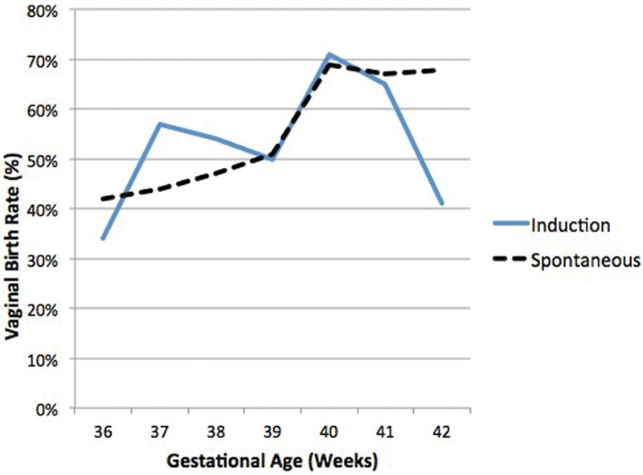

## タイトル
Gestational Weight Gain during Pregnancy as an Important Factor Influencing a Successful Trial of Labor following Two Previous Cesareans  
過去2回の帝王切開後の成功した分娩試験に影響する重要な要因としての妊娠中の妊娠中の体重増加

## 著者/所属機関

## 論文リンク
10.1055/s-0038-1670679

## 投稿日付
received: January 28, 2018  
accepted: August 13, 2018  
published online: September 19, 2018

## 概要
### 目的
北米コホートにおける2回の帝王切開分娩（CD）後の成功した経膣分娩トライ（TOL）に関連する要因を特定すること。

### 研究デザイン
2012年から2014年までの米国における過去2回のCDの既往歴の後の帝王切開後の経膣分娩（VBAC）を試みた正期産、非異常、シングルトン妊娠、頭位の遡及的コホート研究である。
母体および分娩因子は、カイ二乗検定および多変量ロジスティック回帰を用いて分析した。

### 結果
合計22,762人の女性が選択基準を満たし、TOLを受けた。  
このうち、12,192人（53.6％）がVBACを実施した。  
多変量ロジスティック回帰を使用して、以前の経膣分娩および妊娠40〜41週の分娩はVBACと関連していた。  
母体年齢、教育、メディケイド保険、白人以外の人種/民族、体重（太りすぎまたは肥満）、および医学研究所のガイドラインを超える妊娠中の体重増加（調整オッズ比：0.88; 95％信頼区間：0.81-0.95）はCDと関連していた。  
分娩誘発はVBAC率に影響を及ぼさなかった。

### 結論
過去2回のCDの後にTOLを望んでいる人にとっては、妊娠中の体重増加を制限する介入、ならびに安全性および分娩誘発の最適なタイミングを評価するための前向き研究が必要です。  
TOLを試みるという決定は、リスク、利点、およびTOLが成功する可能性に関するカウンセリングによって導かれるべきです。

### 図1

