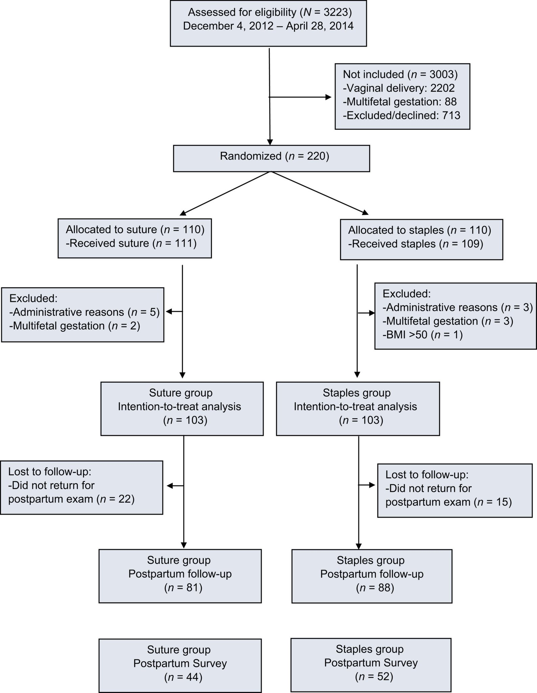

## タイトル
Absorbable subcuticular staples versus suture for caesarean section closure: a randomised clinical trial  
帝王切開閉鎖術のための吸収性皮下ステープル対縫合糸：無作為化臨床試験

## 著者/所属機関
AM Madsen  ML Dow  CM Lohse  JA Tessmer‐Tuck  
Department of Obstetrics and Gynecology at Mayo Clinic, Rochester, Minnesota

## 論文リンク
https://doi.org/10.1111/1471-0528.15532

## 投稿日付
Issue Online: 06 February 2019  
Version of Record online: 28 November 2018  
Accepted manuscript online: 20 November 2018  
Manuscript accepted: 18 October 2018  
First published: 20 November 2018

## 概要
### 目的
帝王切開皮膚閉鎖術のための吸収性皮下ステープルと皮下縫合糸の間の効率、安全性、患者、および外科医の満足度の結果を比較すること。

### 設計デザイン
前向き無作為化非ブラインド並行群間試験。  
帝王切開を受けている、少なくとも18歳および24週間の妊娠。除外基準は、ボディマスインデックス> 50、絨毛羊膜炎、子宮内胎児死亡、および多胎児妊娠。  
患者は、帝王切開履歴、肥満度指数、および外科医のレベルによって層別化され、吸収性皮下ステープルまたは皮下縫合糸に無作為化された。  
主要転帰は、切開開始から閉鎖までの総手術時間であり、副次的転帰は、皮下皮膚閉鎖時間、患者および外科医の満足度、経皮的損傷、痛み（鎮痛剤使用）、美容上の転帰、および創傷合併症が含まれた。

### 結果
220人の無作為化患者のうち、206人が最終分析に含まれた（1群あたり103人）。
ベースライン特性は類似していた。
全手術時間の主要転帰は、群間で有意差はなかった[54.0（44.9-63.6）vs58.0（50.4-68.2）分、P＝0.053]。
皮下ステープル群の皮下皮膚閉鎖時間は短かった[中央値2.6（1.8-4.0）vs8.5（6.2-10.5）分、P<0.001]。
鎮痛剤の使用、創傷の合併症、美容または患者の満足度に差はなかった。
縫合糸で1本の針刺し事故が発生した。
外科医は、吸収性皮下ステープルを推奨する（97％vs85％、P＝0.004）および使用する（98％vs82％、P<0.001）可能性が高かった。

### 結論
帝王切開による皮膚閉鎖の場合、吸収性皮下ステープルは縫合糸と比較して有意に異なる総手術時間をもたらさなかった。
鎮痛剤の使用、創傷の合併症、および美容上の転帰は同等であった。
患者と外科医の満足度は両方の方法で高かった。

### 図

