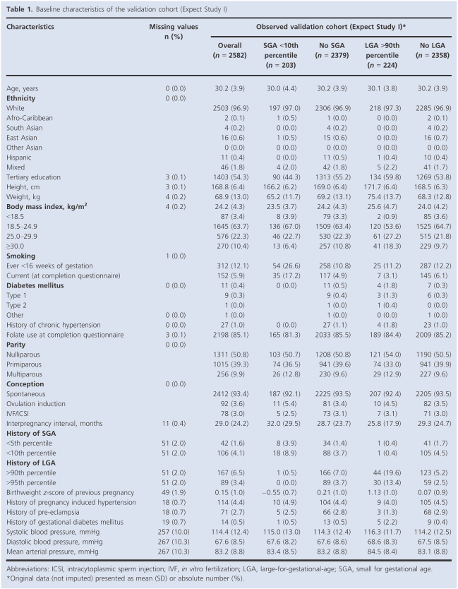
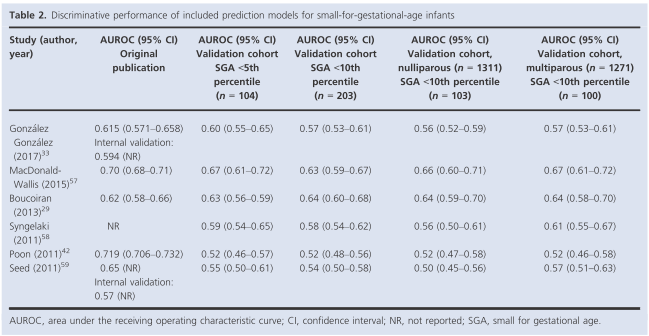
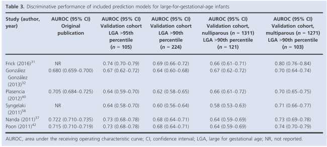
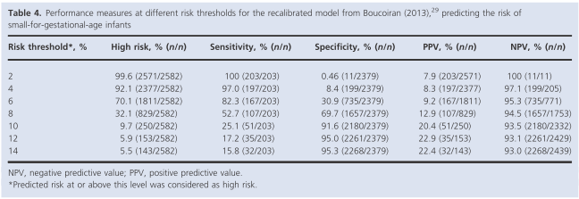
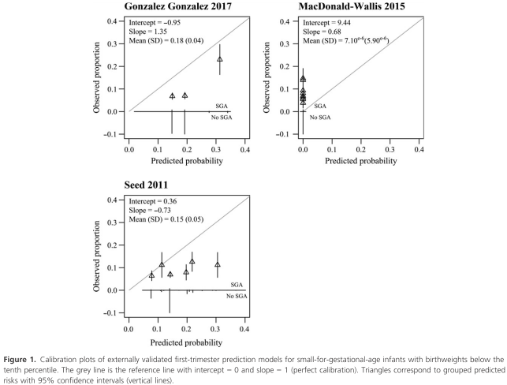
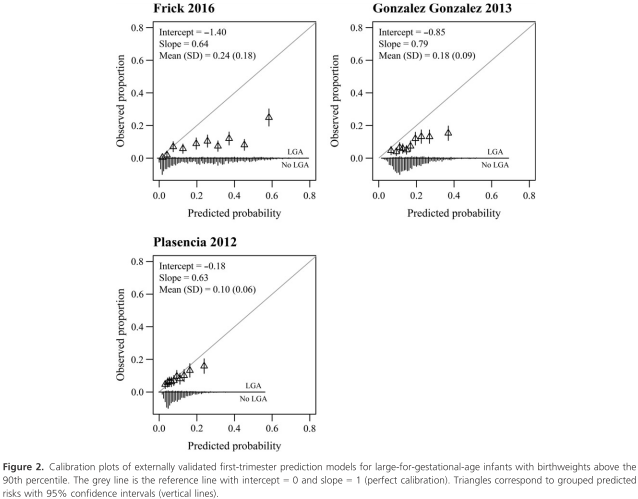
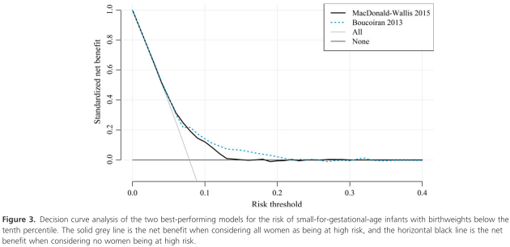
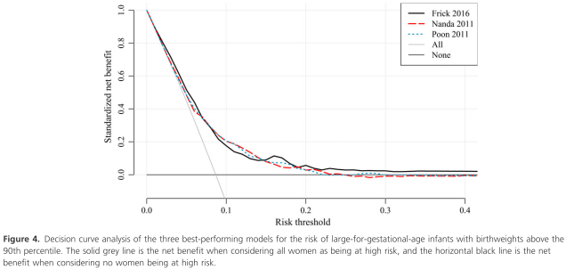
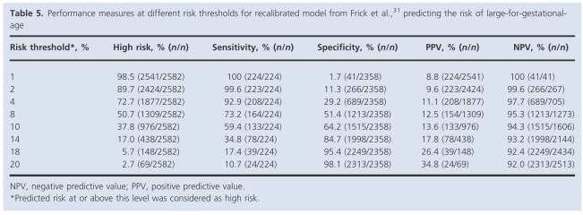

## タイトル
External validation and clinical usefulness of first‐trimester prediction models for small‐ and large‐for‐gestational‐age infants: a prospective cohort study  
妊娠期間が短い/長い乳児の妊娠初期予測モデルの外部検証と臨床的有用性：前向きコホート研究

## 著者/所属機関
LJE Meertens  LJM Smits  SMJ van Kuijk  R Aardenburg  IMA van Dooren  J Langenveld  IM Zwaan MEA Spaanderman  HCJ Scheepers

## 論文リンク
https://doi.org/10.1111/1471-0528.15516

## 投稿日付
Accepted 12 October 2018  
Published Online 17 January 2019

## 概要
### 目的
妊娠期間が短い/長い（SGAおよびLGA）乳児のリスクについて、公開されているすべての妊娠初期予測モデルの外部妥当性を評価すること。

### 研究デザイン
オランダの36助産施設および6病院において、2013年7月1日から2015年12月31日までの2582人の妊娠16週未満の女性を対象とした多施設前向きコホート研究。

### 方法
予測モデルは過去の文献に基づいて体系的に選択された。予測因子に関する情報は、Webベースのアンケートによって得られた。出生時体重の区分は、妊娠期間、出産歴、胎児の性別、および民族で補正された。予測モデルの性能をDiscrimination（C統計量）およびCalibrationによって評価した。

### 結果
被験者2582人のうち、SGA（<10パーセンタイル）およびLGA（>90パーセンタイル）は、それぞれ203人および224人であった。C統計量は、SGA群（n＝6）では0.52-0.64 、LGA群（n＝6）では0.60-0.69であった。特に重度のSGA（<5パーセンタイル）およびLGA（>95パーセンタイル）の場合にC統計量が高かった。最初のCalibrationは予測された確率と観察された結果との間に低-中等度の一致を示したが、これは再補正後に実質的に改善した。

### 結論
モデルの臨床的関連性は、それらの適度な予測性能のため、そしてSGAおよびLGAの定義が体質的に小さいまたは大きい幼児を除外しないために制限されている。臨床的に重要な胎児成長偏差は「血管」または「代謝」因子に関連しているため、高血圧障害と妊娠糖尿病を予測するモデルの方がより特異的である可能性がある。

### 表1. 検証コホートのベースライン特性（Expect Study I）

### 表2. SGA児の予測モデルを含む判別性能

### 表3．LGA児の予測モデルを含む判別性能

### 表4. Boucoiran（2013）による再較正モデルの異なるリスク閾値での性能測定、SGA児のリスク予測。

### 図1 出生時体重が10パーセンタイル以下の、SGA児のための外部検証済み妊娠初期予測モデルのキャリブレーションプロット。

### 図2 出生時体重が90パーセンタイル以上の、LGA児のための外部検証済み妊娠初期予測モデルのキャリブレーションプロット。

### 図3 出生時体重が10パーセンタイル以下の、SGA児のリスクに関する2つの最高性能モデルの決定曲線分析。

### 図4 出生時体重が90パーセンタイル以上の、LGA児のリスクに関する3つの最高性能モデルの決定曲線分析。

### 表5 Frickらによる再較正モデルの異なるリスク閾値での性能測定、LGA児のリスク予測。

