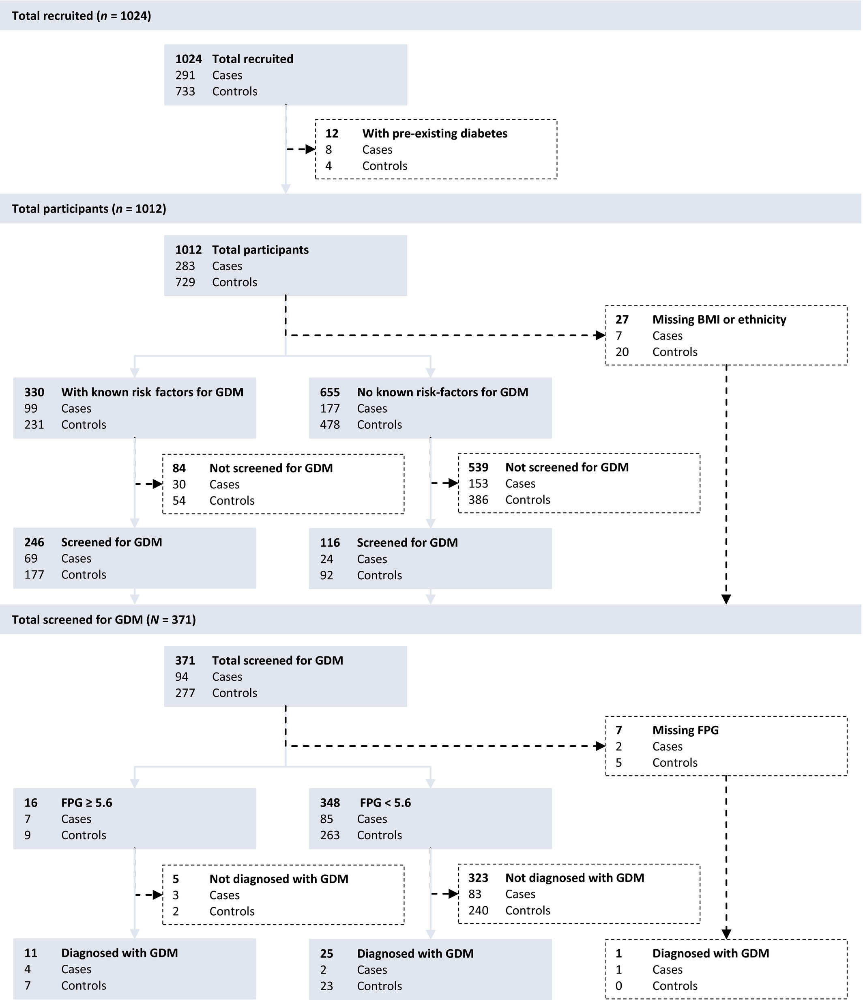
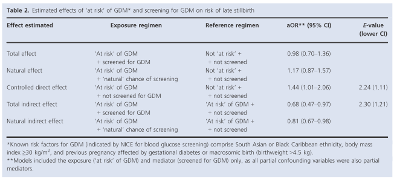

## タイトル
Gestational diabetes and the risk of late stillbirth: a case–control study from England, UK  
妊娠性糖尿病と後期死産のリスク：イギリスの症例対照研究

## 著者/所属機関
T Stacey 1, PWG Tennant 1 2, LME McCowan 3, EA Mitchell 3, J Budd 4 5, M Li 3, JMD Thompson 3, B Martin 6, D Roberts 7, AEP Heazell 4 5  
1 University of Leeds, UK  
2 The Alan Turing Institute, UK  
3 The University of Auckland, New Zealand  
4 University of Manchester, UK  
5 Manchester University NHS Foundation Trust, UK  
6 Birmingham Women's Hospital NHS Foundation Trust, Birmingham, UK  
7 Liverpool Women's Hospital NHS Foundation Trust, Liverpool, UK

## 論文リンク
https://doi.org/10.1111/1471-0528.15659

## 投稿日付
First published: 19 March 2019  
Version of Record online: 19 March 2019  
Manuscript accepted: 31 January 2019

## 概要
### 目的
妊娠糖尿病（GDM）およびGDMのスクリーニングの「リスクがあること」、ならびに空腹時血漿グルコース（FPG）の上昇およびGDMの臨床診断が、後期死産のリスクに及ぼす個別の影響を調査すること。

### 研究デザイン
イギリスの41の産科施設で行われた前向き症例対照研究。  
妊娠28週以上の妊婦（n＝291）および妊娠中の女性（n＝733）。

### 方法
媒介分析は、後期死産のリスクに関する複合効果を検討した。
* （i）GDMの「リスクがある」およびGDMのスクリーニング
* （ii）FPGの上昇（≧5.6 mmol/l）およびGDMの臨床診断
調整オッズ比（aOR）は有向非巡回グラフによって識別される交絡因子について調整されたロジスティック回帰によって推定された。  
主要転帰はGDMおよびFPGレベルのスクリーニングであった。

### 結果
GDMの「リスクがある」が、スクリーニングされていない被験者は、「リスクがない」被験者より44％後期死産のリスクが高かった（aOR 1.44、95％CI 1.01-2.06）。  
GDMの「リスクがあり」、スクリーニングされた被験者には、そのような増加が見られなかった（aOR 0.98、95％CI 0.70-1.36）。  
FPGが上昇しながらGDMと診断されなかった被験者は、正常なFPGの被験者より後期死産のリスクが4倍高かった（aOR 4.22、95％CI 1.04-17.02）。  
FPGが上昇し、GDMと診断された被験者には、そのような増加は見られなかった（aOR 1.10、95％CI 0.31-3.91）。

### 結論
GDMの最適なスクリーニングおよび診断は、GDMの「リスクがある」、および/またはFPGが上昇している被験者の後期死産のリスクを軽減する。  
FPGが上昇し、GDMと診断されなかった被験者は、（本来回避可能である）後期死産のリスクにさらされたままである。

### 図1 研究の導出および分析サンプル。

### 表1 危険因子、スクリーニングおよびFPG濃度

### 表2 GDMの「リスクがある」およびGDMのスクリーニングが後期死産のリスクに及ぼす推定効果

### 表3 後期死産のリスクに対するFPG濃度およびGDMの臨床診断の推定効果

### 図2 FPGが4.1mmol/l未満の被験者に関する後期死産の無条件オッズ比。（点線は、NICEが推奨するFPG閾値）

### 表4 GDMの診断、治療の有無にかかわらず、FPGが4.1mmol/l未満の（未診断の）被験者に関する、後期死産の推定オッズ比

