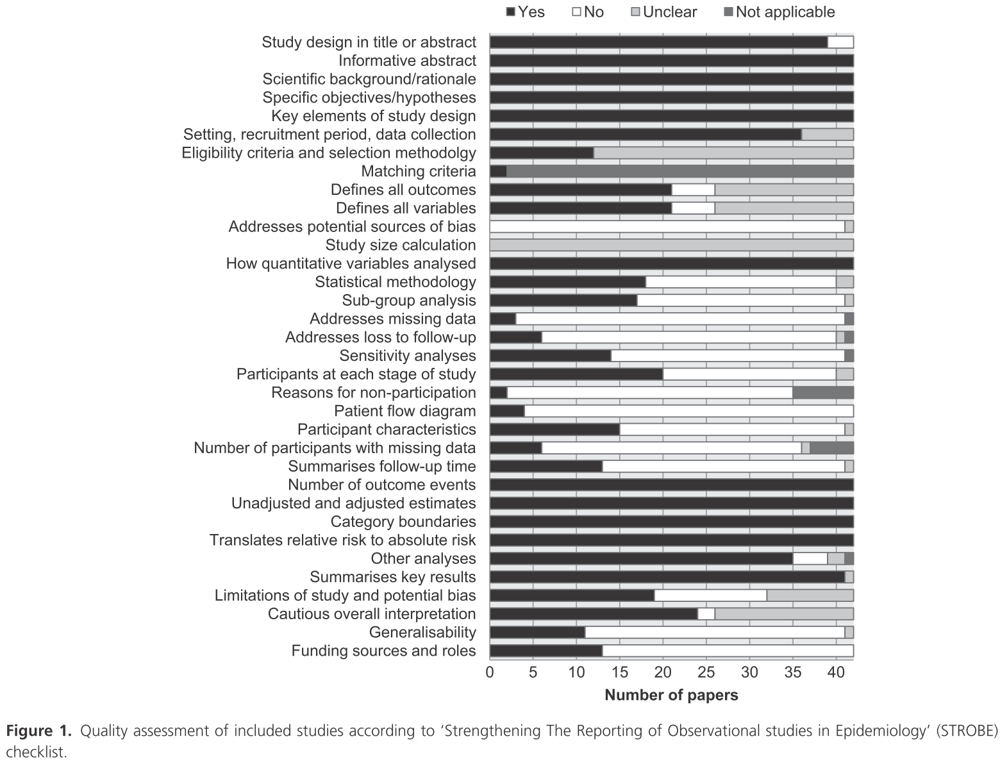
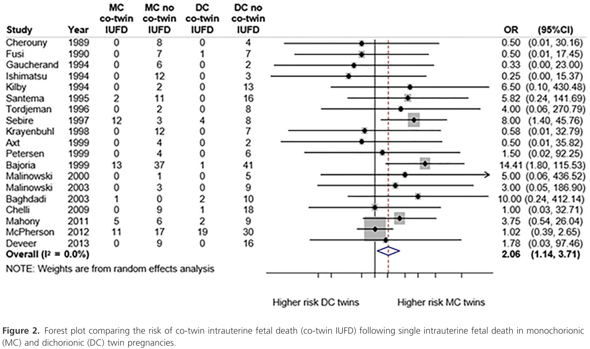
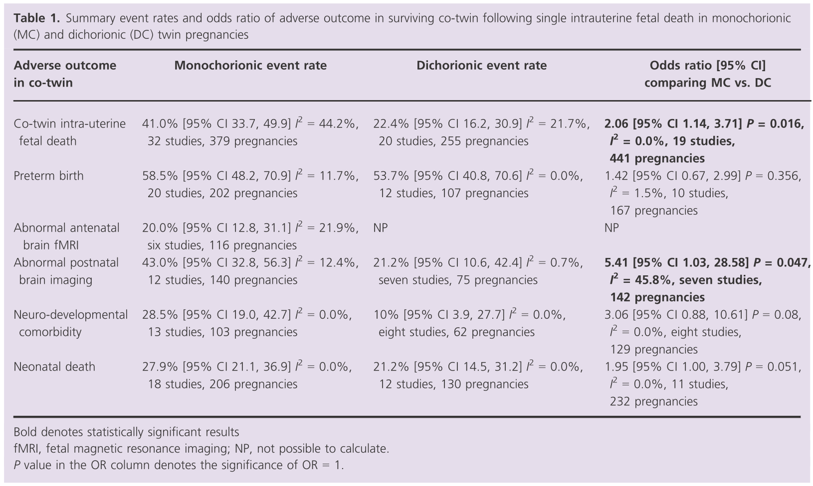
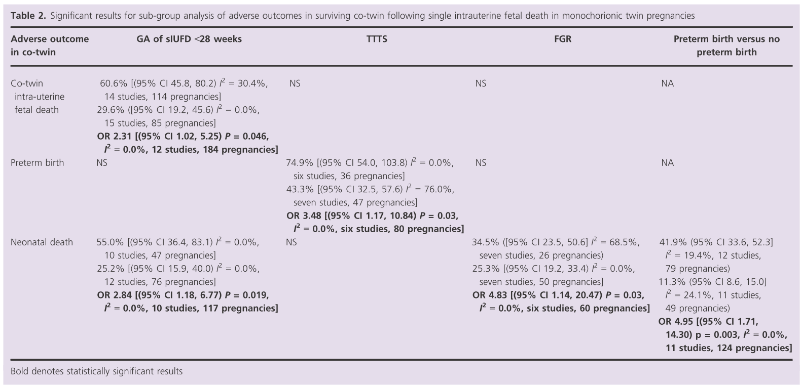

## タイトル
Prognosis of the co‐twin following spontaneous single intrauterine fetal death in twin pregnancies: a systematic review and meta‐analysis  
双胎妊娠における一方の児が死亡した場合のもう一方の児の予後：系統的レビューとメタアナリシス

## 著者/所属機関
FL Mackie, Centre for Women's and Children Health, Institute of Metabolism and Systems Research, University of Birmingham, Birmingham, UK  
A Rigby, Flinders Medical Centre, Adelaide, SA, Australia  
RK Morris, Centre for Women's and Children Health, Institute of Metabolism and Systems Research, University of Birmingham, Birmingham, UK  
MD Kilby, Centre for Women's and Children Health, Institute of Metabolism and Systems Research, University of Birmingham, Birmingham, UK

## 論文リンク
https://doi.org/10.1111/1471-0528.15530

## 投稿日付
First published: 20 November 2018  
Issue Online: 04 March 2019  
Version of Record online: 26 November 2018  
Accepted manuscript online: 20 November 2018  
Manuscript accepted: 17 October 2018

## 概要
### 目的
双胎妊娠の一方の胎児が自然に死亡した場合の、もう一方の胎児の予後を調査すること。

### 研究デザイン
* 1980年から2017年6月までのMedline、Embase、Web of Science、およびCochrane Libraryを調査した。
* 二羊膜双胎妊娠における妊娠14週以降の一方の胎児が死亡した5症例以上の研究を対象とした。
* サマリーイベント発生率を絨毛膜性によって計算、分類した。
* 一絨毛膜および二絨毛膜の双子、およびサブグループをオッズ比で比較した。

### 主要転帰
* 一絨毛膜性双胎妊娠では、妊娠28週未満で一方の胎児が死亡した場合、28週以上の場合と比較して、もう一方の胎児死亡[オッズ比（OR）2.31、95％信頼区間（CI）1.02-5.25、I2＝0.0％、12件の研究、184件の妊娠]および新生児死亡（OR 2.84、95％CI 1.18-6.77、I2＝0.0％、10件の研究、117件の妊娠）の割合が有意に増加した。
* 胎児発育不全（OR 4.83、95％CI 1.14-20.47、I2＝0.0％、6件の研究、60回の妊娠）または早産（OR 4.95、95％CI 1.71-14.30、I2＝0.0％、11件の研究、124件の妊娠）の場合、一絨毛膜性双胎の新生児死亡は有意に高かった。
* 出生前の脳画像診断の異常は、生存している一絨毛膜性双胎の20.0％（95％CI 12.8-31.1、I2＝21.9％、6件の研究、116件の妊娠）で報告されている。

### 結論
* 早産は、58.5％および53.7％の一絨毛膜性および二絨毛膜性双胎妊娠に影響する最も一般的な有害転帰であった。
* 脳画像診断および神経発達共存症に関する結果は将来の研究にとって重要な分野であるが、メタアナリシスは異なる評価方法のために制限されるかもしれない。

### 図1 STROBEチェックリストに従った研究品質の評価

### 図2 一絨毛膜および二絨毛膜性双胎妊娠における一方の胎児死亡後のもう一方の胎児死亡のリスクを比較するフォレストプロット

### 表1 一絨毛膜および二絨毛膜性双胎妊娠における一方の胎児死亡後のもう一方の胎児における有害転帰のサマリーイベント発生率とオッズ比

### 表2 一絨毛膜性双胎妊娠における一方の胎児死亡後のもう一方の胎児における有害転帰のサブグループ分析のための有意な結果

