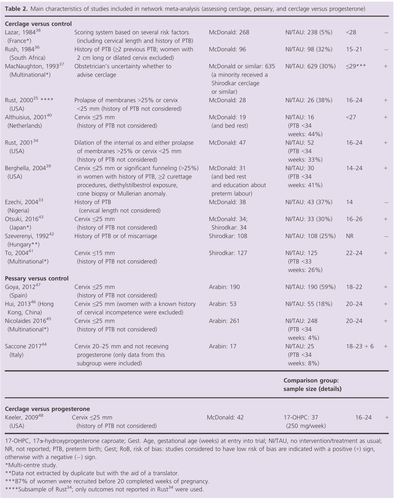

## タイトル
Vaginal progesterone, oral progesterone, 17‐OHPC, cerclage, and pessary for preventing preterm birth in at‐risk singleton pregnancies: an updated systematic review and network meta‐analysis  
リスクのある単胎妊娠における早産防止のための膣プロゲステロン、経口プロゲステロン、17-OHPC、頸管縫縮、およびペッサリー：最新の系統的レビューおよびネットワークメタアナリシス

## 著者/所属機関
A Jarde, Department of Obstetrics and Gynecology, McMaster University, Hamilton, ON, Canada  
O Lutsiv, Provincial Council for Maternal and Child Health, Toronto, ON, Canada  
J Beyene, Department of Clinical Epidemiology and Biostatistics, McMaster University, Hamilton, ON, Canada  
SD McDonald, Department of Obstetrics and Gynecology, McMaster University, Hamilton, ON, Canada 

## 論文リンク
https://doi.org/10.1111/1471-0528.15566

## 投稿日付
First published: 27 November 2018  
Issue Online: 04 March 2019  
Version of Record online: 29 December 2018  
Accepted manuscript online: 27 November 2018  
Manuscript accepted: 12 November 2018

## 概要
### 目的
ハイリスク妊娠の全体および特定の集団の早産予防におけるプロゲステロン、頸管縫縮、およびペッサリーのさまざまな種類および投与経路の相対的な影響を比較すること。

### 研究デザイン
* 2018年1月1日までの、Medline、EMBASE、CINAHL、Cochrane CENTRAL、Web of Scienceを検索した。
* ハイリスクの単胎妊娠における早産予防のためのプロゲステロン、頸管縫縮またはペッサリーの無作為化試験を対象とした。
* パイロットデータ抽出フォームを使用し、95％信頼区間（CrI）でベイズランダム効果ネットワークメタアナリシスを実行し、さらにペアワイズメタアナリシス、GRADEを使用してエビデンスの質を評価した。

### 主要転帰
* 40の試験の11,311人が対象となった。
* ハイリスク妊娠全体で、膣プロゲステロンは<34週の早産（OR 0.43、95％CrI 0.20-0.81）および<37週（OR 0.51、95％CrI 0.34-0.74）、および新生児死亡（OR 0.41、95％CrI 0.20-0.83）であった。
* 早産の経験のある患者では、膣プロゲステロンは<34週の早産（OR 0.29、95％CI 0.12-0.68）および<37週（OR 0.43、95％CrI 0.23-0.74）を減少させ、17α-ヒドロキシプロゲステロンカプロン酸は<37週の早産（OR 0.53、95％CrI 0.27〜0.95）および新生児死亡（OR 0.39、95％CI 0.16〜0.95）を減少させた。
* 子宮頸管が短い（25 mm以下）女性では、膣プロゲステロンによって<34週の早産が減少した（OR 0.45、95％CI 0.24〜0.84）。

### 結論
膣プロゲステロンは、ハイリスクの単胎妊娠全体および早産の経験のある患者の早産予防において唯一有効性を有した。

### 図1 統計的レビューのフローダイアグラム

### 表1 メタアナリシスに含まれる研究の主要特性(プロゲステロン)

### 表2 メタアナリシスに含まれる研究の主要特性(頸管縫縮、ペッサリー、頸管縫縮vsプロゲステロン)

### 表3 早産の全体的な危険性がある単胎妊娠の女性および共通の危険因子によって定義されるサブグループ（過去の早産の経歴または子宮頸管長≦25 mm）におけるプロゲステロン（PV、PO、IM 17-OHPC）、頸管縫縮、およびペッサリーの有効性

