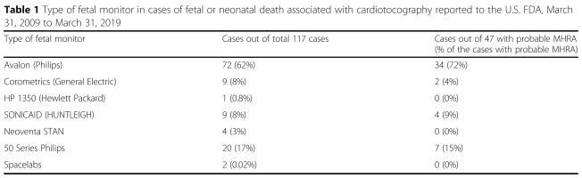
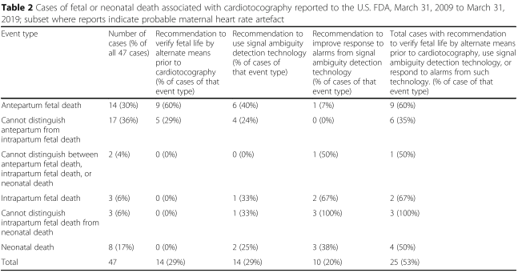

## タイトル
Unrecognized maternal heart rate artefact in cases of perinatal mortality reported to the United States Food and Drug Administration from 2009 to 2019: a critical patient safety issue  
2009年から2019年にFDAに報告された周産期死亡症例における母体心拍数アーチファクト：患者の重大な安全性の問題

## 著者/所属機関

## 論文リンク
https://doi.org/10.1186/s12884-019-2660-5

## 投稿日付
Received: 19 May 2019  
Accepted: 03 December 2019  
Published: 16 December 2019

## 概要
### バックグラウンド
米国FDA MAUDEデータベースでCTG関連の胎児および/または新生児の死亡の可能性のあるMHRAの頻度を評価し、これらの報告書でMHRAが検出されないリスクを減らすため戦略に関する医療提供者の教育と訓練のギャップの兆候があるかどうかを評価すること。

### 方法
* 著者(産婦人科医)は、2009年3月31日～2019年3月31日にFDA医療機器有害事象報告(MAUDE)のデータベースに記録されたにCTG関連の全死亡症例を調査した。
* これらの検索用語は次のとおりであった。
  * ブランド名等
    * fetal monitor (胎児モニター)
    * avalon (アヴァロン)
    * corometrics (コロメトリクス)
    * fetal heart monitor (胎児心臓モニター)
    * STAN S31
    * perinatal monitoring system (周産期モニタリングシステム)
    * sonicaid (ソニケイド)
    * series 50 (シリーズ50)
    * fetal/maternal monitor (胎児/母体モニター)
    * maternal monitor (母体モニター)
    * 50 IP
    * huntleigh (ハントレー)
    * S50 XM
    * 50 XM
    * neoventa (ネオベンタ)
    * obstetric data analyzer (産科データ分析装置)
    * fetal transducer (胎児トランスデューサー)
    * ultrasound transducer (超音波トランスデューサー)
    * ohmeda (オメダ)
    * coro 250 (コロ(メトリクス) 250シリーズ)
    * spacelabs (スペースラブ)
  * 製品コード
    * HEL (monitor モニター, heart rate 心拍数, fetal 胎児, ultrasonic 超音波)
    * HEK (monitor モニター, heart sound 心音, fetal 胎児, ultrasonic 超音波)
    * HEI (monitor モニター, heart-valve movement 心臓弁の動き, fetal 胎児, ultrasonic 超音波)
    * HGM (system システム, monitoring モニタリング, perinatal 周産期)
    * HFM (fetal monitor 胎児モニター)
    * HEO (fetal heart monitor 胎児心臓モニター)
  * 除外
    * 胎児心拍数モニターに関連しない記録
    * central fetal monitoring systems (胎児中央集中監視システム)
* 次に以下を検討した。
  * イベントの種別
    * 分娩前胎児死亡/分娩中胎児死亡/新生児死亡/分娩前と分娩中の間の児死亡/分娩中と新生児の間の児死亡/区別不可能
    * 母体心拍数アーチファクトが関与した可能性
    * 胎児モニターの種類
    * 製造業者の報告が完全/進行中/不明
  * レポートの決定基準
    * 母体心拍数アーチファクト混入の可能性があり、製造業者からの推奨事項があるかどうか
    * MHRAの可能性については、イベントの説明に「母体心拍数混入」「母児一致」「内測での予測不可能な徐脈(児頭電極)」のような文言が含まれるか
    * イベントの説明者または製造業者がMHRAと信じていることを伝える言葉があるか
  * 胎児が死産の場合、MHRAの可能性の根拠として胎児電子モニタリングを考慮した
  * 母体心拍数アーチファクトの診断/管理に製造業者の推奨/提案事項が各レポートに含まれるか評価した
  * 推奨/提案事項は事前に以下のように指定
    * 電子胎児モニタリングを開始前に別の手段で胎児の生命を確認する必要があること
    * 曖昧な信号検出技術を使用する必要があること
    * 曖昧な信号検出技術からのアラームへの応答が優れていたはずであること
  * メーカーからの推奨事項を含む母体心拍アーチファクトの可能性については2人の専門家により個別にレビューされ、意見の相違はコンセンサスにより解決した

### 結果
* 500件のFDAのレポートから除外要件を除いた117件を抽出(35件は「外国」とリストされていた)
  * “Cardiotocography-associated fetal and neonatal deaths reported to the US FDA 2009-2019”というタイトルでオープンアクセスで入手可能
* 117件のうち、47症例(40％)は母体心拍アーチファクトの可能性があると断定
  * 製造業者の報告書では母体心拍の取り違えリスク軽減のために追加の措置を取るべきであると頻繁に示唆している
    * CTG検査前に別の方法で胎児心拍を確認(16例)
    * 信号が曖昧であることを検出する技術の有効化(16例)
    * 信号が曖昧である場合の警告への対応の改善(10例)
    * 29症例(25％)で上記の推奨事項の1つ以上が含まれていた

母親の心拍数が推定される症例を、CTGモニタリングの開始前に分娩前胎児死亡または分娩前胎児死亡の可能性があるケース、または2つ、分娩中胎児死亡または新生児があることが比較的確実であるケースに分けました。 CTGモニタリングの開始後の死亡。分娩前の胎児死亡の場合、MHRAは不必要な帝王切開、医療提供者チームの混乱、および患者の精神的苦痛につながる可能性があります。ただし、分娩時の胎児死亡または新生児死亡の場合、MHRAは胎児の苦痛を隠し、よりタイムリーな介入を妨げる可能性があるため、胎児/新生児死亡の潜在的な直接的な要因です。産前の胎児死亡を含む、またはおそらく関与する可能性のあるMHRAの33症例では、製造業者のレポートは、14症例（42％）でCTGモニタリングの前に胎児の生命の検証を推奨し、10症例（30％）で信号曖昧性検出技術を有効化するこれらの推奨事項のいずれか（48％）で、合計16ケースに対して2ケース（6％）の信号曖昧性検出テクノロジーへの対応。分娩中の胎児死亡または新生児死亡を伴う可能性のあるMHRAの14症例（追加ファイル3で省略形で、全体がFigshareリポジトリのフォルダーで利用可能）[22]では、胎児の生命を確認するための推奨事項はありませんCTGモニタリング（CTGモニタリングの開始時に胎児が生存していると推定されるケースであるため、予想される）、信号曖昧性技術の使用を推奨する4ケース（29％）、および推奨を伴う8ケースこれらの推奨事項の1つを使用して、合計9ケース（64％）で、信号曖昧性テクノロジーからのアラームへの応答を改善する（57％）。

MHRAやメーカーからのMHRAに関する推奨事項を含めると判断したすべてのレポートの主要なフィールドを、追加ファイルとして含めたコンパクトなドキュメントに要約しました。含まれたフィールドは、胎児モニターの種類、イベントの日付（利用可能な場合）、メーカーの説明（完全）、イベントの説明（完全）、MDRレポートキー、およびレポート番号です。このようなコンパクトファイルは3つあります。1つは、可能性のあるMHRAのすべてのケースを含む（追加ファイル1）、MHRAを含む製造元からの推奨事項を含むすべてのケース（追加ファイル2）、およびイベントタイプが明確なすべてのケースを含む1つです可能性のあるMHRAを伴う分娩中死亡または新生児死亡（分娩前または分娩前の胎児死亡の場合とは対照的に）（追加ファイル3）。さらに、すべてのコンパクトファイルで、レポートの対象となった関連セクションが黄色で強調表示され、イベントを要約するセクションが緑色で強調表示されます。これにより、関心のある読者は短時間ですべてのレポートを確認し、結論の強さについて自分で決定できます。

We separated the cases with probable maternal heart rate into those where either: one, there was an antepartum fetal death or a possible antepartum fetal death prior to initiation of CTG monitoring or two, it appeared relatively certain that there was an intrapartum fetal death or neonatal death after initiation of CTG monitoring. In cases of antepartum fetal death, MHRA may lead to unnecessary cesarean, healthcare provider team confusion, and emotional distress for the patient. However, in cases of intrapartum fetal death or neonatal death, MHRA is a potential direct contributor to fetal/neonatal death by masking fetal distress and potentially precluding more timely intervention. In the 33 cases of probable MHRA involving or possibly involving antepartum fetal death, the manufacturer’s report recommends verification of fetal life prior to CTG monitoring in 14 cases (42%), activating signal ambiguity detection technology in 10 cases (30%), and better response to signal ambiguity detection technology in 2 cases (6%) for a total of 16 cases with one of these recommendations (48%). In the 14 cases of probable MHRA involving intrapartum fetal death or neonatal death (available in abbreviated form in Additional file 3 and, in their entirety, in a folder of the Figshare repository) [22], there are no recommendations to verify fetal life prior to CTG monitoring (as would be expected as these were cases where the fetus is presumed to have been alive at the start of CTG monitoring), 4 cases with a recommendation to use signal ambiguity technology (29%), and 8 cases with a recommendation to improve response to alarms from signal ambiguity technology (57%), for a total of 9 cases (64%) with one of these recommendations.

We have abstracted the salient fields of every report which we judged to include probable MHRA and/or a recommendation regarding MHRA from the manufacturer into compact documents which we have included as additional files. The fields we included are fetal monitor type, event date if available, manufacturer narrative (full), event description (full), MDR report key, and report number. There are 3 such compact files: one including all cases of probable MHRA (Additional file 1), one including all cases involving a recommendation from the manufacturer involving MHRA (Additional file 2), and one involving all cases of where the event type is clearly intrapartum death or neonatal death (as opposed to cases of antepartum or possible antepartum fetal death) with probable MHRA (Additional file 3). Further, in all compact files, the relevant sections which led to inclusion of the report are highlighted in yellow and sections summarizing the event are highlighted in green. This allows an interested reader to review all reports in a short amount of time and decide for themselves regarding the strength of our conclusions.

### 結論
このケースシリーズは、
周産期死亡率につながる未検出の母体心拍アーチファクトと、既存の胎児死亡の場合には医療提供者の混乱につながる再発問題を示しています。
これに対応して、製造業者は、デバイスの使用説明書に記載されているが、主要な分娩時心電図ガイドラインにはないセーフガードを頻繁に推奨しています。
心電図ガイドラインを更新して、母体の心拍アーチファクトのリスクに対する最新の保護手段を含める必要があります。
臨床医の重要なポイントを要約した追加ファイルが含まれています。
