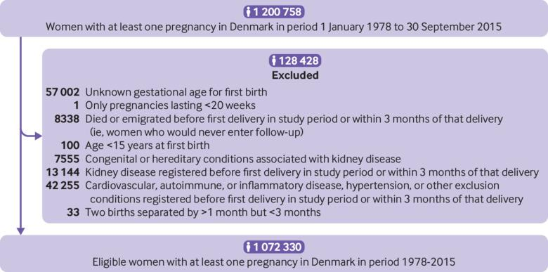
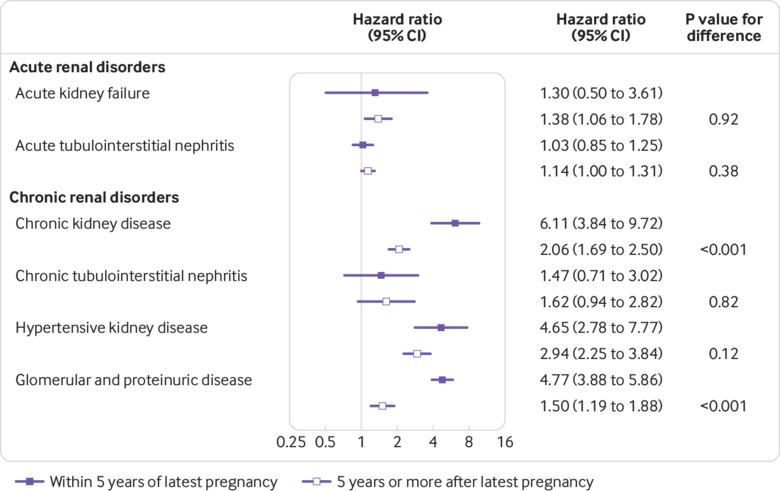

## タイトル
Pre-eclampsia and risk of later kidney disease: nationwide cohort study  
妊娠高血圧腎症とその後の腎臓病のリスク：全国コホート研究

## 著者/所属機関

## 論文リンク
https://doi.org/10.1136/bmj.l1516

## 投稿日付
Published 29 April 2019  
Accepted 19 March 2019

## 概要
### 目的
妊娠高血圧腎症とその後の腎臓病リスクとの関連を調査すること。

### 研究デザイン
デンマークにおける全国レジスターベースのコホート研究。  
対象人口は、1978年から2015年の間に少なくとも1回以上20週以上まで妊娠したすべての女性である。  
主な結果の尺度は、妊娠高血圧腎症の既往歴のある女性とない女性の腎疾患の発生率を分娩時の在胎週数で層別化し、Cox回帰を用いて推定したハザード比です。

### 結果
コホートは、19,994,470人の間に追跡された1,072,330人の女性からなっていた（平均18.6歳/女性）。  
妊娠高血圧腎症の既往歴のない女性と比較して、妊娠高血圧腎症の既往歴のある人は、慢性腎臓病を発症する可能性がより高かった：ハザード比3.93（95％信頼区間2.90〜5.33、早期preterm妊娠高血圧腎症（分娩<34週）; 2.81（2.13～3.71）、後期preterm妊娠高血圧腎症（分娩34〜36週）; 2.27（2.02〜2.55）term妊娠高血圧腎症（分娩≧37週）。  
特に慢性腎臓病、高血圧腎臓病、糸球体/タンパク尿について強い関連性が認められた。  
心血管疾患と高血圧の調整は、観察された関連性を部分的にしか弱めませんでした。  
妊娠からの経過時間分析を層別化すると、妊娠高血圧腎症と慢性腎臓病および糸球体/タンパク尿症との関連は、最近の妊娠から5年以内（ハザード比はそれぞれ6.11（3.84〜9.72）および4.77（3.88〜5.86））では5年以上（2.06（1.69〜2.50）および1.50（1.19〜1.88））よりはるかに強いことが示された。   
これとは対照的に、妊娠高血圧腎症と急性腎臓病との間の関連は中程度でした。

### 結論
妊娠高血圧腎症、特に早期pretermの妊娠高血圧腎症は、後年のいくつかの慢性腎障害と強く関連していました。  
どの女性が妊娠高血圧腎症の後に腎臓病を発症する可能性が最も高いか、どのメカニズムが関連の根底にあり、どのような臨床的追跡調査および介入（および妊娠後の期間）が最も適切かつ効果的であるかを決定するためにさらなる研究が必要である。

### 図1 研究コホートの構築を説明するフローチャート

### 図2 直近の妊娠からの経過時間による急性および慢性の腎臓障害グループのハザード比

