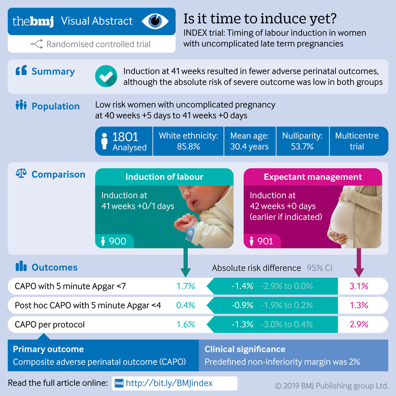
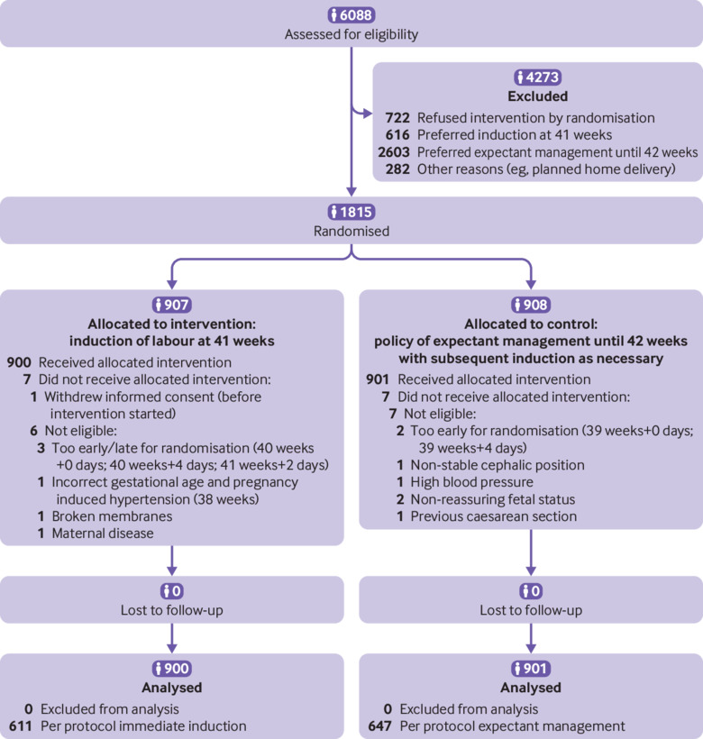
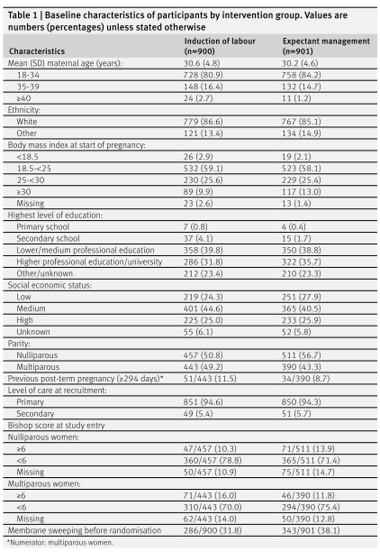
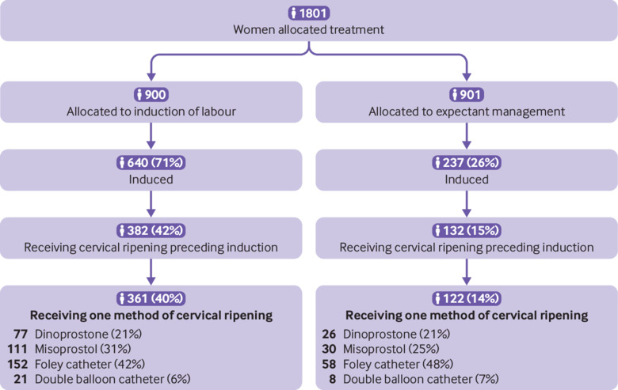
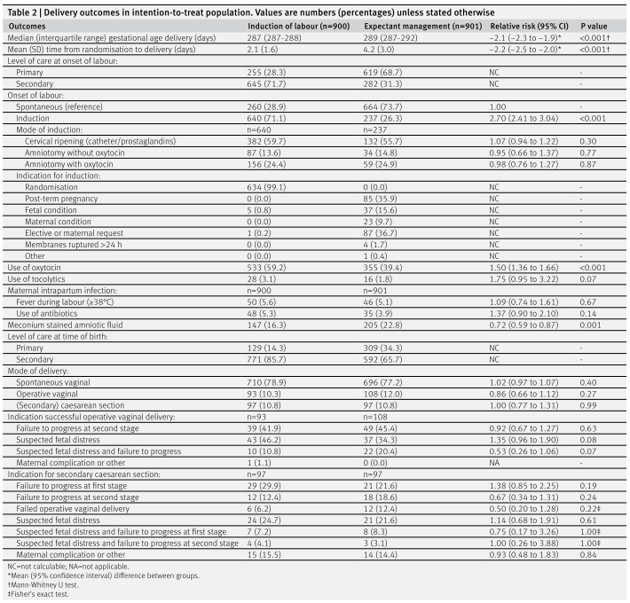
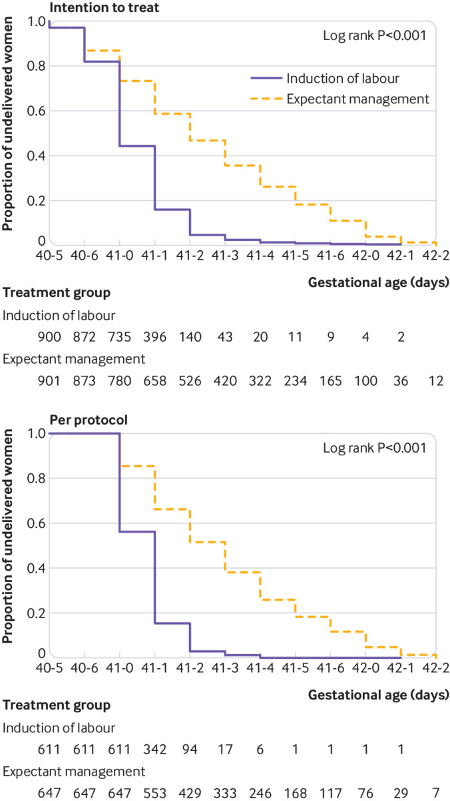
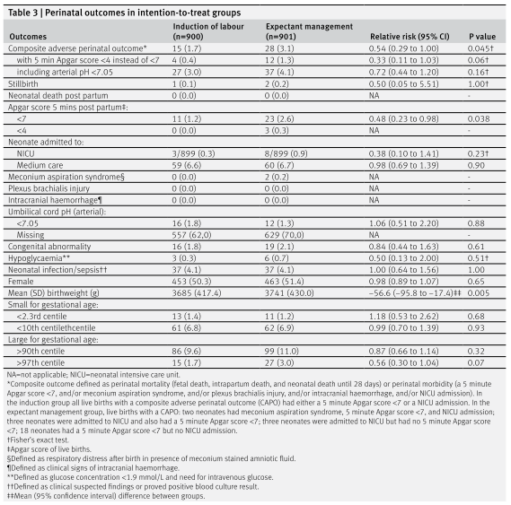
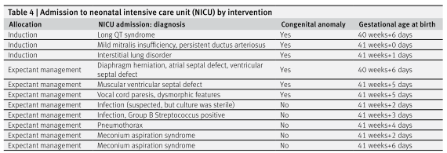
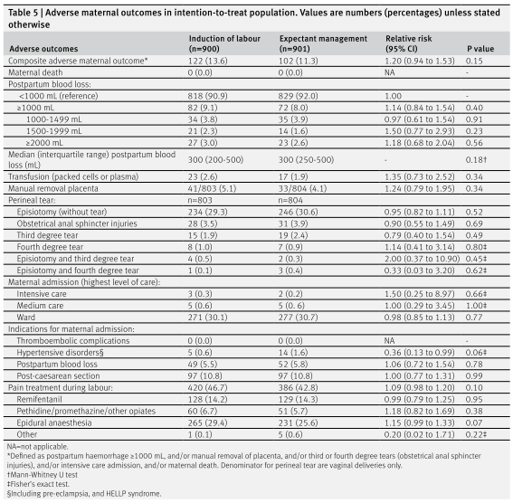

## タイトル
Induction of labour at 41 weeks versus expectant management until 42 weeks (INDEX): multicentre, randomised non-inferiority trial  
41週での分娩誘発と42週までの待機的管理（INDEX）：多施設共同無作為化非劣性試験

## 著者/所属機関

## 論文リンク

## 投稿日付

## 概要
### 目的
低リスクの女性において、41週での分娩誘発を42週までの待機的管理を比較すること。

### 方法
* 非盲検無作為化対照非劣性試験。
* 2012-16年にオランダの123の助産施設と45の病院（2次施設）で実施された。
* 合併症のない単胎妊娠の低リスク女性1801人を無作為に割り当てた：誘発（n＝900）または待機的管理（n＝901）。
* 必要に応じて介入を実施。
* 主要転帰は周産期死亡率および新生児複合罹患率であった（5分Apgarスコア<7、動脈血pH<7.05、胎便吸引症候群、腕神経叢損傷、頭蓋内出血、およびNICUへの入院）
* 副次転帰は母体の転帰および分娩様式であった。
* 待機的管理が誘発より劣っているという帰無仮説は、非劣性のマージンが2％で検定された。

### 結果
* 出産時の妊娠週数の中央値は、誘発群で41+0週（四分位は41+0週-41+1週）、管理群で41+2週（41+0週-41+5週）であった。
* 主要転帰は、ITT群とプロトコル群の両方について分析された。
* 誘発群15人/900（1.7％）に対して、管理群28人/901（3.1％）が有害な周産期転帰を示した（絶対リスク差-1.4％、95％CI -2.9％-0.0％、非劣性の場合P＝0.22）。
* 誘発群の11人の乳児（1.2％）および管理群の23人の乳児（2.6％）は、5分Apgarスコアが<7であった（相対リスク（RR）0.48、95％CI 0.23-0.98）。
* 管理群の3人（0.3％）は5分Apgarスコアが<4であった。
* 誘発群の1人（0.1％）および管理群の2人（0.2％）が胎児死亡であった。
* 新生児死亡は発生しなかった。
* 誘発群の新生児3人（0.3％）および管理群の8人（0.9％）がNICUに入院した（RR 0.38、95％CI 0.10-1.41）。
* 母体の有害転帰（誘発群 n＝122（13.6％）vs 管理群 n＝102（11.3％））、帝王切開率（両群 n＝97（10.8％））に有意差は認められなかった。

### 結論
本研究では41週時点で妊娠が合併症のない女性において誘発と管理では非劣性を示すことはできなかった。

### 図 Abstract

### 図1 研究の流れ

### 表1 介入した参加者のベースライン特性

### 図2 研究中の頸管熟化

### 表2 ITT群における分娩転帰

### 図3 分娩時間

### 表3 ITT群の周産期予後

### 表4 介入によるNICU入院

### 表5 ITT群における母体有害転帰

