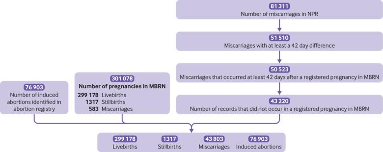
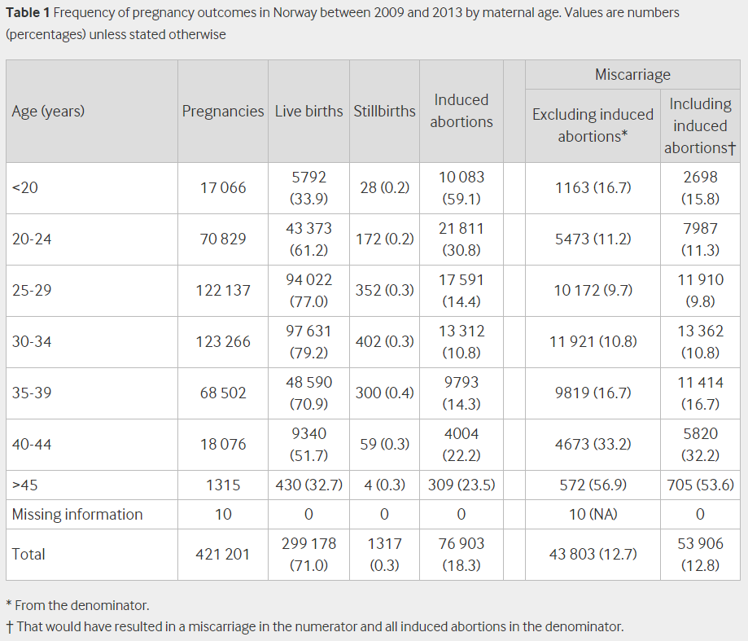
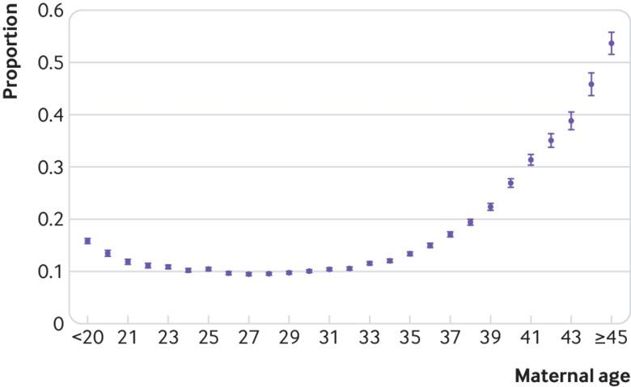
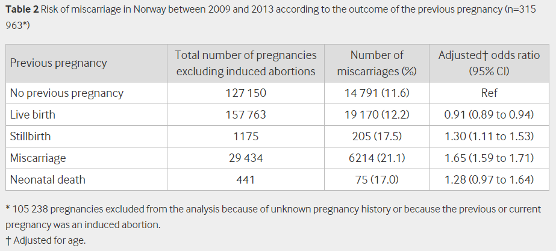
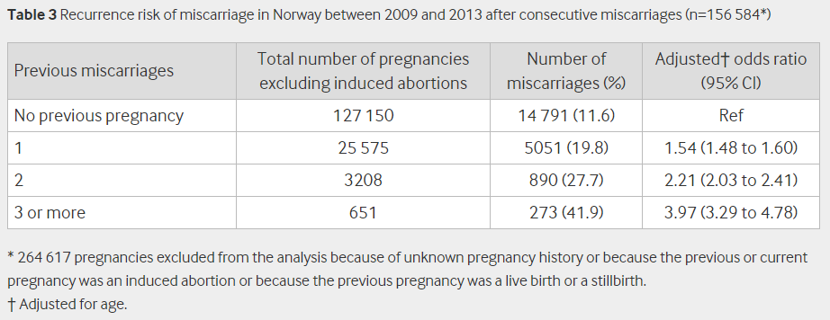
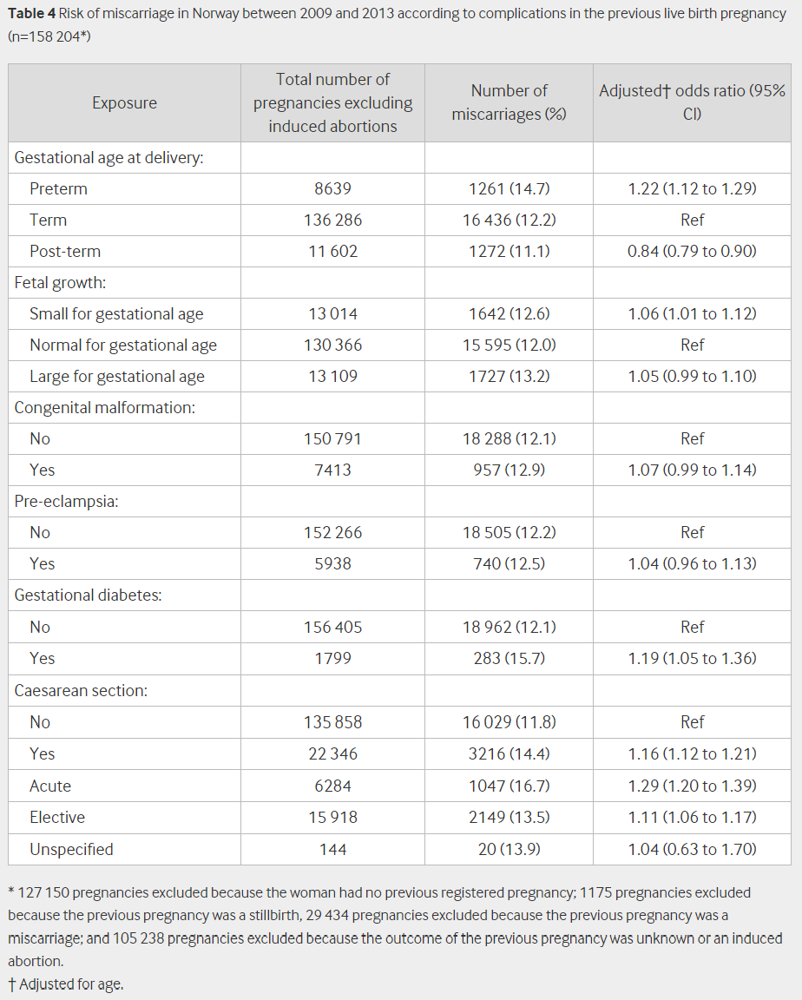
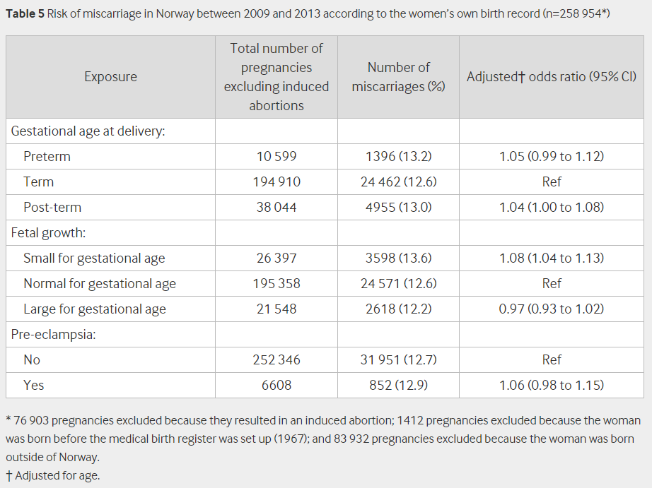

## タイトル
Role of maternal age and pregnancy history in risk of miscarriage: prospective register based study  
流産のリスクにおける母体年齢と妊娠の既往歴：登録に基づく前向き研究

## 著者/所属機関
Maria C Magnus, researcher 1 2 3, Allen J Wilcox, senior investigator 1 4, Nils-Halvdan Morken, senior consultant 1 5 6, Clarice R Weinberg, senior investigator 7, Siri E Håberg, deputy director 1  
1 Centre for Fertility and Health, Norwegian Institute of Public Health, PO Box 222 Skøyen, N-0213 Oslo, Norway  
2 MRC Integrative Epidemiology Unit at the University of Bristol, Bristol, UK  
3 Department of Population Health Sciences, Bristol Medical School, Bristol, UK  
4 Epidemiology Branch, National Institute of Environmental Health Sciences, Durham, NC, USA  
5 Department of Clinical Science, University of Bergen, Bergen, Norway  
6 Department of Obstetrics and Gynecology, Haukeland University Hospital, Bergen, Norway  
7 Biostatistics and Computational Biology Branch, National Institute of Environmental Health Sciences, Durham, NC, USA

## 論文リンク
https://doi.org/10.1136/bmj.l869

## 投稿日付
Published 20 March 2019  
Accepted 11 February 2019  
Original article 21 November 2018  
First decision 21 January 2019  
Author response 05 February 2019  
ICJME forms 05 February 2019

## 概要
### 目的
流産の負担を推定し、母体年齢と妊娠の既往歴の関連を評価すること。

### 研究デザイン
* 登録に基づく前向き研究。
* ノルウェーのMedical Birth Register、Norwegian Patient Register、および人工妊娠中絶登録。
* 2009-13年にノルウェーで妊娠したすべての女性が対象。
* 主要評価項目は、ロジスティック回帰によって推定され母体年齢および妊娠の既往歴による流産のリスク。

### 結果
* 研究期間中に421,201例の妊娠があった。  
* 流産のリスクは、
  * 25〜29歳の女性で最も低く（10％）、
  * 30歳以降は急速に上昇し、
  * 45歳以上の女性では53％に達した。  
* 流産は強い再発リスクがあった。
  * 1回の流産後の年齢調整オッズ比 1.54（95％信頼区間 1.48-1.60）
  * 2回の流産後の2.21（2.03-2.41）
  * 3回の連続流産後の3.97（3.29-4.78）
* 前回の出産が、以下の場合、流産のリスクはやや増加した。
  * 早産（調整後オッズ比 1.22、95％信頼区間1.12-1.29）
  * 死産（1.30、1.11-1.53）
  * 帝王切開（1.16、1.12-1.21）
  * 妊娠糖尿病の既往歴（1.19、1.05-1.36）
* 流産の危険性は、SGA児（1.08、1.04〜1.13）でわずかに高かった。

### 結論
流産のリスクは、母体年齢で異なり、強い再発パターンを示し、有害な妊娠転帰の既往歴で増加していた。  
流産およびその他の妊娠中の合併症は根本的な原因を共有している可能性がある。

### 図1 2009-13年のノルウェーにおける妊娠等の数

### 表1 2009-13年の母体年齢による妊娠数、（）内はパーセント

### 図2 母体年齢による流産のリスク

### 表2 過去の妊娠結果、および流産のリスク（n＝315,963\*）

### 表3 2009-13年の流産、その後の再発リスク（n＝156,584\*）

### 表4 過去の妊娠合併症、および流産のリスク（n＝158,204\*）

### 表5 妊婦自身の出生歴、および流産のリスク（n＝258,954\*）

