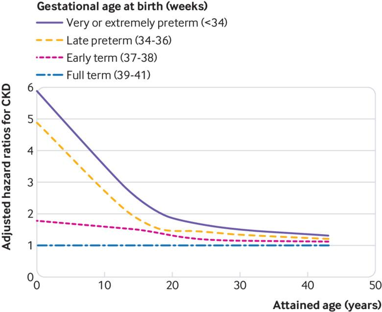
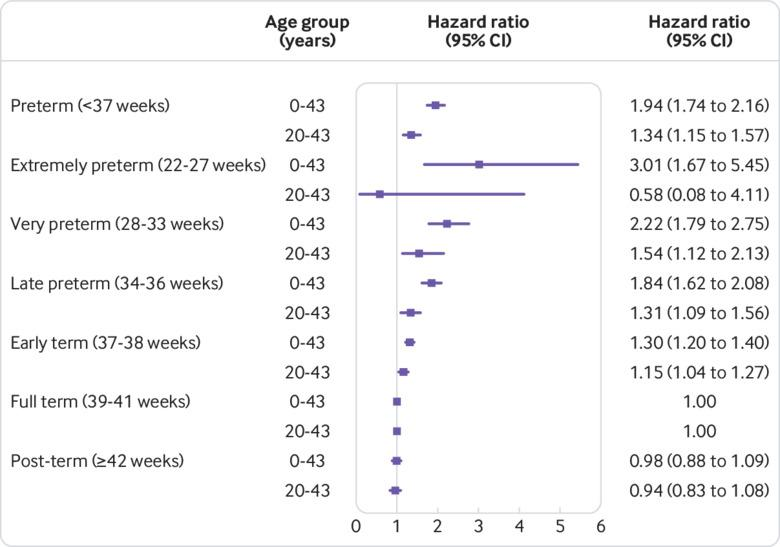

## タイトル
Preterm birth and risk of chronic kidney disease from childhood into mid-adulthood: national cohort study  
早産と小児期から成人期半ばまでの慢性腎臓病のリスク：全国コホート研究

## 著者/所属機関

## 論文リンク
https://doi.org/10.1136/bmj.l1346

## 投稿日付
Published 01 May 2019

## 概要
### 目的
早産（妊娠期間<37週）と小児期から成人期中期までのCKDのリスクとの関係を調査すること。

### デザイン
1973年から2014年の間にスウェーデンで4 186 615人のシングルトンを対象に実施した全国的コホート研究。  
ばく露は出生時の妊娠年齢、スウェーデンの出生登録簿の全国的な出生記録から識別されます。  
主要アウトカムは、2015年までの全国の入院患者および外来患者の診断から同定されたCKD（最大年齢43歳）。  
潜在的交絡因子を調整しながら、出生時の妊娠年齢およびCKDのリスクを調べるためにコックス回帰を使用し、そして同胞兄弟分析は、測定されていない共有の家族的（遺伝的または環境的）因子の影響を評価した。

### 結果
4305人（0.1％）の参加者が、8,700万人年の追跡調査期間中にCKDと診断された。  
早産および極度早産（<28週）は、出生から成人中期まで、それぞれCKDのほぼ2倍および3倍のリスクと関連していた（調整ハザード比1.94、95％信頼区間1.74から2.16; P <0.001; 3.01、 1.67〜5.45; P <0.001）。  
早期正期産（37〜38週）で生まれた人々の間でもリスクの増加が観察された（1.30、1.20〜1.40； P <0.001）。  
早産とCKDの間の関連は0-9歳（5.09、4.11〜6.31; P <0.001）で最も強く、その後弱まったが10-19歳（1.97、1.57〜2.49; P <0.001）、20〜43歳（1.34、1.15〜1.57; P <0.001）で増加し続けた。  
これらの関連は男性と女性の両方に影響を及ぼし、家族における共通の遺伝的要因または環境的要因に関連しているとは思われなかった。

### 結論
早産および早期正期産は、小児期から成人期半ばまでのCKD発症の強力な危険因子です。  
未成熟で生まれた人々は、一生を通して腎機能を維持するためのモニタリングおよび予防措置のための長期的な追跡調査を必要としています。

### 図1

### 図2

