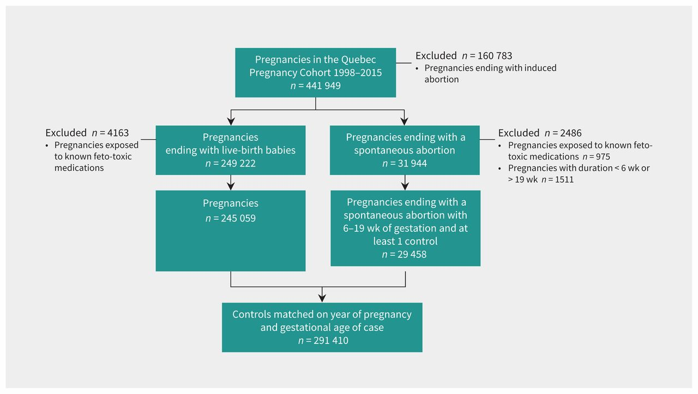
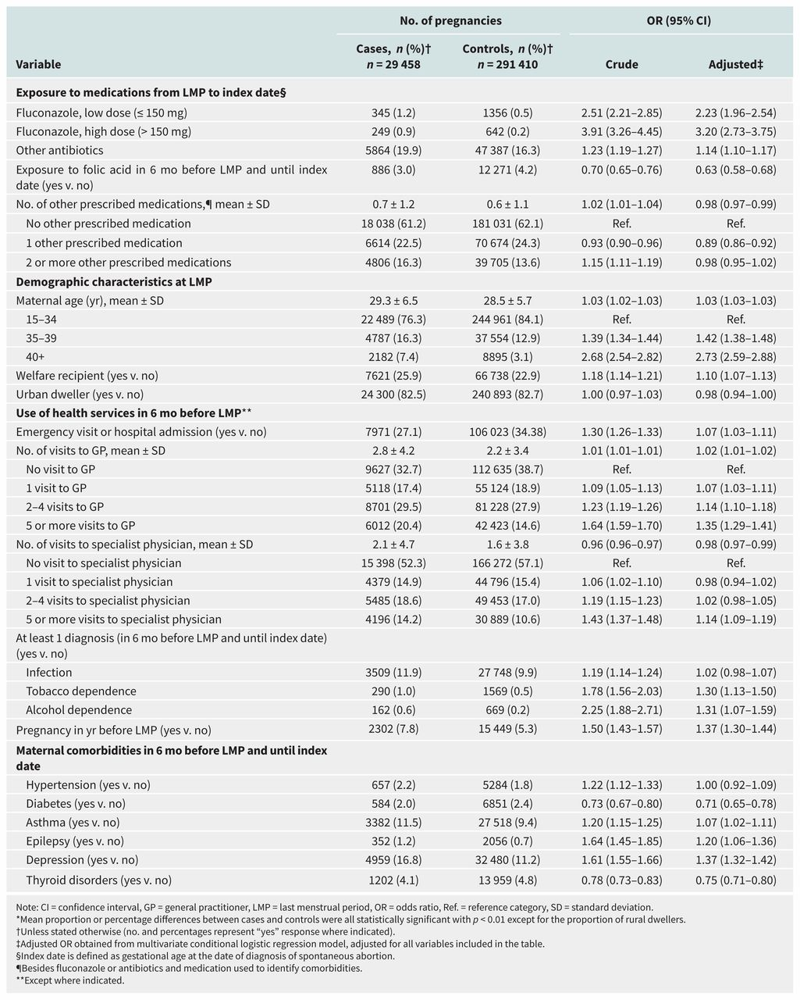
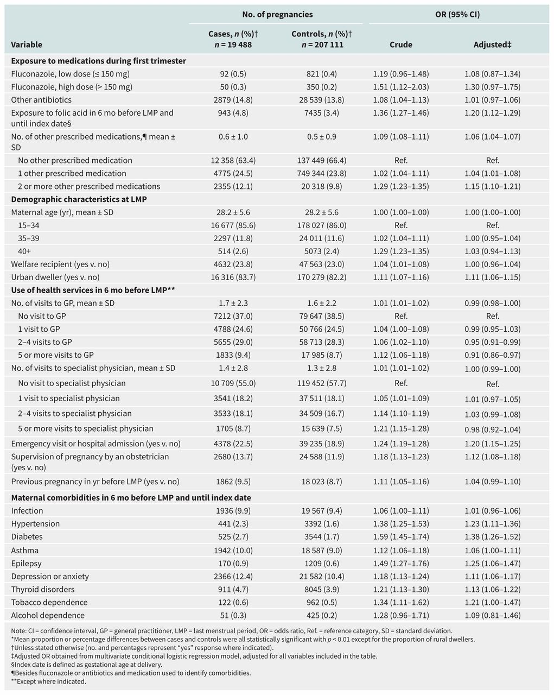
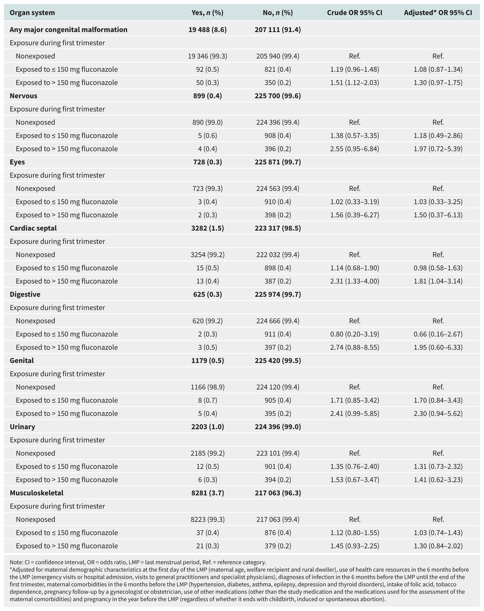

## タイトル
Associations between low- and high-dose oral fluconazole and pregnancy outcomes: 3 nested case–control studies  
低用量および高用量の経口フルコナゾールと妊娠転帰との関連性：3つのネスト症例対照研究

## 著者/所属機関
Anick Bérard, PhD, Odile Sheehy, MSc, Jin-Ping Zhao, MD PhD, Jessica Gorgui, MSc, Sasha Bernatsky, MD PhD, Cristiano Soares de Moura, PhD, Michal Abrahamowicz, PhD  
Research Centre (Bérard, Sheehy, Zhao, Gorgui), CHU Sainte-Justine; Faculty of Pharmacy (Bérard, Gorgui), University of Montreal; Faculty of Medicine (Bernatsky, Moura), McGill University; Faculty of Medicine, Department of Clinical Epidemiology (Abrahamowicz), McGill University, Montréal, Que.

## 論文リンク
https://doi.org/10.1503/cmaj.180963

## 投稿日付
Accepted January 22, 2019  
Published online February 18, 2019.

## 概要
### 目的
妊娠中の低用量および高用量のフルコナゾールへの曝露が自然流産、主要な先天性奇形および死産の発生に及ぼす影響を評価すること。

### 方法
1998-2015年の妊婦のコホート研究において、低用量（150 mg以下）および高用量（150 mg以上）のフルコナゾールにばく露された女性、およびばく露されなかった女性を特定した。  
自然流産または死産の各症例について、自然流産または死産の診断時の在胎齢（基準日）および最後の月経期間の年に一致する発生密度サンプリング法を使用して、最大5対照を無作為に選択した。  
主要な先天性奇形の症例では、我々はすべての出生児を対照と見なした。  
一般化推定方程式モデルを用いて3つの主な結果を別々に分析した。

### 結果
コホートの対象となった441,949症例のうち、320,868人が自然流産、226,599人が先天性奇形、および7832人の死産であった。  
妊娠中にフルコナゾールに曝露された多く（69.5％）の女性が150 mg（低用量）の一般的な単一投与であり、残りは>150 mg（高用量）の投与を受けた。  
妊娠初期の経口フルコナゾールの曝露は、非曝露と比較して自然流産のリスク増加と関連していた（低線量治療を受けた345症例の調整オッズ比\[OR\] 2.23、95％信頼区間\[CI\] 1.96-2.54; 高線量治療を受けた249症例の調整後OR 3.20、95％CI 2.73-3.75）。  
妊娠初期のフルコナゾールの曝露は、全体的な先天性奇形のリスクは増加しなかったが、妊娠初期の高線量への曝露は、曝露なしと比較して心中隔閉鎖異常のリスク増加と関連していた（調整後OR 1.81、95％CI 1.04〜3.14、13症例）。  
妊娠中のフルコナゾールへの曝露と死産との関連性は見られなかった。

### 結論
妊娠中の母親のフルコナゾールへの曝露は自発的流産のリスクを高める可能性があり、妊娠中期に150mgを超える用量を投与すると心中隔閉鎖異常のリスクを高める可能性がある。

### 図1

### 表1

### 表2

### 表3

