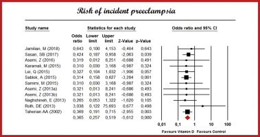

## タイトル
Vitamin D supplementation and incident preeclampsia: A systematic review and meta-analysis of randomized clinical trials  
ビタミンD補給と子incident前症：無作為化臨床試験の系統的レビューとメタ分析

## 著者/所属機関

## 論文リンク
https://doi.org/10.1016/j.clnu.2019.08.015

## 投稿日付
Available online 4 September 2019

## 概要
バックグラウンド
母体のビタミンD欠乏症は、子ec前症のリスク増加と関連しています。これにもかかわらず、子lamp前症の予防におけるビタミンD補給の有効性に関する現在の証拠は議論の余地があります。子D前症のリスクに対するビタミンD補給の影響を評価するために、文献の体系的なレビューと利用可能なランダム化臨床試験（RCT）のメタ分析を実施しました。

方法
主要な結果は子ec前症でした。サブグループ分析は、補充のタイミング、介入の種類、および研究デザインを考慮して実施されました。異質性を調査するために、ビタミンDの量や母親の年齢を含むメタ回帰分析が計画されました（PROSPEROデータベース登録番号：CRD42019119207）。

結果
データは、合計4777人の参加者を含む59のアームを含む27のRCTからプールされ、そのうちの2487はビタミンD投与群、2290は対照群でした。妊娠中のビタミンD投与は、子ec前症のリスク低下と関連していました（奇数比[OR] 0.37、95％信頼区間[CI]：0.26、0.52、I 2  = 0％）。妊娠20週までにビタミンDの補給を開始した場合、オッズは少し低くなりました（または0.35、95％CI：0.24、0.50、p  <0.001）。この効果は、サプリメントの中止（分娩までまたはそれまで）、介入の種類（ビタミンD単独またはカルシウムとの併用）、および研究デザインとはほとんど無関係でした。ビタミンDの増量は、子lamp前症の発生率の低下と関連していました（logの勾配または：-1.1、95％CI：-1.73、-0.46; p  <0.001）。

結論
結果は、ビタミンD補給が子lamp前症の予防に役立つ可能性があることを示唆しています。これらのデータは、子lamp前症のリスクのある妊婦の管理に従事する医療提供者にとって特に有用です。私たちの調査結果は、妊娠中の子preventing前症を予防するための可能な介入戦略として、ビタミンDの補給に明確に取り組むための行動の呼びかけです。

### Graphical Abstract

