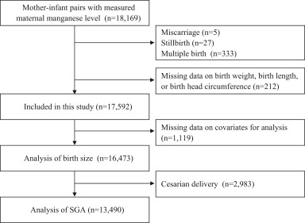
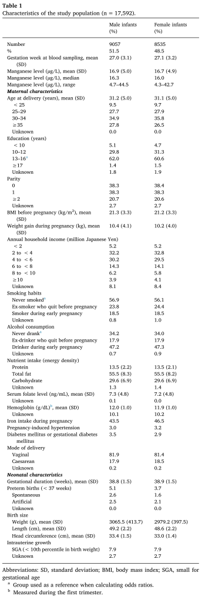
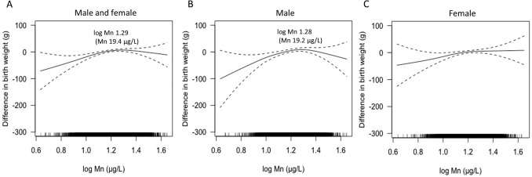
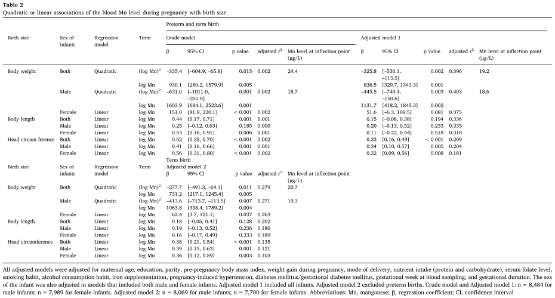
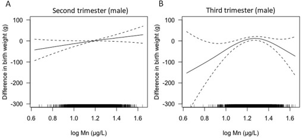
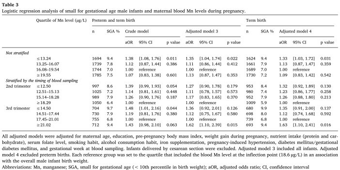

## タイトル
Association between blood manganese level during pregnancy and birth size: The Japan environment and children's study (JECS)  
妊娠中の血中マンガン濃度と出生サイズの関係：日本の環境と子供の研究（JECS）

## 著者/所属機関
Yamamoto M 1, Sakurai K 1, Eguchi A 1, Yamazaki S 2, Nakayama SF 2, Isobe T 2, Takeuchi A 3, Sato T 4, Hata A 1, Mori C 1, Nitta H 2, Ohya Y 5, Kishi R 6, Yaegashi N 7, Hashimoto K 8, Mori C 1, Ito S 9, Yamagata Z 10, Inadera H 11, Kamijima M 12, Nakayama T 13, Iso H 14, Shima M 15, Hirooka Y 16, Suganuma N 17, Kusuhara K 18, Katoh T 19.  
1 Chiba University, Japan  
2 National Institute for Environmental Studies, Japan  
3 Keio University, Japan  
4 Kyoto University School of Public Health, Japan  
5 National Center for Child Health and Development, Japan  
6 Hokkaido University, Japan  
7 Tohoku University, Japan  
8 Fukushima Medical University, Japan  
9 Yokohama City University, Japan  
10 University of Yamanashi, Japan  
11 University of Toyama, Japan  
12 Nagoya City University, Japan  
13 Kyoto University, Japan  
14 Osaka University, Japan  
15 Hyogo College of Medicine, Japan  
16 Tottori University, Japan  
17 Kochi University, Japan  
18 University of Occupational and Environmental Health, Japan  
19 Kumamoto University, Japan  

## 論文リンク
https://doi.org/10.1016/j.envres.2019.02.007

## 投稿日付
Received 24 July 2018  
Received in revised form 4 February 2019  
Accepted 6 February 2019  
Available online 08 February 2019

## 概要
### 目的
妊娠中の母体血中Mn濃度と出生サイズの相関を評価すること。

### 方法
2011年1月-2014年3月にかけての日本における全国規模の出生コホート研究。  
16,473症例。  
妊娠中の母体血中Mn濃度と乳児の出生時体重、身長、および頭囲との相関を調べた。  
出生サイズの分析（男児8,484人、女児7,989人）は、非線形スプラインを用いて行い、続いて二次回帰または線形回帰モデルを用いた。  
多変量ロジスティック回帰を使用して、小児用（SGA）（男性6,962人および膣に生まれた6,528人の女性）の分析を行った。また、採血のタイミングに合わせてサブグループ分析を行った。  
SGA児（男児6,962人および女児6,528人）の分析は多変量ロジスティック回帰を用いて行われた。  
また、採血のタイミングに合わせてサブグループ分析を行った。

### 結果
妊娠中の母体血中Mn値の中央値（妊娠第2期-第3期）は16.2µg/L（範囲、4.3-44.5µg/L）であった。  
対数血中Mn濃度と頭囲との間には、男児および女児の両方ともに正の線形相関があった。  
しかし、対数血中Mn濃度と出生時体重との間には、男児のみに非線形相関があり、血中Mn濃度18.6μg/Lまで出生時体重の増加が見られた。ただし、母体の採血のタイミングによって層別化されたサブグループ分析では、妊娠第3期に行われた時のみであった。  
血中Mn濃度が第3四分位（18.6-21.0μg/L）の男児と比較して、血中Mn濃度が第1四分位の男児（≦13.2µg/L、オッズ比\[95％信頼区間\]＝1.35\[1.04-1.74\]）は、妊娠第3期に採血された時に血中Mn濃度が第4四分位の男児（≥21.0µg/L、オッズ比\[95％信頼区間\]＝1.62\[1.10-2.39\]）と同様に、SGAリスクが増大した。  
女児については、出生時体重と血中Mn濃度の相関はなかった。  
血中Mn濃度は、男児、女児ともに出生期間と相関がなかった。

### 結論
妊娠中の低血中Mn濃度または妊娠中期中の高血中Mn濃度は、男児では出生時体重の低下およびSGAのリスク増加と相関があったが、女児はそうではなかった。  
低血中Mn濃度は、男児、女児ともに小さな頭囲とわずかに相関することがわかった。

### 図1

### 表1

### 図2

### 表2

### 図3

### 表3

