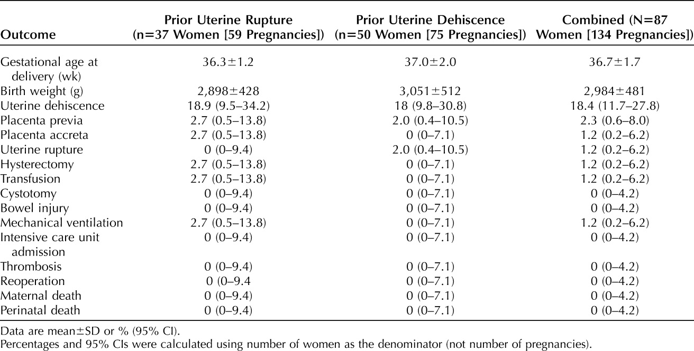

## タイトル
Pregnancy Outcomes in Patients With Prior Uterine Rupture or Dehiscence  
子宮破裂の既往がある患者の妊娠転帰

## 著者/所属機関

## 論文リンク
10.1097/AOG.0000000000003622

## 投稿日付
Originally published: December 3, 2019  
Received: August 31, 2019  
Revision Received: October 4, 2019  
Accepted: October 10, 2019

## 概要
### 背景
2014年に、以下の子宮破裂の既往がある患者の妊娠転帰を報告した。
* 子宮破裂の既往がある14人の女性（20妊娠）  
（臨床的に明らかで、分娩中または分娩前の完全な瘢痕分離）
* 子宮の裂開の既往のある30人の女性（40妊娠）  
（無傷の漿膜を伴う不完全な子宮瘢痕分離、ときにuterine windowと呼ばれる）

※ window：子宮の裂開でできた窓

再発率の転帰は以下の通りであった。
* 重症罹患率：0％
* 再発：6.7％

### 目的
前回の報告より患者が増えたため、アップデートすること。

### 方法
* 2005年7月～2019年8月の24週以降に出産した患者の記録をレビュー（2014年のものと同じ方法）
* 著者らの施設では通常、以下の通り帝王切開にて出産
  * 子宮破裂の既往のある患者は妊娠36～37週、または早産の場合はもっと早く
  * 子宮の裂開の既往がある患者は妊娠37〜39週頃（産科歴、臨床所見、および超音波所見に基づいて決定）
* 転帰（発生率、および95％CI）
  * 重症罹患率（子宮破裂、子宮摘出、輸血、膀胱切開、腸損傷、人工呼吸器、集中治療室入院、血栓症、再手術、母体死、および周産期死亡）
  * その他罹患率（前置胎盤、癒着胎盤、分娩時の子宮の裂開など）

### 結果
* 構成
  * 子宮破裂の既往がある37人の女性（59妊娠）
  * 子宮の裂開の既往がある50人の女性（75妊娠）
* 母体、および周産期死亡 0件
* 子宮破裂 1件（全妊娠の0.7％、全女性の1.2％、95％CI 0.2–6.2％）
  * 帝王切開 3回、子宮の裂開 1回、単角子宮の女性
  * 帝王切開予定日の2日前(妊娠36週2日)に出産
  * 出産時に偶発的な子宮破裂、母体合併症なし
  * 新生児のアプガースコア1/5 9/9、NICU入院なし
* その他 1件（前置胎盤、および癒着胎盤の疑い）
  * 人工呼吸、輸血、および子宮摘出術
  * 子宮破裂の既往の女性（4回の帝王切開既往）
  * (不正？)出血の為、妊娠34週で帝王切開し、癒着胎盤により子宮摘出術を実施
* uterine window発生率
  * 帝王切開 11.9％
  * 全妊娠 18.4％（95％CI 11.7–27.8％）

Table.1 子宮破裂または子宮の裂開の既往歴のある女性の妊娠転帰

### 討論
過去の報告同様、子宮破裂または子宮の裂開の既往のある女性において、標準化された方法で管理した場合、その後の妊娠の有害転帰リスクは低い。

## リンク
[Pregnancy Outcomes in Patients With Prior Uterine Rupture or Dehiscence](10.1097/AOG.0000000000000181)
